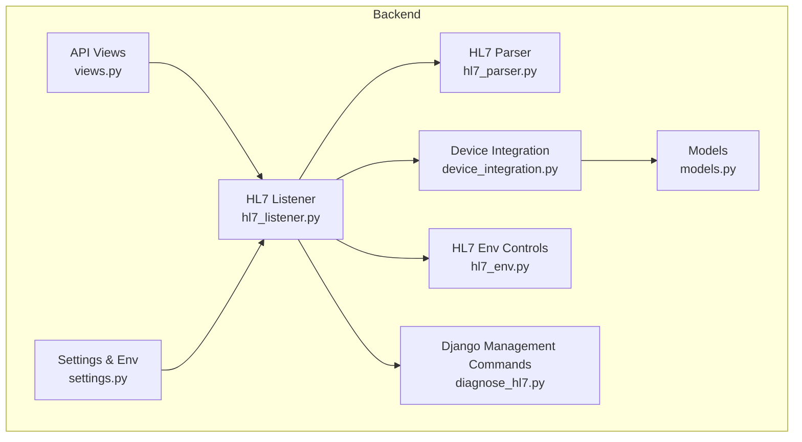
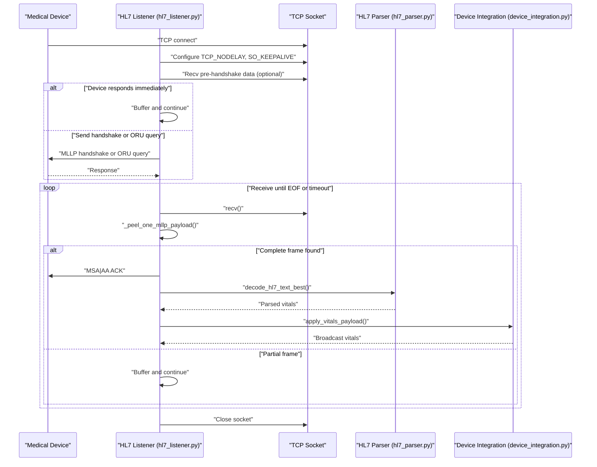
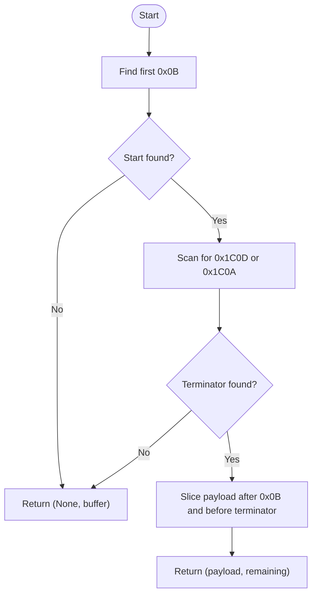
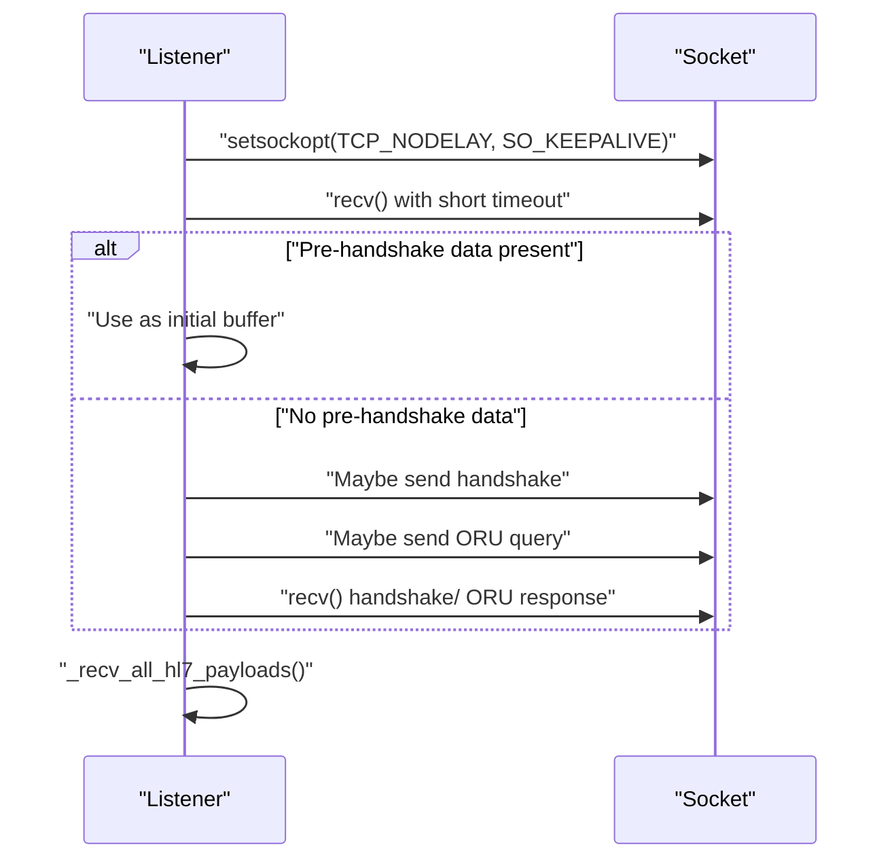
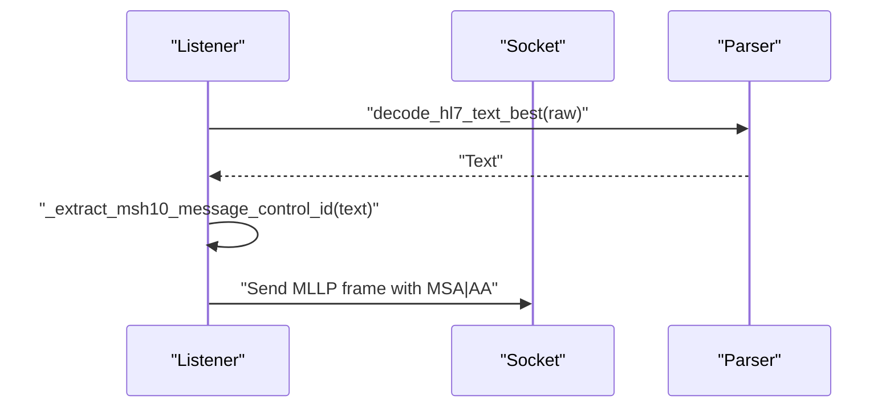
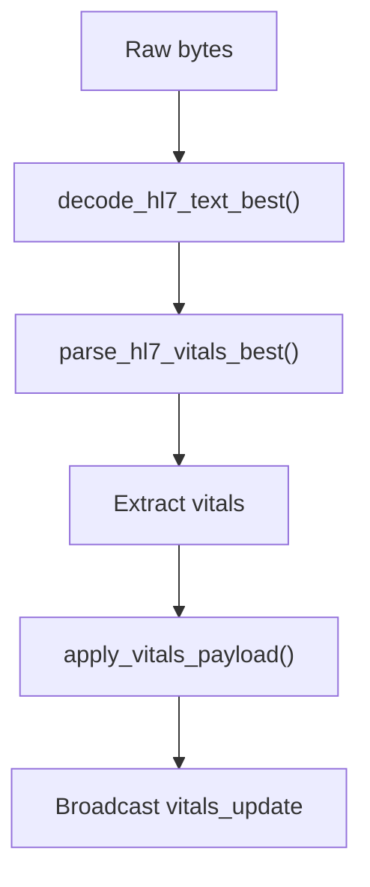
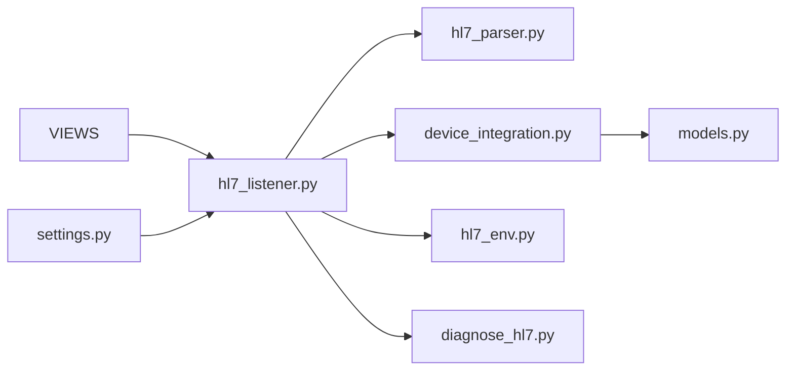

# MLLP Protocol Handling

<cite>
**Referenced Files in This Document**
- [hl7_listener.py](file://backend/monitoring/hl7_listener.py)
- [hl7_parser.py](file://backend/monitoring/hl7_parser.py)
- [models.py](file://backend/monitoring/models.py)
- [device_integration.py](file://backend/monitoring/device_integration.py)
- [hl7_env.py](file://backend/monitoring/hl7_env.py)
- [diagnose_hl7.py](file://backend/monitoring/management/commands/diagnose_hl7.py)
- [views.py](file://backend/monitoring/views.py)
- [settings.py](file://backend/medicentral/settings.py)
- [README.md](file://README.md)
</cite>

## Update Summary
**Changes Made**
- Enhanced error handling for zero-byte sessions with comprehensive diagnostic logging
- Improved MLLP handshake configuration options with device-specific overrides
- Added comprehensive troubleshooting guide with step-by-step diagnostic procedures
- Enhanced diagnostic information collection for troubleshooting HL7 connections
- Improved error messaging for common connection issues including firewall/router interference

## Table of Contents
1. [Introduction](#introduction)
2. [Project Structure](#project-structure)
3. [Core Components](#core-components)
4. [Architecture Overview](#architecture-overview)
5. [Detailed Component Analysis](#detailed-component-analysis)
6. [Dependency Analysis](#dependency-analysis)
7. [Performance Considerations](#performance-considerations)
8. [Troubleshooting Guide](#troubleshooting-guide)
9. [Conclusion](#conclusion)
10. [Appendices](#appendices)

## Introduction
This document explains the Minimal Lower Layer Protocol (MLLP) implementation used by the HL7 listener in the backend. It covers the MLLP framing mechanism, frame extraction from TCP streams, acknowledgment behavior, timeouts, error handling, and operational guidance for high-throughput medical device environments. The goal is to make the internals understandable for both developers and operators who need to configure, debug, and optimize HL7 reception.

**Updated** Enhanced error handling for zero-byte sessions and improved diagnostic capabilities for troubleshooting HL7 connections.

## Project Structure
The HL7 MLLP listener is implemented in a single module and integrates with the HL7 parser and device integration layers. Environment controls govern behavior such as listening address/port, timeouts, and optional diagnostic logging.



**Diagram sources**
- [hl7_listener.py](file://backend/monitoring/hl7_listener.py)
- [hl7_parser.py](file://backend/monitoring/hl7_parser.py)
- [device_integration.py](file://backend/monitoring/device_integration.py)
- [models.py](file://backend/monitoring/models.py)
- [hl7_env.py](file://backend/monitoring/hl7_env.py)
- [diagnose_hl7.py](file://backend/monitoring/management/commands/diagnose_hl7.py)
- [views.py](file://backend/monitoring/views.py)
- [settings.py](file://backend/medicentral/settings.py)

**Section sources**
- [hl7_listener.py](file://backend/monitoring/hl7_listener.py)
- [hl7_parser.py](file://backend/monitoring/hl7_parser.py)
- [device_integration.py](file://backend/monitoring/device_integration.py)
- [models.py](file://backend/monitoring/models.py)
- [hl7_env.py](file://backend/monitoring/hl7_env.py)
- [diagnose_hl7.py](file://backend/monitoring/management/commands/diagnose_hl7.py)
- [views.py](file://backend/monitoring/views.py)
- [settings.py](file://backend/medicentral/settings.py)
- [README.md](file://README.md)

## Core Components
- MLLP framing constants and extractor: defines the start and end markers and extracts complete frames from a byte stream.
- Connection lifecycle: accepts sockets, applies TCP optimizations, and orchestrates pre-handshake data handling.
- Acknowledgment: generates and sends MSA|AA acknowledgments for incoming HL7 messages.
- Parser integration: decodes HL7 text and extracts vitals for persistence and alerts.
- Device resolution: maps TCP peer IPs to configured devices and updates online status.
- Diagnostics and environment controls: configurable timeouts, logging, and runtime toggles.
- **Enhanced** Zero-byte session detection and comprehensive diagnostic logging for troubleshooting.

**Section sources**
- [hl7_listener.py](file://backend/monitoring/hl7_listener.py)
- [hl7_parser.py](file://backend/monitoring/hl7_parser.py)
- [device_integration.py](file://backend/monitoring/device_integration.py)
- [models.py](file://backend/monitoring/models.py)
- [hl7_env.py](file://backend/monitoring/hl7_env.py)

## Architecture Overview
The HL7 listener runs as a long-lived thread that binds to a configurable host and port, accepts TCP connections, and processes HL7 messages framed in MLLP. It supports optional pre-handshake data capture, optional connection handshake, and optional ORU queries for specific monitors. Each message is acknowledged and parsed to extract vitals, which are persisted and broadcast to clients.



**Diagram sources**
- [hl7_listener.py](file://backend/monitoring/hl7_listener.py)
- [hl7_parser.py](file://backend/monitoring/hl7_parser.py)
- [device_integration.py](file://backend/monitoring/device_integration.py)

## Detailed Component Analysis

### MLLP Framing and Frame Extraction
- Start and end markers:
  - Start: 0x0B
  - End: either 0x1C0D or 0x1C0A
- Extraction algorithm:
  - Find the first start marker.
  - Scan the remainder for the earliest occurrence of either terminator.
  - If found, extract the payload between start and terminator and return the remainder for further processing.
  - If not found, return None and keep the entire buffer for accumulation.



**Diagram sources**
- [hl7_listener.py](file://backend/monitoring/hl7_listener.py)

**Section sources**
- [hl7_listener.py](file://backend/monitoring/hl7_listener.py)

### Connection Lifecycle and Pre-handshake Handling
- Applies TCP optimizations (disable Nagle, enable keepalive).
- Optionally receives a short pre-handshake chunk before deciding whether to send a handshake or query.
- Supports two special flows:
  - Some monitors send data immediately upon connect; the listener captures this data first.
  - Others require a handshake or an ORU query to trigger a response.
- After initial exchange, continues receiving until EOF or timeout, extracting MLLP frames.
- **Enhanced** Zero-byte session detection with detailed error logging and diagnostic information.



**Diagram sources**
- [hl7_listener.py](file://backend/monitoring/hl7_listener.py)

**Section sources**
- [hl7_listener.py](file://backend/monitoring/hl7_listener.py)

### Acknowledgment System (MSA|AA)
- Automatic ACK generation is controlled by an environment flag.
- For each valid HL7 message containing an MSH segment, the listener constructs an ACK with MSA|AA and sends it as an MLLP frame.
- The ACK includes the original message control ID to correlate responses.



**Diagram sources**
- [hl7_listener.py](file://backend/monitoring/hl7_listener.py)
- [hl7_parser.py](file://backend/monitoring/hl7_parser.py)

**Section sources**
- [hl7_listener.py](file://backend/monitoring/hl7_listener.py)
- [hl7_parser.py](file://backend/monitoring/hl7_parser.py)

### HL7 Parsing and Vitals Application
- Decoding attempts multiple encodings and selects the best representation.
- Extracts vitals (heart rate, SpO2, temperature, respiratory rate, NIBP) using robust heuristics.
- Persists vitals and broadcasts updates via WebSocket.



**Diagram sources**
- [hl7_parser.py](file://backend/monitoring/hl7_parser.py)
- [device_integration.py](file://backend/monitoring/device_integration.py)

**Section sources**
- [hl7_parser.py](file://backend/monitoring/hl7_parser.py)
- [device_integration.py](file://backend/monitoring/device_integration.py)

### Timeout Handling
- Connection receive timeout is configurable via an environment variable. If unset or zero, blocking reads are used.
- Short timeouts are applied around pre-handshake data capture and during handshake/ ORU exchanges.
- Timeouts are handled gracefully; partial buffers are retained and processed on subsequent reads.

**Section sources**
- [hl7_listener.py](file://backend/monitoring/hl7_listener.py)

### Enhanced Error Handling and Diagnostics
- **Enhanced** Comprehensive error handling for zero-byte sessions with detailed diagnostic logging.
- Graceful handling of connection resets, broken pipes, and OS-level errors.
- Diagnostic summaries track last payloads, session counts, and raw TCP previews when MSH is missing.
- **Enhanced** Zero-byte session detection with specific error messages for different failure scenarios:
  - TCP connection established but zero bytes received
  - HL7/MSH segment not found but TCP data received
- Optional environment flags enable hex dumps of first and raw TCP receives for troubleshooting.

**Section sources**
- [hl7_listener.py](file://backend/monitoring/hl7_listener.py)
- [hl7_env.py](file://backend/monitoring/hl7_env.py)

## Dependency Analysis
The HL7 listener depends on:
- Parser for decoding and vitals extraction.
- Device integration for device resolution, vitals application, and broadcasting.
- Models for device and patient data.
- Environment controls for runtime behavior.
- **Enhanced** Management commands for comprehensive troubleshooting and diagnostic reporting.



**Diagram sources**
- [hl7_listener.py](file://backend/monitoring/hl7_listener.py)
- [hl7_parser.py](file://backend/monitoring/hl7_parser.py)
- [device_integration.py](file://backend/monitoring/device_integration.py)
- [models.py](file://backend/monitoring/models.py)
- [hl7_env.py](file://backend/monitoring/hl7_env.py)
- [diagnose_hl7.py](file://backend/monitoring/management/commands/diagnose_hl7.py)
- [views.py](file://backend/monitoring/views.py)
- [settings.py](file://backend/medicentral/settings.py)

**Section sources**
- [hl7_listener.py](file://backend/monitoring/hl7_listener.py)
- [hl7_parser.py](file://backend/monitoring/hl7_parser.py)
- [device_integration.py](file://backend/monitoring/device_integration.py)
- [models.py](file://backend/monitoring/models.py)
- [hl7_env.py](file://backend/monitoring/hl7_env.py)
- [diagnose_hl7.py](file://backend/monitoring/management/commands/diagnose_hl7.py)
- [views.py](file://backend/monitoring/views.py)
- [settings.py](file://backend/medicentral/settings.py)

## Performance Considerations
- TCP optimizations: Nagle's algorithm disabled and keepalive enabled reduce latency and detect dead peers.
- Buffering and incremental parsing: the listener accumulates TCP chunks and peels frames in-place to minimize copies.
- Encoding diversity: decoding tries multiple encodings to avoid misinterpretation under mixed OEM configurations.
- Concurrency: each connection is handled in a dedicated thread, allowing parallel processing of multiple monitors.
- Throughput tips:
  - Keep receive timeouts tuned to network conditions.
  - Prefer persistent connections and avoid unnecessary reconnections.
  - Ensure device configuration matches server IP/port to prevent retries and timeouts.

## Troubleshooting Guide

### Comprehensive Diagnostic Procedures

#### 1. Initial Connection Verification
- **Verify listener status**: Check if HL7 thread is alive and listening on correct port
- **Test local connectivity**: Confirm port 6006 accepts connections locally
- **Database connectivity**: Ensure database connection is established

#### 2. Device-Specific Configuration Issues
- **Handshake configuration**: Verify device-specific `hl7_connect_handshake` setting
- **IP address mapping**: Check if device IP addresses match server expectations
- **NAT traversal**: Configure `hl7_peer_ip` for devices behind NAT/firewall

#### 3. Network and Firewall Troubleshooting
- **Firewall rules**: Verify TCP 6006 is allowed through firewall
- **Cloud security groups**: Check AWS/DigitalOcean security group configurations
- **Router interference**: Test for packet filtering or connection resets

#### 4. Zero-Byte Session Analysis
When encountering zero-byte sessions, the system provides detailed diagnostic information:

**Symptoms and Causes:**
- TCP connection established but zero bytes received
- Common causes: device not configured for HL7, handshake failures, firewall interference, sensor verification issues

**Diagnostic Information Collected:**
- Last empty session peer IP and byte count
- Device resolution attempts and results
- Handshake configuration status
- Network connectivity verification

**Recommended Actions:**
1. **Device Configuration Verification**
   - Confirm monitor server IP matches server IP
   - Verify port 6006 is correctly configured
   - Check protocol selection (HL7/MLLP)

2. **Network Connectivity Testing**
   ```bash
   # Test local port accessibility
   telnet 127.0.0.1 6006
   
   # Check firewall status
   sudo ufw status verbose
   ```

3. **Handshake Configuration Adjustment**
   - Try different `hl7_connect_handshake` values (True/False)
   - Adjust `HL7_RECV_BEFORE_HANDSHAKE_MS` timeout
   - Verify device sensor verification status

4. **Advanced Troubleshooting**
   - Enable detailed logging with `HL7_DEBUG=true`
   - Use diagnostic command for comprehensive system analysis
   - Check cloud firewall security group rules

#### 5. Automated Diagnostic Tools
The system provides built-in diagnostic capabilities:

**Management Command Usage:**
```bash
python manage.py diagnose_hl7
```

**API Endpoint Access:**
- `/api/infrastructure/` endpoint provides HL7 diagnostic information
- Includes firewall hints and system status

**Diagnostic Information Available:**
- Last payload timestamps and peer information
- Session counters (with/without HL7 payload)
- Listener thread status and port accessibility
- Bind error details if applicable

#### 6. Common Issue Resolution Matrix

| Issue | Symptoms | Diagnostic Steps | Solution |
|-------|----------|------------------|----------|
| **Zero-byte sessions** | TCP connects, no HL7 data | Check device config, firewall, handshake | Verify server IP/port, adjust handshake settings |
| **Handshake failures** | Connection resets after handshake | Monitor handshake responses, check timeouts | Adjust `HL7_RECV_BEFORE_HANDSHAKE_MS`, verify device support |
| **Firewall blocked** | Connection refused | Test local connectivity, check firewall rules | Allow TCP 6006, configure cloud security groups |
| **NAT traversal** | Device behind router | Check `hl7_peer_ip` configuration | Set device-specific peer IP, enable NAT fallback |

#### 7. Operational Best Practices
- **Configuration Management**: Use device-specific settings for complex deployments
- **Monitoring**: Regularly check diagnostic endpoints for system health
- **Logging**: Enable appropriate logging levels for troubleshooting
- **Testing**: Perform connectivity tests before device deployment

**Section sources**
- [hl7_listener.py](file://backend/monitoring/hl7_listener.py)
- [hl7_env.py](file://backend/monitoring/hl7_env.py)
- [diagnose_hl7.py](file://backend/monitoring/management/commands/diagnose_hl7.py)
- [views.py](file://backend/monitoring/views.py)
- [README.md](file://README.md)

## Conclusion
The HL7 MLLP listener provides a robust, configurable receiver for HL7 messages from diverse medical devices. Its framing logic, pre-handshake handling, automatic ACK generation, and integrated parser make it suitable for high-throughput environments. The enhanced error handling for zero-byte sessions and comprehensive diagnostic capabilities significantly improve troubleshooting and operational reliability. Operators can tune timeouts, enable diagnostics, align handshake behavior, and leverage automated diagnostic tools to accommodate a wide range of monitor models and network configurations.

## Appendices

### Configuration Options
- HL7_LISTEN_ENABLED: Enable/disable the listener.
- HL7_LISTEN_HOST: Host to bind.
- HL7_LISTEN_PORT: Port to bind (default 6006).
- HL7_RECV_TIMEOUT_SEC: Receive timeout for established connections.
- HL7_RECV_BEFORE_HANDSHAKE_MS: Short pre-handshake receive window.
- HL7_SEND_ACK: Toggle automatic ACK generation.
- HL7_SEND_CONNECT_HANDSHAKE: Whether to send an initial MLLP handshake.
- HL7_DEBUG, HL7_LOG_RAW_TCP_RECV, HL7_LOG_FIRST_RECV_HEX, HL7_LOG_RAW_PREVIEW: Diagnostic logging toggles.
- **Enhanced** HL7_NAT_SINGLE_DEVICE_FALLBACK: Enable automatic device assignment for NAT scenarios.

### Enhanced Diagnostic Features
- **Zero-byte session tracking**: Detailed logging for sessions with no HL7 payload
- **Comprehensive error messages**: Specific guidance for different failure scenarios
- **Automated diagnostic command**: `python manage.py diagnose_hl7` for system-wide analysis
- **API-based diagnostics**: `/api/infrastructure/` endpoint for real-time status
- **Firewall integration**: Built-in firewall configuration suggestions

**Section sources**
- [hl7_listener.py](file://backend/monitoring/hl7_listener.py)
- [hl7_env.py](file://backend/monitoring/hl7_env.py)
- [diagnose_hl7.py](file://backend/monitoring/management/commands/diagnose_hl7.py)
- [README.md](file://README.md)