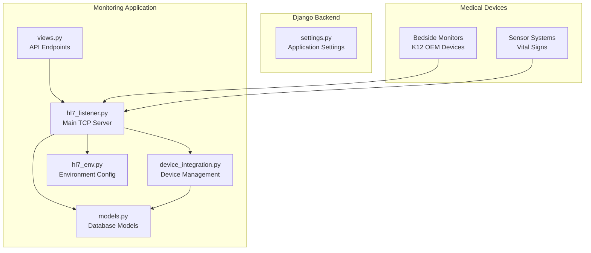
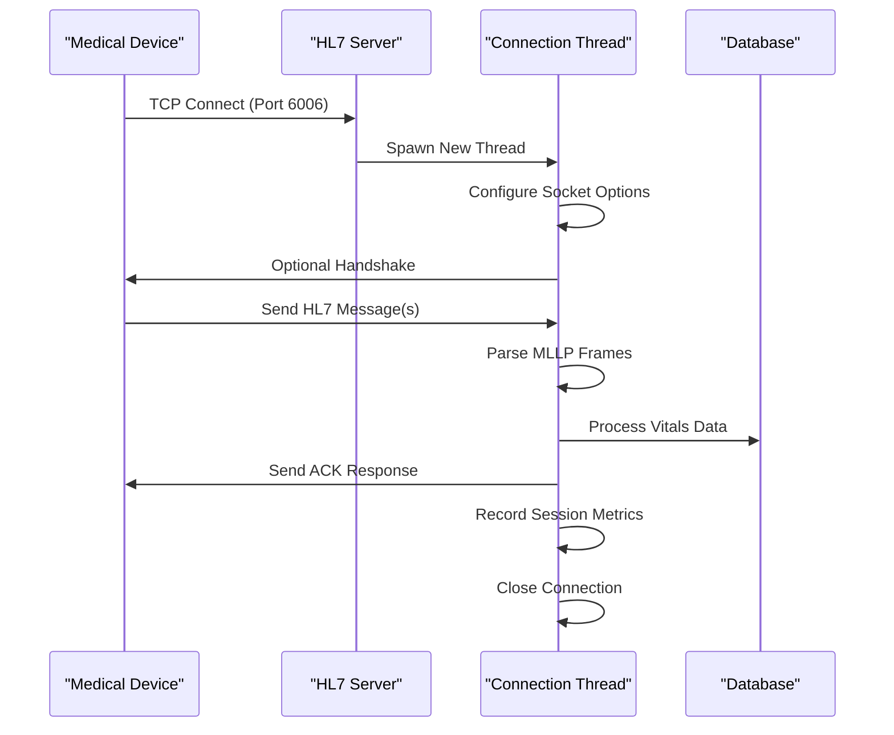
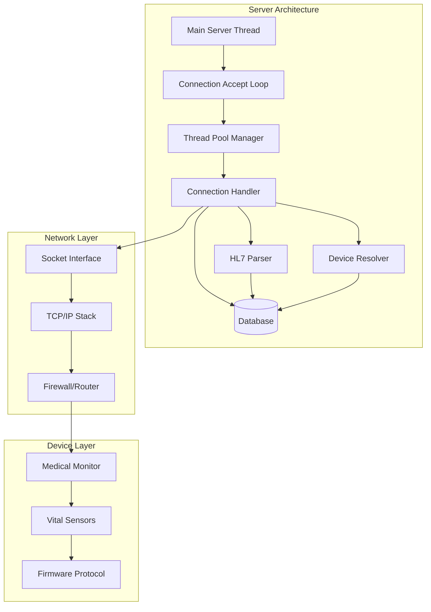
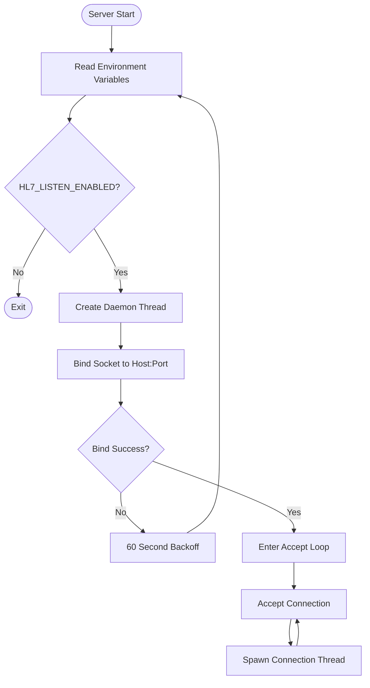
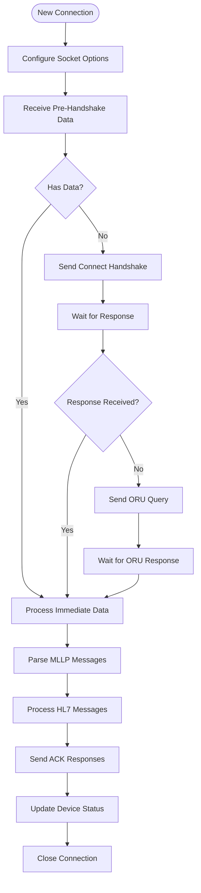
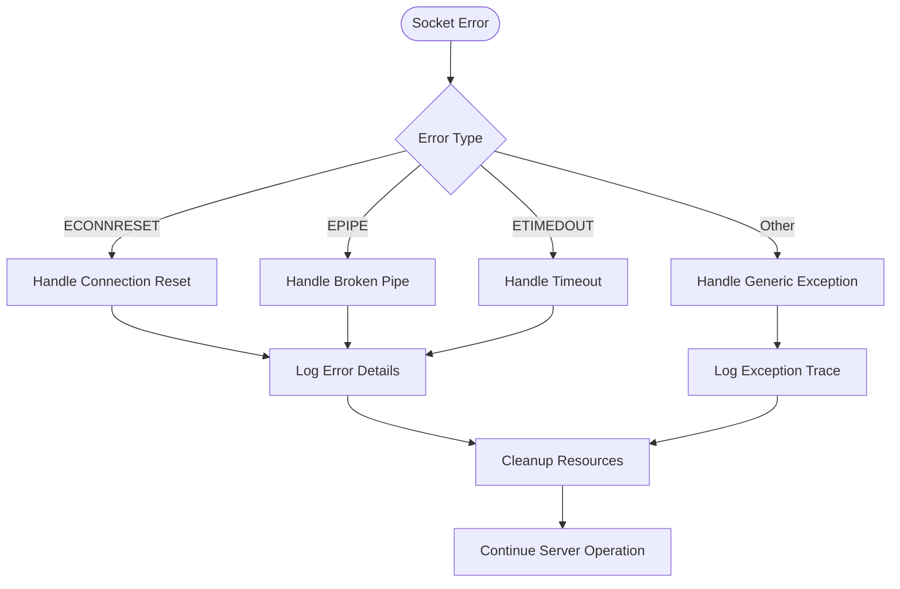
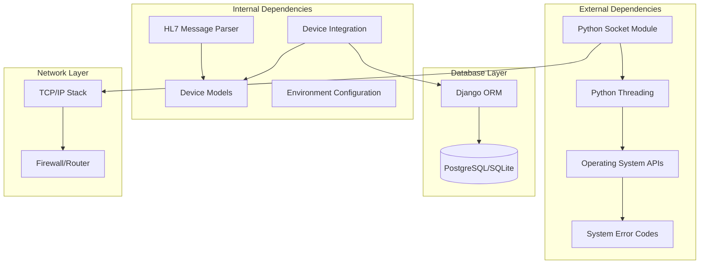

# TCP Socket Server Implementation

<cite>
**Referenced Files in This Document**
- [hl7_listener.py](file://backend/monitoring/hl7_listener.py)
- [models.py](file://backend/monitoring/models.py)
- [device_integration.py](file://backend/monitoring/device_integration.py)
- [views.py](file://backend/monitoring/views.py)
- [hl7_env.py](file://backend/monitoring/hl7_env.py)
- [settings.py](file://backend/medicentral/settings.py)
</cite>

## Table of Contents
1. [Introduction](#introduction)
2. [Project Structure](#project-structure)
3. [Core Components](#core-components)
4. [Architecture Overview](#architecture-overview)
5. [Detailed Component Analysis](#detailed-component-analysis)
6. [Dependency Analysis](#dependency-analysis)
7. [Performance Considerations](#performance-considerations)
8. [Troubleshooting Guide](#troubleshooting-guide)
9. [Conclusion](#conclusion)

## Introduction

The TCP socket server implementation handles medical device connections on port 6006 using the HL7 MLLP (Minimal Lower Layer Protocol). This system enables real-time monitoring of patient vitals from bedside monitors and other medical devices. The server operates as a dedicated daemon thread that accepts TCP connections, processes HL7 messages, and maintains device connectivity status.

The implementation includes sophisticated connection handling for various medical device firmware, automatic retry mechanisms for failed bindings, comprehensive error handling, and extensive diagnostic capabilities for troubleshooting network issues.

## Project Structure

The TCP socket server is implemented within the monitoring application of the Django backend. The key files involved in the implementation are:



**Diagram sources**
- [hl7_listener.py:1-755](file://backend/monitoring/hl7_listener.py#L1-L755)
- [device_integration.py:1-232](file://backend/monitoring/device_integration.py#L1-L232)
- [models.py:80-130](file://backend/monitoring/models.py#L80-L130)

**Section sources**
- [hl7_listener.py:1-755](file://backend/monitoring/hl7_listener.py#L1-L755)
- [models.py:80-130](file://backend/monitoring/models.py#L80-L130)

## Core Components

### HL7 MLLP TCP Server

The core server implementation provides a robust TCP listener that accepts connections from medical devices and processes HL7 messages. The server operates as a daemon thread with automatic restart capabilities.

Key features include:
- **Concurrent Connection Handling**: Each connection is processed in a separate daemon thread
- **Automatic Retry Logic**: Handles port binding failures with 60-second backoff
- **Socket Optimization**: Configures TCP_NODELAY and SO_KEEPALIVE for optimal performance
- **Device Discovery**: Automatic device resolution using IP address mapping
- **Diagnostic Tracking**: Comprehensive logging and monitoring of connection states

### Connection Management

The server implements sophisticated connection lifecycle management:



**Diagram sources**
- [hl7_listener.py:426-578](file://backend/monitoring/hl7_listener.py#L426-L578)
- [hl7_listener.py:635-684](file://backend/monitoring/hl7_listener.py#L635-L684)

### Socket Configuration and Optimization

The server applies critical socket optimizations for reliable medical device communication:

- **TCP_NODELAY**: Eliminates Nagle's algorithm delays for real-time vitals data
- **SO_KEEPALIVE**: Maintains connection health and detects dead connections
- **SO_REUSEADDR**: Enables immediate server restart without TIME_WAIT issues
- **Connection Timeouts**: Configurable receive timeouts for responsive operation

**Section sources**
- [hl7_listener.py:345-354](file://backend/monitoring/hl7_listener.py#L345-L354)
- [hl7_listener.py:638-641](file://backend/monitoring/hl7_listener.py#L638-L641)

## Architecture Overview

The TCP socket server follows a multi-threaded architecture designed for high reliability and concurrent device support:



**Diagram sources**
- [hl7_listener.py:635-684](file://backend/monitoring/hl7_listener.py#L635-L684)
- [hl7_listener.py:426-578](file://backend/monitoring/hl7_listener.py#L426-L578)

The architecture ensures that:
- **Scalability**: Multiple devices can connect simultaneously
- **Reliability**: Individual connection failures don't affect other connections
- **Real-time Processing**: Minimal latency for critical patient data
- **Resilience**: Automatic recovery from network interruptions

## Detailed Component Analysis

### Server Startup and Configuration

The server initialization process involves several critical steps:

1. **Environment Configuration**: Reads HL7_LISTEN_HOST, HL7_LISTEN_PORT, and HL7_LISTEN_ENABLED
2. **Thread Management**: Creates daemon thread for continuous operation
3. **Socket Setup**: Configures socket options and binds to interface
4. **Accept Loop**: Starts listening for incoming connections



**Diagram sources**
- [hl7_listener.py:738-754](file://backend/monitoring/hl7_listener.py#L738-L754)
- [hl7_listener.py:635-684](file://backend/monitoring/hl7_listener.py#L635-L684)

### Connection Acceptance Logic

The connection acceptance process handles various device firmware behaviors:



**Diagram sources**
- [hl7_listener.py:426-578](file://backend/monitoring/hl7_listener.py#L426-L578)
- [hl7_listener.py:187-234](file://backend/monitoring/hl7_listener.py#L187-L234)

### Thread Management for Concurrent Connections

The server employs a thread-per-connection model for handling multiple simultaneous device connections:

- **Daemon Threads**: Connection threads are daemon threads that terminate automatically
- **Thread Naming**: Each thread receives a descriptive name for debugging
- **Resource Isolation**: Each connection has its own socket and processing context
- **Memory Management**: Proper cleanup of thread resources upon completion

**Section sources**
- [hl7_listener.py:668-674](file://backend/monitoring/hl7_listener.py#L668-L674)
- [hl7_listener.py:426-578](file://backend/monitoring/hl7_listener.py#L426-L578)

### Socket Optimization Settings

The server applies critical socket optimizations for reliable medical device communication:

| Socket Option | Value | Purpose |
|---------------|-------|---------|
| TCP_NODELAY | 1 | Disable Nagle's algorithm for real-time data |
| SO_KEEPALIVE | 1 | Enable keepalive probes for connection health |
| SO_REUSEADDR | 1 | Allow immediate server restart |
| Receive Timeout | Configurable | Prevent indefinite blocking |

These optimizations ensure minimal latency for critical patient monitoring data while maintaining connection reliability.

**Section sources**
- [hl7_listener.py:345-354](file://backend/monitoring/hl7_listener.py#L345-L354)
- [hl7_listener.py:638-641](file://backend/monitoring/hl7_listener.py#L638-L641)

### Error Handling and Recovery

The server implements comprehensive error handling for various failure scenarios:



**Diagram sources**
- [hl7_listener.py:558-577](file://backend/monitoring/hl7_listener.py#L558-L577)

The error handling covers:
- **Connection Resets**: Graceful handling of abrupt device disconnections
- **Broken Pipes**: Recovery from write failures during ACK transmission
- **Network Timeouts**: Responsive handling of slow or unresponsive devices
- **Generic Exceptions**: Comprehensive logging for debugging unknown issues

**Section sources**
- [hl7_listener.py:558-577](file://backend/monitoring/hl7_listener.py#L558-L577)

### Connection Lifecycle Handling

The complete connection lifecycle includes multiple phases:

1. **Initial Acceptance**: Socket creation and basic configuration
2. **Device Identification**: IP-based device resolution and registration
3. **Protocol Negotiation**: Handshake and query exchange with device
4. **Data Processing**: HL7 message parsing and vitals extraction
5. **Response Generation**: ACK message creation and transmission
6. **Status Updates**: Device status and vitals data persistence
7. **Resource Cleanup**: Proper socket closure and memory release

**Section sources**
- [hl7_listener.py:426-578](file://backend/monitoring/hl7_listener.py#L426-L578)
- [device_integration.py:129-224](file://backend/monitoring/device_integration.py#L129-L224)

## Dependency Analysis

The TCP socket server has well-defined dependencies that support its functionality:



**Diagram sources**
- [hl7_listener.py:1-14](file://backend/monitoring/hl7_listener.py#L1-L14)
- [device_integration.py:1-19](file://backend/monitoring/device_integration.py#L1-L19)

The dependency analysis reveals:
- **Low Coupling**: Minimal inter-module dependencies
- **Clear Separation**: Network logic separated from business logic
- **Database Integration**: Clean ORM usage for device management
- **External API Boundaries**: Well-defined interfaces with system libraries

**Section sources**
- [hl7_listener.py:1-14](file://backend/monitoring/hl7_listener.py#L1-L14)
- [device_integration.py:1-19](file://backend/monitoring/device_integration.py#L1-L19)

## Performance Considerations

The TCP socket server is optimized for high-performance medical device monitoring:

### Memory Management
- **Buffer Management**: Efficient byte array usage for message parsing
- **Connection Pooling**: Thread-per-connection model prevents resource contention
- **Garbage Collection**: Minimal object creation during high-frequency data processing

### Network Optimization
- **TCP_NODELAY**: Eliminates buffering delays for real-time vitals
- **Keepalive Probes**: Detects dead connections quickly
- **Connection Limits**: Configurable backlog queue (32 connections)

### Scalability Features
- **Asynchronous Processing**: Non-blocking socket operations
- **Resource Cleanup**: Automatic thread termination and socket closure
- **Error Containment**: Individual connection failures don't affect others

## Troubleshooting Guide

### Common Connection Issues

**Issue**: Device cannot connect to port 6006
- **Check Firewall**: Verify port 6006 is open in cloud firewall/security group
- **Verify Server Status**: Use `/api/infrastructure` endpoint to check server status
- **Test Local Connection**: Use `telnet localhost 6006` to test local connectivity

**Issue**: Zero-byte connections (TCP established but no HL7 data)
- **Enable Handshake**: Set `HL7_SEND_CONNECT_HANDSHAKE=true` for devices requiring handshake
- **Adjust Timing**: Modify `HL7_RECV_BEFORE_HANDSHAKE_MS` (default 300ms)
- **Check Device Settings**: Verify monitor's HL7 configuration is enabled

**Issue**: Frequent connection resets
- **Network Stability**: Check for intermittent network connectivity
- **Firewall Interference**: Review firewall rules that might reset connections
- **Device Firmware**: Some devices require specific handshake sequences

### Diagnostic Commands

```bash
# Check server status
curl http://localhost:8000/api/infrastructure

# Test local port availability
nc -zv 127.0.0.1 6006

# Monitor server logs
journalctl -u daphne -f

# Check environment variables
env | grep HL7_
```

### Configuration Examples

**Basic Configuration**:
```bash
export HL7_LISTEN_HOST=0.0.0.0
export HL7_LISTEN_PORT=6006
export HL7_LISTEN_ENABLED=true
```

**Advanced Configuration**:
```bash
export HL7_RECV_TIMEOUT_SEC=30
export HL7_SEND_CONNECT_HANDSHAKE=true
export HL7_RECV_BEFORE_HANDSHAKE_MS=500
export HL7_SEND_ACK=true
```

**Monitoring Configuration**:
```bash
export HL7_DEBUG=true
export HL7_LOG_RAW_TCP_RECV=true
export HL7_LOG_FIRST_RECV_HEX=true
```

**Section sources**
- [views.py:266-305](file://backend/monitoring/views.py#L266-L305)
- [hl7_env.py:1-33](file://backend/monitoring/hl7_env.py#L1-L33)

## Conclusion

The TCP socket server implementation provides a robust, production-ready solution for medical device monitoring. Key strengths include:

- **Reliability**: Comprehensive error handling and automatic recovery mechanisms
- **Performance**: Optimized socket configurations for real-time vitals processing
- **Flexibility**: Support for diverse medical device firmware and protocols
- **Maintainability**: Clean architecture with clear separation of concerns
- **Observability**: Extensive logging and diagnostic capabilities

The implementation successfully addresses the critical requirements of healthcare monitoring systems, providing reliable data acquisition from bedside monitors while maintaining system stability and performance. The modular design allows for easy extension and customization for different device types and network environments.