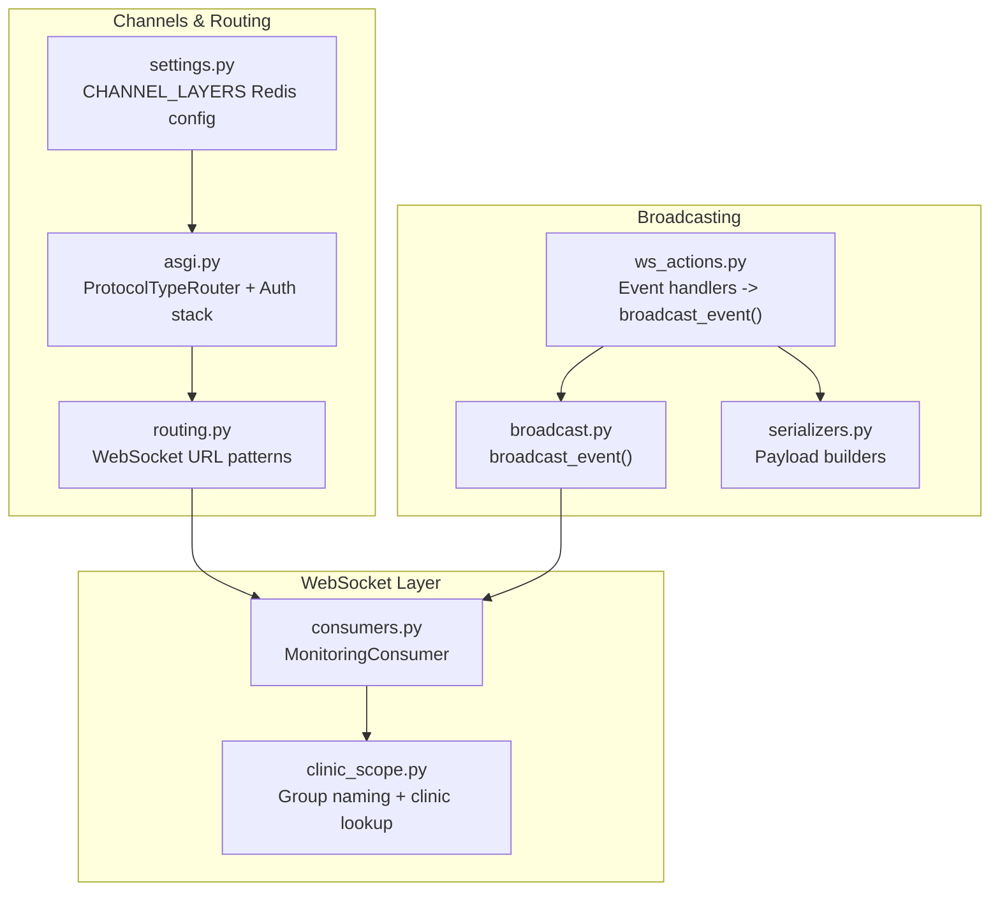
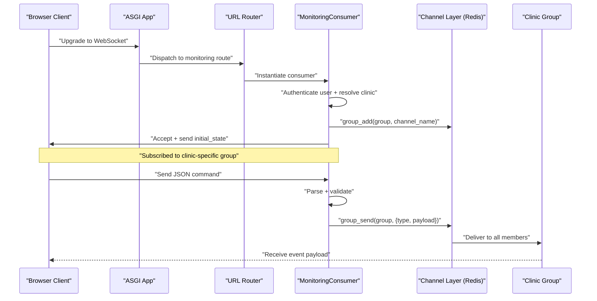
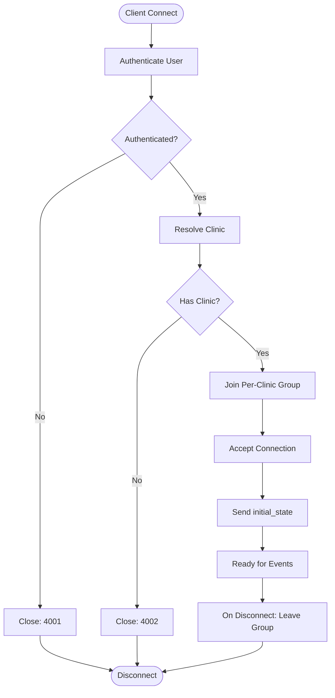
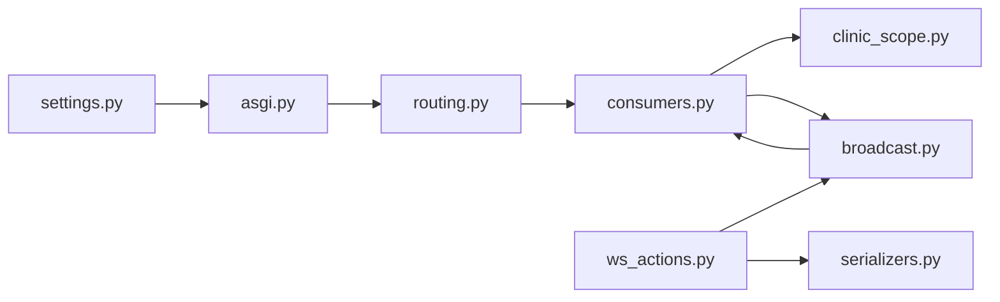

# Broadcasting System Architecture

<cite>
**Referenced Files in This Document**
- [settings.py](file://backend/medicentral/settings.py)
- [asgi.py](file://backend/medicentral/asgi.py)
- [routing.py](file://backend/monitoring/routing.py)
- [broadcast.py](file://backend/monitoring/broadcast.py)
- [consumers.py](file://backend/monitoring/consumers.py)
- [clinic_scope.py](file://backend/monitoring/clinic_scope.py)
- [ws_actions.py](file://backend/monitoring/ws_actions.py)
- [serializers.py](file://backend/monitoring/serializers.py)
</cite>

## Table of Contents
1. [Introduction](#introduction)
2. [Project Structure](#project-structure)
3. [Core Components](#core-components)
4. [Architecture Overview](#architecture-overview)
5. [Detailed Component Analysis](#detailed-component-analysis)
6. [Dependency Analysis](#dependency-analysis)
7. [Performance Considerations](#performance-considerations)
8. [Troubleshooting Guide](#troubleshooting-guide)
9. [Conclusion](#conclusion)

## Introduction
This document explains the event broadcasting system built on Redis pub/sub via Django Channels. It covers how real-time updates are distributed to WebSocket clients per clinic group, the payload structure and serialization, delivery guarantees, and integration with the Channels Redis backend. It also includes performance and scaling considerations, connection pooling, and fault tolerance strategies.

## Project Structure
The broadcasting system spans a small set of focused modules:
- Channel layer configuration and ASGI wiring
- WebSocket consumer and routing
- Group naming and clinic scoping
- Broadcast dispatcher
- Event handlers that emit broadcasts
- Serialization utilities for event payloads

**Diagram sources**
- [settings.py:170-183](file://backend/medicentral/settings.py#L170-L183)
- [asgi.py:12-21](file://backend/medicentral/asgi.py#L12-L21)
- [routing.py:5-7](file://backend/monitoring/routing.py#L5-L7)
- [consumers.py:12-36](file://backend/monitoring/consumers.py#L12-L36)
- [clinic_scope.py:11-23](file://backend/monitoring/clinic_scope.py#L11-L23)
- [broadcast.py:10-19](file://backend/monitoring/broadcast.py#L10-L19)
- [ws_actions.py:32-228](file://backend/monitoring/ws_actions.py#L32-L228)
- [serializers.py:13-97](file://backend/monitoring/serializers.py#L13-L97)

**Section sources**
- [settings.py:170-183](file://backend/medicentral/settings.py#L170-L183)
- [asgi.py:12-21](file://backend/medicentral/asgi.py#L12-L21)
- [routing.py:5-7](file://backend/monitoring/routing.py#L5-L7)
- [consumers.py:12-36](file://backend/monitoring/consumers.py#L12-L36)
- [clinic_scope.py:11-23](file://backend/monitoring/clinic_scope.py#L11-L23)
- [broadcast.py:10-19](file://backend/monitoring/broadcast.py#L10-L19)
- [ws_actions.py:32-228](file://backend/monitoring/ws_actions.py#L32-L228)
- [serializers.py:13-97](file://backend/monitoring/serializers.py#L13-L97)

## Core Components
- Channel layer configuration: Redis-backed Channels layer configured via environment variable.
- ASGI application: Wires HTTP and WebSocket protocols, applying authentication and origin validation.
- WebSocket routing: Exposes a single WebSocket endpoint for monitoring.
- Consumer: Authenticates users, scopes to clinic, joins a per-clinic group, sends initial state, and relays broadcast payloads.
- Broadcast dispatcher: Sends JSON payloads to a per-clinic group via Channels.
- Event handlers: Parse incoming WebSocket messages and emit appropriate broadcasts.
- Payload serializers: Build normalized event payloads and initial state snapshots.

**Section sources**
- [settings.py:170-183](file://backend/medicentral/settings.py#L170-L183)
- [asgi.py:12-21](file://backend/medicentral/asgi.py#L12-L21)
- [routing.py:5-7](file://backend/monitoring/routing.py#L5-L7)
- [consumers.py:12-36](file://backend/monitoring/consumers.py#L12-L36)
- [broadcast.py:10-19](file://backend/monitoring/broadcast.py#L10-L19)
- [ws_actions.py:32-228](file://backend/monitoring/ws_actions.py#L32-L228)
- [serializers.py:13-97](file://backend/monitoring/serializers.py#L13-L97)

## Architecture Overview
The system uses Django Channels with a Redis-backed channel layer. Each authenticated user connects to a WebSocket endpoint and is joined to a group named after their clinic. Outbound events are published to that group, and Channels delivers them to all connected WebSocket connections in that group.

**Diagram sources**
- [asgi.py:12-21](file://backend/medicentral/asgi.py#L12-L21)
- [routing.py:5-7](file://backend/monitoring/routing.py#L5-L7)
- [consumers.py:12-36](file://backend/monitoring/consumers.py#L12-L36)
- [broadcast.py:10-19](file://backend/monitoring/broadcast.py#L10-L19)

## Detailed Component Analysis

### Channel Layer and Redis Backend
- Redis URL is read from an environment variable and passed to the Channels Redis backend.
- If no Redis URL is present, an in-memory channel layer is used for development.

Key behaviors:
- Single host configuration for the Redis backend.
- No explicit connection pool configuration is set in code; defaults apply.

Operational implications:
- Production deployments should set REDIS_URL to enable durable pub/sub across workers/processes.
- In-memory fallback disables cross-instance broadcasting.

**Section sources**
- [settings.py:170-183](file://backend/medicentral/settings.py#L170-L183)

### ASGI Application and Routing
- ProtocolTypeRouter handles HTTP and WebSocket protocols.
- WebSocket protocol is wrapped with origin validation and authentication middleware.
- URL router binds the monitoring WebSocket endpoint to the consumer.

**Section sources**
- [asgi.py:12-21](file://backend/medicentral/asgi.py#L12-L21)
- [routing.py:5-7](file://backend/monitoring/routing.py#L5-L7)

### WebSocket Consumer and Group Management
- On connect:
  - Validates authentication.
  - Resolves the user’s clinic and constructs a group name.
  - Joins the per-clinic group and accepts the connection.
  - Sends an initial snapshot of all patients for the clinic.
- On message:
  - Parses JSON and delegates to a handler that may trigger a broadcast.
- On disconnect:
  - Removes the channel from the group.

Delivery semantics:
- Uses Channels group_send, which is designed for fan-out delivery to all group members.

**Section sources**
- [consumers.py:12-36](file://backend/monitoring/consumers.py#L12-L36)

### Group Naming and Clinic Scoping
- Group names are derived from the clinic identifier.
- Clinic resolution is performed per-user to ensure isolation between clinics.

**Section sources**
- [clinic_scope.py:11-23](file://backend/monitoring/clinic_scope.py#L11-L23)

### Broadcast Dispatcher
- Accepts a JSON payload and a clinic identifier.
- Resolves the group name and dispatches a message to the group.
- Uses an async-to-sync bridge to call the Channels layer.

**Section sources**
- [broadcast.py:10-19](file://backend/monitoring/broadcast.py#L10-L19)

### Event Handlers and Payload Construction
Handlers react to client actions and emit broadcasts. Examples include:
- Toggling a patient pin
- Adding a clinical note
- Acknowledging/clearing alarms
- Updating schedules
- Discharging or admitting a patient

Each handler:
- Validates the action and patient ownership within the clinic.
- Persists changes atomically.
- Builds a normalized event payload (often containing a type and serialized data).
- Calls the broadcast dispatcher with the clinic identifier.

Payload normalization:
- Patient data is serialized using a dedicated serializer that includes vitals, alarms, scheduled checks, history, and ancillary data.

**Section sources**
- [ws_actions.py:32-228](file://backend/monitoring/ws_actions.py#L32-L228)
- [serializers.py:13-97](file://backend/monitoring/serializers.py#L13-L97)

### Event Payload Structure and Message Formats
Common event types emitted by the system:
- patient_refresh: Indicates a patient record change requiring UI refresh.
- initial_state: Full snapshot of all patients for the clinic.
- patient_discharged: Indicates a patient was discharged.
- patient_admitted: Indicates a new patient was admitted.

Payload composition:
- Each event carries a type field and a payload body.
- Payload bodies are constructed using serializers to ensure consistent shapes.

Delivery guarantees:
- Channels group_send delivers to all group members synchronously from the perspective of the sender.
- Across process boundaries, Redis pub/sub ensures delivery to all subscribed instances.

**Section sources**
- [ws_actions.py:43-46](file://backend/monitoring/ws_actions.py#L43-L46)
- [ws_actions.py:63-66](file://backend/monitoring/ws_actions.py#L63-L66)
- [ws_actions.py:120-126](file://backend/monitoring/ws_actions.py#L120-L126)
- [ws_actions.py:172-175](file://backend/monitoring/ws_actions.py#L172-L175)
- [ws_actions.py:222-225](file://backend/monitoring/ws_actions.py#L222-L225)
- [serializers.py:13-97](file://backend/monitoring/serializers.py#L13-L97)

### Subscriber Management Flow

**Diagram sources**
- [consumers.py:12-36](file://backend/monitoring/consumers.py#L12-L36)

## Dependency Analysis

**Diagram sources**
- [settings.py:170-183](file://backend/medicentral/settings.py#L170-L183)
- [asgi.py:12-21](file://backend/medicentral/asgi.py#L12-L21)
- [routing.py:5-7](file://backend/monitoring/routing.py#L5-L7)
- [consumers.py:12-36](file://backend/monitoring/consumers.py#L12-L36)
- [clinic_scope.py:11-23](file://backend/monitoring/clinic_scope.py#L11-L23)
- [broadcast.py:10-19](file://backend/monitoring/broadcast.py#L10-L19)
- [ws_actions.py:32-228](file://backend/monitoring/ws_actions.py#L32-L228)
- [serializers.py:13-97](file://backend/monitoring/serializers.py#L13-L97)

**Section sources**
- [settings.py:170-183](file://backend/medicentral/settings.py#L170-L183)
- [asgi.py:12-21](file://backend/medicentral/asgi.py#L12-L21)
- [routing.py:5-7](file://backend/monitoring/routing.py#L5-L7)
- [consumers.py:12-36](file://backend/monitoring/consumers.py#L12-L36)
- [clinic_scope.py:11-23](file://backend/monitoring/clinic_scope.py#L11-L23)
- [broadcast.py:10-19](file://backend/monitoring/broadcast.py#L10-L19)
- [ws_actions.py:32-228](file://backend/monitoring/ws_actions.py#L32-L228)
- [serializers.py:13-97](file://backend/monitoring/serializers.py#L13-L97)

## Performance Considerations
- High-frequency streams:
  - Batch or throttle frequent updates (e.g., vitals) at the producer level to avoid flooding the channel layer.
  - Use scheduled checks to limit update frequency per patient.
- Memory management:
  - Avoid retaining large historical buffers in memory; the serializer already caps history length.
  - Prefer streaming or paginated snapshots for very large clinics.
- Redis backend:
  - Ensure a dedicated Redis instance with adequate memory and persistence settings.
  - Monitor channel layer metrics exposed by Channels to detect backpressure.
- Connection pooling:
  - The Channels Redis backend uses aioredis; configure connection pools via environment variables if needed.
  - Keep worker counts balanced with available Redis connections.
- Fan-out costs:
  - Group sizes directly impact delivery overhead; monitor per-clinic group sizes.
  - Consider partitioning by region or floor within a clinic if groups grow large.

[No sources needed since this section provides general guidance]

## Troubleshooting Guide
- No Redis configured:
  - Symptom: Broadcasts do not reach other workers/processes.
  - Resolution: Set REDIS_URL to a valid Redis endpoint.
- Authentication failures:
  - Symptom: Connections close immediately with a 4001 code.
  - Resolution: Ensure the user is authenticated and session cookies are accepted.
- No clinic resolved:
  - Symptom: Connections close with a 4002 code.
  - Resolution: Verify user profile includes a clinic assignment or that the user is a superuser.
- Payload parsing errors:
  - Symptom: Incoming messages ignored.
  - Resolution: Ensure JSON payloads conform to expected shape and include required fields.
- Delivery gaps:
  - Symptom: Clients miss events.
  - Resolution: Confirm the client remains connected and in the correct group; check for network interruptions or reconnection logic.

**Section sources**
- [settings.py:170-183](file://backend/medicentral/settings.py#L170-L183)
- [consumers.py:12-36](file://backend/monitoring/consumers.py#L12-L36)
- [broadcast.py:10-19](file://backend/monitoring/broadcast.py#L10-L19)

## Conclusion
The system leverages Django Channels with a Redis backend to deliver real-time updates to WebSocket clients scoped by clinic. The group-based routing ensures isolation and efficient fan-out. Event payloads are normalized via serializers, and handlers emit targeted broadcasts upon state changes. For production, ensure Redis-backed channel layers, monitor group sizes, and tune update frequencies to maintain responsiveness and throughput.