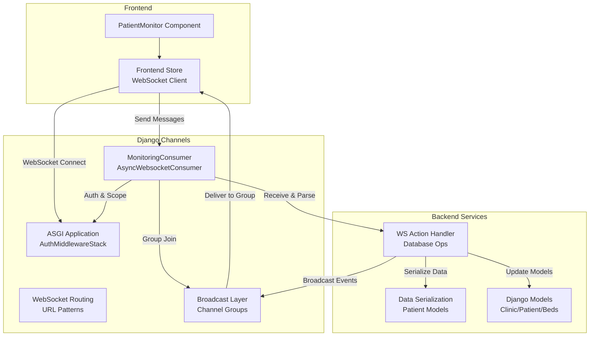
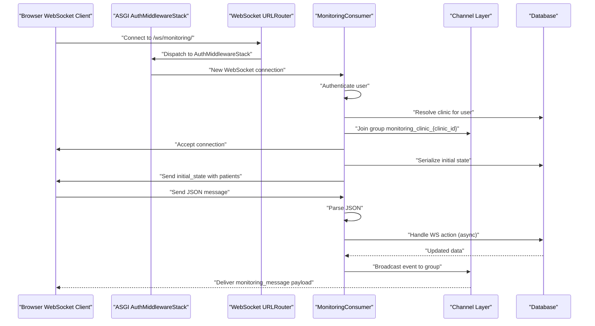
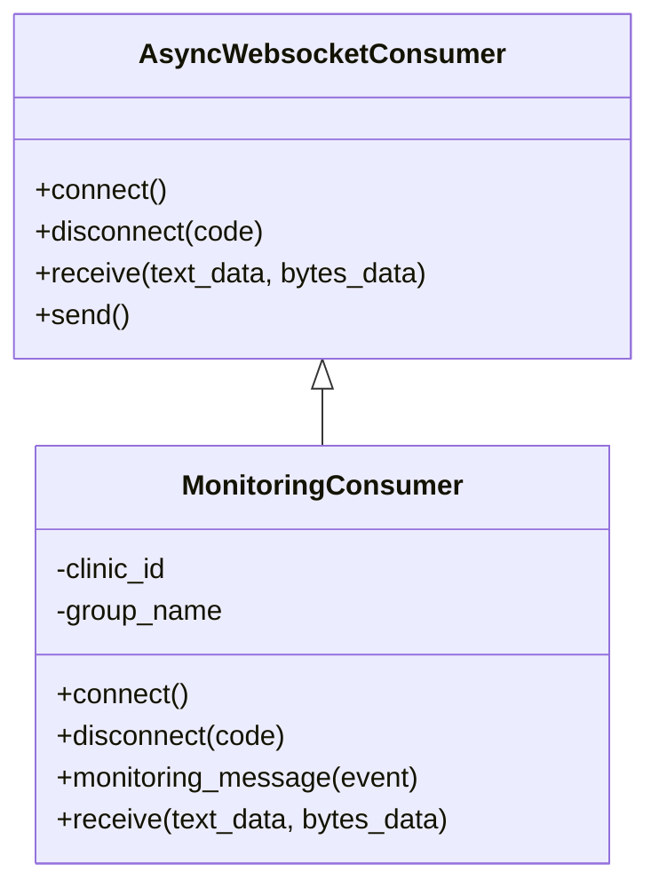
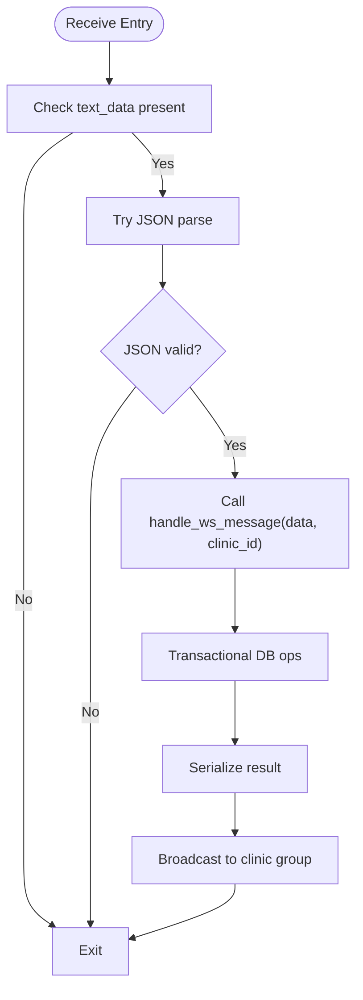
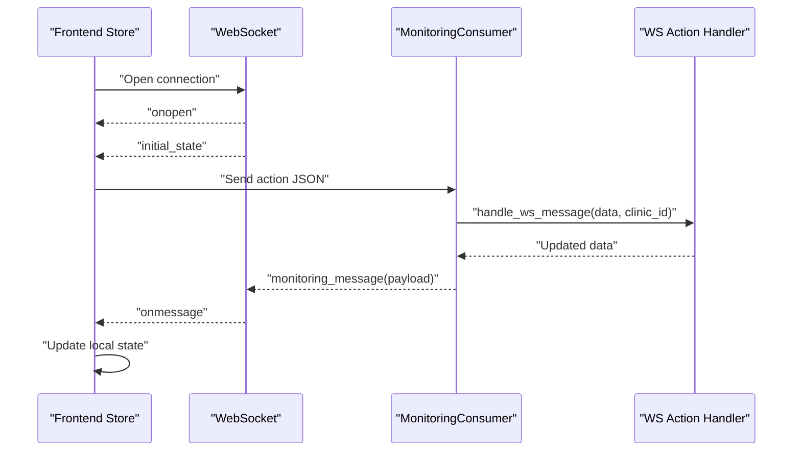
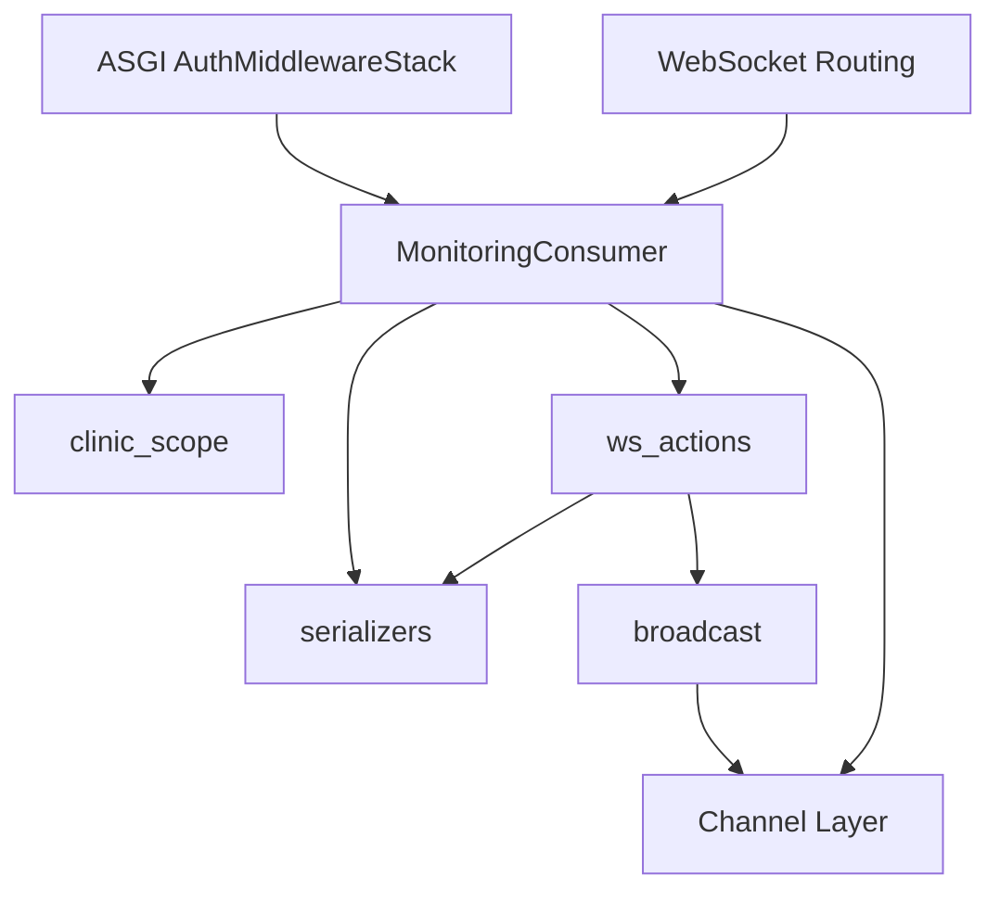

# WebSocket Consumer Implementation

<cite>
**Referenced Files in This Document**
- [consumers.py](file://backend/monitoring/consumers.py)
- [routing.py](file://backend/monitoring/routing.py)
- [broadcast.py](file://backend/monitoring/broadcast.py)
- [clinic_scope.py](file://backend/monitoring/clinic_scope.py)
- [ws_actions.py](file://backend/monitoring/ws_actions.py)
- [models.py](file://backend/monitoring/models.py)
- [serializers.py](file://backend/monitoring/serializers.py)
- [asgi.py](file://backend/medicentral/asgi.py)
- [settings.py](file://backend/medicentral/settings.py)
- [store.ts](file://frontend/src/store.ts)
- [PatientMonitor.tsx](file://frontend/src/components/PatientMonitor.tsx)
</cite>

## Table of Contents
1. [Introduction](#introduction)
2. [Project Structure](#project-structure)
3. [Core Components](#core-components)
4. [Architecture Overview](#architecture-overview)
5. [Detailed Component Analysis](#detailed-component-analysis)
6. [Dependency Analysis](#dependency-analysis)
7. [Performance Considerations](#performance-considerations)
8. [Troubleshooting Guide](#troubleshooting-guide)
9. [Conclusion](#conclusion)

## Introduction
This document provides comprehensive technical documentation for the WebSocket consumer implementation using Django Channels in the monitoring system. It focuses on the MonitoringConsumer class, covering connection handling, authentication verification, clinic-based group management, message processing, and broadcasting mechanisms. It also includes practical examples of WebSocket message formats, connection lifecycle events, and error handling patterns, along with authentication requirements, session validation, and anonymous user handling.

## Project Structure
The WebSocket implementation spans several modules within the monitoring app and integrates with Django Channels and the frontend store:

- Backend WebSocket consumer and routing: monitoring/consumers.py, monitoring/routing.py
- Authentication and middleware stack: medicentral/asgi.py, medicentral/settings.py
- Broadcasting and group management: monitoring/broadcast.py, monitoring/clinic_scope.py
- Message handling and database operations: monitoring/ws_actions.py
- Data models and serialization: monitoring/models.py, monitoring/serializers.py
- Frontend WebSocket client and message handling: frontend/src/store.ts, frontend/src/components/PatientMonitor.tsx

**Diagram sources**
- [asgi.py:14-21](file://backend/medicentral/asgi.py#L14-L21)
- [routing.py:5-7](file://backend/monitoring/routing.py#L5-L7)
- [consumers.py:12-46](file://backend/monitoring/consumers.py#L12-L46)
- [broadcast.py:10-19](file://backend/monitoring/broadcast.py#L10-L19)
- [ws_actions.py:31-229](file://backend/monitoring/ws_actions.py#L31-L229)
- [serializers.py:13-97](file://backend/monitoring/serializers.py#L13-L97)
- [models.py:5-224](file://backend/monitoring/models.py#L5-L224)
- [store.ts:219-352](file://frontend/src/store.ts#L219-L352)

**Section sources**
- [asgi.py:14-21](file://backend/medicentral/asgi.py#L14-L21)
- [routing.py:5-7](file://backend/monitoring/routing.py#L5-L7)

## Core Components
This section outlines the primary components involved in the WebSocket consumer implementation and their responsibilities.

- MonitoringConsumer: Asynchronous WebSocket consumer handling connections, authentication, group subscriptions, message parsing, and broadcasting.
- ASGI Application: Configures authentication middleware and WebSocket routing.
- WebSocket Routing: Maps WebSocket URLs to the MonitoringConsumer.
- Broadcast Layer: Manages per-clinic channel groups and event delivery.
- WS Action Handler: Processes incoming messages, performs database operations, and triggers broadcasts.
- Data Serialization: Converts model instances to JSON for initial state and updates.
- Frontend Store: Establishes WebSocket connections, parses incoming messages, and manages UI state.

Key implementation references:
- MonitoringConsumer.connect(): Authentication, clinic scope resolution, group subscription, initial state delivery.
- MonitoringConsumer.disconnect(): Cleanup of channel group membership.
- MonitoringConsumer.receive(): JSON parsing and delegation to WS action handler.
- MonitoringConsumer.monitoring_message(): Handler for broadcast events.
- Broadcast mechanism: Per-clinic group names and group_send invocation.
- WS actions: Transactional operations and targeted broadcasts.

**Section sources**
- [consumers.py:12-46](file://backend/monitoring/consumers.py#L12-L46)
- [broadcast.py:10-19](file://backend/monitoring/broadcast.py#L10-L19)
- [ws_actions.py:31-229](file://backend/monitoring/ws_actions.py#L31-L229)
- [serializers.py:13-97](file://backend/monitoring/serializers.py#L13-L97)
- [clinic_scope.py:11-23](file://backend/monitoring/clinic_scope.py#L11-L23)
- [asgi.py:14-21](file://backend/medicentral/asgi.py#L14-L21)
- [routing.py:5-7](file://backend/monitoring/routing.py#L5-L7)

## Architecture Overview
The WebSocket architecture follows a strict clinic-scoped pattern:
- Authentication middleware ensures sessions are valid before WebSocket acceptance.
- Each authenticated user is associated with a clinic via profile or superuser fallback.
- Channel groups are named per clinic to isolate traffic.
- Consumers accept connections, join the appropriate group, send initial state, and process messages asynchronously.
- Broadcast events target the clinic-specific group, ensuring clients receive only relevant updates.

**Diagram sources**
- [asgi.py:17-18](file://backend/medicentral/asgi.py#L17-L18)
- [routing.py:5-7](file://backend/monitoring/routing.py#L5-L7)
- [consumers.py:13-29](file://backend/monitoring/consumers.py#L13-L29)
- [broadcast.py:10-19](file://backend/monitoring/broadcast.py#L10-L19)
- [ws_actions.py:31-229](file://backend/monitoring/ws_actions.py#L31-L229)

## Detailed Component Analysis

### MonitoringConsumer Class
The MonitoringConsumer extends AsyncWebsocketConsumer and implements the core WebSocket lifecycle and message handling.

- connect():
  - Validates user authentication and clinic association.
  - Creates a clinic-scoped group name and joins the channel group.
  - Sends initial state containing serialized patient data.
  - Closes connection with explicit codes for authentication failures.

- disconnect():
  - Leaves the clinic group if previously joined.

- monitoring_message():
  - Receives broadcast events and forwards them to the client as JSON.

- receive():
  - Parses incoming text as JSON.
  - Delegates to the WS action handler with clinic context.
  - Handles malformed JSON gracefully.

**Diagram sources**
- [consumers.py:12-46](file://backend/monitoring/consumers.py#L12-L46)

**Section sources**
- [consumers.py:13-29](file://backend/monitoring/consumers.py#L13-L29)
- [consumers.py:31-36](file://backend/monitoring/consumers.py#L31-L36)
- [consumers.py:38-46](file://backend/monitoring/consumers.py#L38-L46)

### Authentication and Middleware Stack
Authentication is enforced through Django Channels' AuthMiddlewareStack integrated into the ASGI application. The WebSocket route is wrapped with AllowedHostsOriginValidator and AuthMiddlewareStack, ensuring that only authenticated sessions can establish WebSocket connections.

- ASGI configuration:
  - ProtocolTypeRouter routes WebSocket traffic through AuthMiddlewareStack.
  - AuthMiddlewareStack attaches the authenticated user to the scope.
  - WebSocket routing directs to MonitoringConsumer.

- Settings impact:
  - Session-based authentication is enabled via Django middleware.
  - Channel layers are configured for Redis or in-memory depending on environment.

**Section sources**
- [asgi.py:14-21](file://backend/medicentral/asgi.py#L14-L21)
- [settings.py:68-78](file://backend/medicentral/settings.py#L68-L78)
- [settings.py:170-183](file://backend/medicentral/settings.py#L170-L183)

### Clinic-Based Group Management
Each clinic maintains its own channel group to ensure isolation of monitoring data. The group naming convention and membership management are handled centrally.

- Group naming:
  - clinic_id is used to construct the group name.
  - broadcast module resolves the group name for a given clinic.

- Membership:
  - Consumer joins the group upon successful connection.
  - Consumer leaves the group during disconnect.

- Broadcast:
  - broadcast_event sends payloads to the clinic-specific group.
  - Uses async_to_sync to bridge sync channel layer operations.

**Section sources**
- [clinic_scope.py:11-12](file://backend/monitoring/clinic_scope.py#L11-L12)
- [consumers.py:22-25](file://backend/monitoring/consumers.py#L22-L25)
- [consumers.py:32-33](file://backend/monitoring/consumers.py#L32-L33)
- [broadcast.py:10-19](file://backend/monitoring/broadcast.py#L10-L19)

### Message Parsing and WS Action Handling
Incoming WebSocket messages are parsed and processed by the WS action handler, which performs database operations and triggers broadcasts.

- Receive flow:
  - Validates presence of text_data.
  - Attempts JSON decode; malformed messages are ignored.
  - Calls handle_ws_message with parsed data and clinic context.

- WS action handler:
  - Performs transactional operations for various actions (toggle pin, add note, acknowledge/clear alarms, set schedules, update limits, measure NIBP, admit/discharge patients).
  - Serializes affected data and broadcasts updates to the clinic group.

**Diagram sources**
- [consumers.py:38-46](file://backend/monitoring/consumers.py#L38-L46)
- [ws_actions.py:31-229](file://backend/monitoring/ws_actions.py#L31-L229)
- [serializers.py:13-97](file://backend/monitoring/serializers.py#L13-L97)
- [broadcast.py:10-19](file://backend/monitoring/broadcast.py#L10-L19)

**Section sources**
- [consumers.py:38-46](file://backend/monitoring/consumers.py#L38-L46)
- [ws_actions.py:31-229](file://backend/monitoring/ws_actions.py#L31-L229)

### Frontend WebSocket Client Integration
The frontend establishes and manages the WebSocket connection, handles incoming messages, and dispatches actions to the backend.

- Connection lifecycle:
  - Creates WebSocket to the monitoring endpoint.
  - Handles onopen, onmessage, onerror, and onclose events.
  - Implements automatic reconnection with exponential backoff-like delay.

- Message handling:
  - Parses incoming JSON messages.
  - Updates local state for initial_state, patient_refresh, vitals_update, patient_admitted, and patient_discharged.
  - Dispatches actions to the backend via WebSocket.

- Action dispatch:
  - Toggles pin, adds notes, acknowledges/clears alarms, sets schedules, updates limits, measures NIBP, admits/discharges patients.
  - Sends structured JSON payloads with action identifiers and parameters.

**Diagram sources**
- [store.ts:219-352](file://frontend/src/store.ts#L219-L352)
- [consumers.py:35-36](file://backend/monitoring/consumers.py#L35-L36)
- [ws_actions.py:31-229](file://backend/monitoring/ws_actions.py#L31-L229)

**Section sources**
- [store.ts:137-141](file://frontend/src/store.ts#L137-L141)
- [store.ts:187-217](file://frontend/src/store.ts#L187-L217)
- [store.ts:219-352](file://frontend/src/store.ts#L219-L352)
- [PatientMonitor.tsx:1-372](file://frontend/src/components/PatientMonitor.tsx#L1-L372)

## Dependency Analysis
The WebSocket consumer implementation exhibits clear separation of concerns and minimal coupling:

- MonitoringConsumer depends on:
  - Authentication middleware (via ASGI scope).
  - clinic_scope for clinic resolution.
  - serializers for initial state serialization.
  - ws_actions for message processing.
  - channel layer for group operations.

- Broadcast layer depends on:
  - clinic_scope for group naming.
  - channel layer for group_send.

- WS action handler depends on:
  - models for data access and updates.
  - serializers for response serialization.
  - broadcast for event propagation.

**Diagram sources**
- [consumers.py:7-9](file://backend/monitoring/consumers.py#L7-L9)
- [clinic_scope.py:11-23](file://backend/monitoring/clinic_scope.py#L11-L23)
- [serializers.py:13-97](file://backend/monitoring/serializers.py#L13-L97)
- [ws_actions.py:12-15](file://backend/monitoring/ws_actions.py#L12-L15)
- [broadcast.py:7-19](file://backend/monitoring/broadcast.py#L7-L19)

**Section sources**
- [consumers.py:7-9](file://backend/monitoring/consumers.py#L7-L9)
- [ws_actions.py:12-15](file://backend/monitoring/ws_actions.py#L12-L15)
- [broadcast.py:10-19](file://backend/monitoring/broadcast.py#L10-L19)

## Performance Considerations
- Asynchronous database operations: database_sync_to_async is used to avoid blocking the event loop during authentication and serialization steps.
- Transactional WS actions: atomic operations prevent partial updates and ensure consistency.
- Efficient broadcasting: per-clinic groups minimize unnecessary fan-out and reduce memory overhead.
- Frontend reconnection: automatic reconnection reduces downtime and improves resilience.
- JSON parsing: early exit on malformed JSON prevents unnecessary processing.

[No sources needed since this section provides general guidance]

## Troubleshooting Guide
Common issues and resolutions:

- Authentication failures:
  - Symptom: Connection closes immediately with code 4001.
  - Cause: Anonymous user or unauthenticated session.
  - Resolution: Ensure the user is logged in and session is valid.

- Clinic scope errors:
  - Symptom: Connection closes with code 4002.
  - Cause: User lacks clinic association.
  - Resolution: Verify user profile has a clinic or that the user is a superuser.

- JSON parsing errors:
  - Symptom: Messages ignored without error.
  - Cause: Malformed JSON payload.
  - Resolution: Validate client-side JSON structure before sending.

- Group membership cleanup:
  - Symptom: Stale subscriptions after disconnect.
  - Cause: Missing cleanup in disconnect handler.
  - Resolution: Ensure group_discard is called in disconnect.

- Broadcast delivery:
  - Symptom: Clients not receiving updates.
  - Cause: Incorrect group name or channel layer misconfiguration.
  - Resolution: Verify clinic_id and channel layer settings.

**Section sources**
- [consumers.py:15-21](file://backend/monitoring/consumers.py#L15-L21)
- [consumers.py:31-33](file://backend/monitoring/consumers.py#L31-L33)
- [consumers.py:42-44](file://backend/monitoring/consumers.py#L42-L44)
- [broadcast.py:10-19](file://backend/monitoring/broadcast.py#L10-L19)

## Conclusion
The WebSocket consumer implementation leverages Django Channels to provide a secure, clinic-scoped real-time monitoring platform. Authentication is enforced at the ASGI level, connections are validated and scoped to clinics, and messages are processed asynchronously with transactional guarantees. The frontend integrates seamlessly with the backend through structured JSON protocols and robust reconnection logic. This design ensures scalability, maintainability, and clear separation of concerns across the WebSocket pipeline.