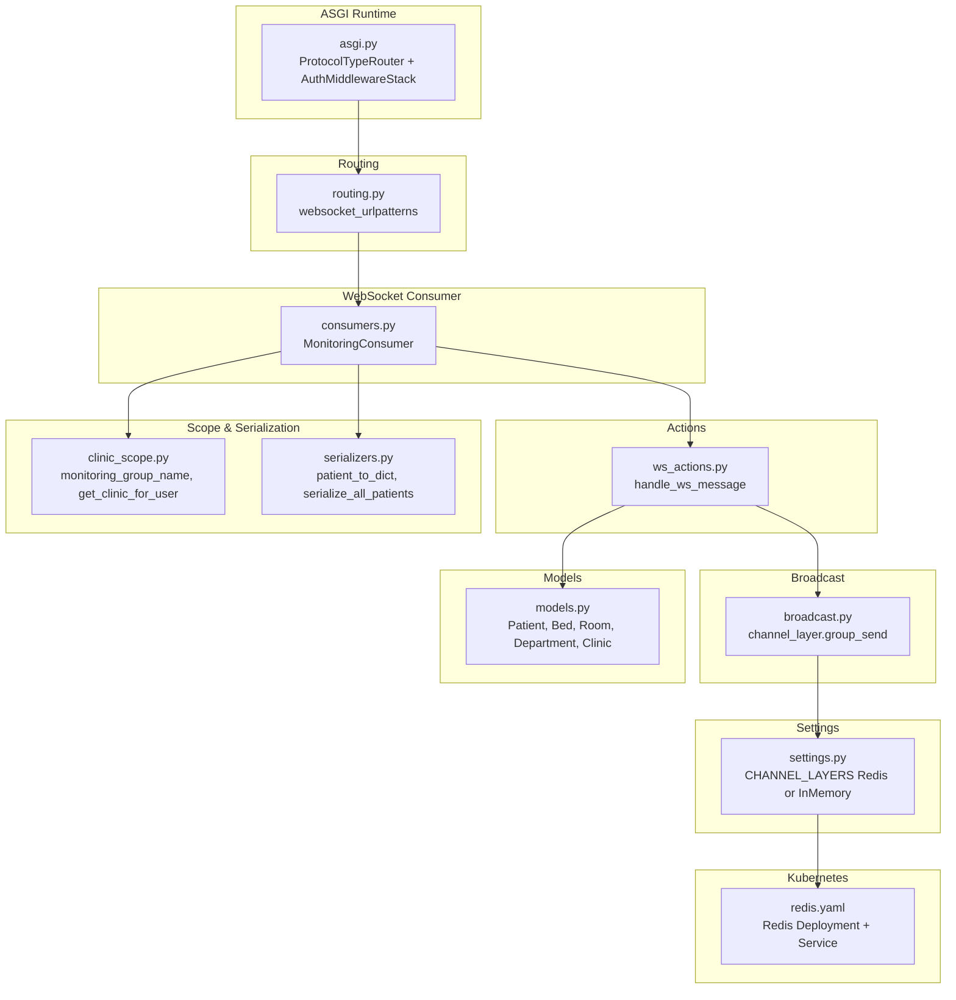
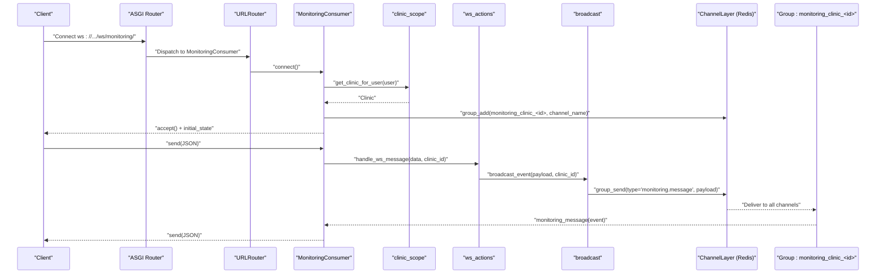
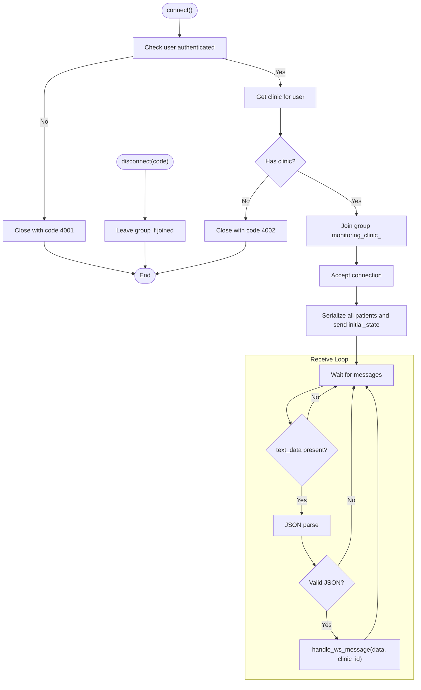
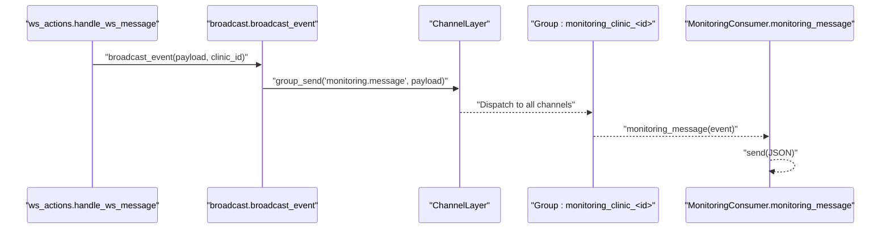
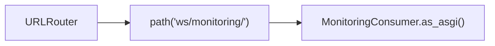
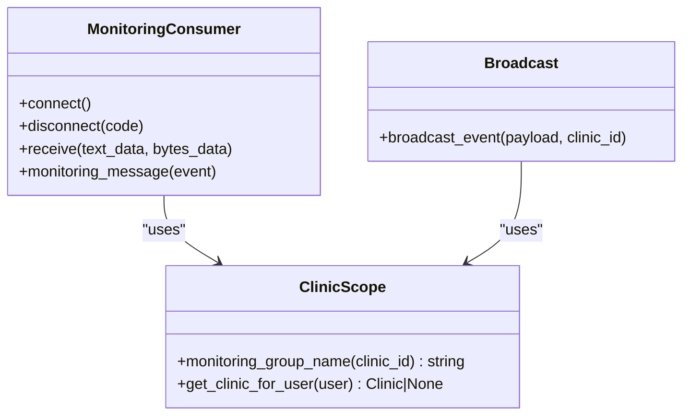
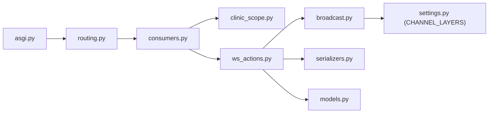

# WebSocket Real-time System

<cite>
**Referenced Files in This Document**
- [asgi.py](file://backend/medicentral/asgi.py)
- [settings.py](file://backend/medicentral/settings.py)
- [routing.py](file://backend/monitoring/routing.py)
- [consumers.py](file://backend/monitoring/consumers.py)
- [broadcast.py](file://backend/monitoring/broadcast.py)
- [ws_actions.py](file://backend/monitoring/ws_actions.py)
- [clinic_scope.py](file://backend/monitoring/clinic_scope.py)
- [serializers.py](file://backend/monitoring/serializers.py)
- [models.py](file://backend/monitoring/models.py)
- [views.py](file://backend/monitoring/views.py)
- [redis.yaml](file://k8s/redis.yaml)
</cite>

## Table of Contents
1. [Introduction](#introduction)
2. [Project Structure](#project-structure)
3. [Core Components](#core-components)
4. [Architecture Overview](#architecture-overview)
5. [Detailed Component Analysis](#detailed-component-analysis)
6. [Dependency Analysis](#dependency-analysis)
7. [Performance Considerations](#performance-considerations)
8. [Troubleshooting Guide](#troubleshooting-guide)
9. [Conclusion](#conclusion)
10. [Appendices](#appendices)

## Introduction
This document describes the WebSocket real-time communication system built with Django Channels. It covers consumer implementation for handling WebSocket connections, message routing, connection lifecycle management, the broadcasting system using Redis for pub/sub messaging, routing configuration for WebSocket endpoints, and group management for targeted message delivery. It also includes connection scaling strategies, performance optimization techniques, memory management for high-frequency data streams, examples of WebSocket message formats and event types, client-server communication patterns, error handling, reconnection strategies, and debugging techniques.

## Project Structure
The WebSocket subsystem is organized around Django Channels and a small set of monitoring-related modules:
- ASGI entrypoint configures protocol routing and middleware stack.
- Routing defines the WebSocket endpoint pattern.
- Consumer handles connection accept/reject, group membership, initial state, and inbound messages.
- Broadcast module publishes events to a Redis-backed Channel Layer.
- Action handler processes inbound WebSocket messages and updates state.
- Clinic scoping utilities derive group names and user clinic context.
- Serializers transform domain models to JSON payloads for clients.
- Settings configure the Channel Layers backend (Redis or in-memory).
- Kubernetes manifests define a Redis service for multi-instance deployments.

**Diagram sources**
- [asgi.py:14-21](file://backend/medicentral/asgi.py#L14-L21)
- [routing.py:5-7](file://backend/monitoring/routing.py#L5-L7)
- [consumers.py:12-46](file://backend/monitoring/consumers.py#L12-L46)
- [broadcast.py:10-19](file://backend/monitoring/broadcast.py#L10-L19)
- [ws_actions.py:32-229](file://backend/monitoring/ws_actions.py#L32-L229)
- [clinic_scope.py:11-23](file://backend/monitoring/clinic_scope.py#L11-L23)
- [serializers.py:13-97](file://backend/monitoring/serializers.py#L13-L97)
- [models.py:5-224](file://backend/monitoring/models.py#L5-L224)
- [settings.py:170-183](file://backend/monitoring/settings.py#L170-L183)
- [redis.yaml:1-41](file://k8s/redis.yaml#L1-L41)

**Section sources**
- [asgi.py:14-21](file://backend/medicentral/asgi.py#L14-L21)
- [routing.py:5-7](file://backend/monitoring/routing.py#L5-L7)
- [settings.py:170-183](file://backend/medicentral/settings.py#L170-L183)

## Core Components
- ASGI application: Defines HTTP and WebSocket protocols, wraps routing with authentication and origin validation.
- Routing: Exposes a single WebSocket endpoint path mapped to the consumer.
- Consumer: Authenticates users, scopes to clinic, joins a per-clinic group, sends initial state, and forwards inbound messages to the action handler.
- Broadcast: Sends events to a Redis-backed Channel Layer for all members of a per-clinic group.
- Action handler: Processes actions like toggling pin, adding notes, acknowledging/clearing alarms, scheduling checks, updating limits, measuring NIBP, admitting/discharging patients.
- Clinic scoping: Derives group names and user clinic association.
- Serializers: Convert domain models to JSON payloads for initial state and refresh events.
- Settings: Configure Channel Layers backend (Redis via environment variable or in-memory fallback).
- Models: Define the domain entities used by serializers and actions.

**Section sources**
- [asgi.py:14-21](file://backend/medicentral/asgi.py#L14-L21)
- [routing.py:5-7](file://backend/monitoring/routing.py#L5-L7)
- [consumers.py:12-46](file://backend/monitoring/consumers.py#L12-L46)
- [broadcast.py:10-19](file://backend/monitoring/broadcast.py#L10-L19)
- [ws_actions.py:32-229](file://backend/monitoring/ws_actions.py#L32-L229)
- [clinic_scope.py:11-23](file://backend/monitoring/clinic_scope.py#L11-L23)
- [serializers.py:13-97](file://backend/monitoring/serializers.py#L13-L97)
- [settings.py:170-183](file://backend/medicentral/settings.py#L170-L183)
- [models.py:5-224](file://backend/monitoring/models.py#L5-L224)

## Architecture Overview
The system uses Django Channels with a Redis-backed Channel Layer for pub/sub messaging across multiple worker processes or pods. Clients connect to the WebSocket endpoint, authenticate, and join a per-clinic group. Outbound events are published to that group, ensuring only users in the same clinic receive updates.

**Diagram sources**
- [asgi.py:14-21](file://backend/medicentral/asgi.py#L14-L21)
- [routing.py:5-7](file://backend/monitoring/routing.py#L5-L7)
- [consumers.py:13-45](file://backend/monitoring/consumers.py#L13-L45)
- [ws_actions.py:32-229](file://backend/monitoring/ws_actions.py#L32-L229)
- [broadcast.py:10-19](file://backend/monitoring/broadcast.py#L10-L19)
- [clinic_scope.py:11-23](file://backend/monitoring/clinic_scope.py#L11-L23)

## Detailed Component Analysis

### Consumer Implementation
The consumer manages connection lifecycle, group membership, and message routing:
- Authentication: Rejects anonymous or unauthenticated users.
- Clinic scoping: Associates the user with a clinic and derives the group name.
- Group membership: Adds the channel to the per-clinic group upon accept.
- Initial state: Serializes all patients for the clinic and sends an initial_state event.
- Inbound messages: Parses JSON, delegates to the action handler, and ignores malformed payloads.
- Disconnect: Removes the channel from the group.

**Diagram sources**
- [consumers.py:13-45](file://backend/monitoring/consumers.py#L13-L45)
- [ws_actions.py:32-229](file://backend/monitoring/ws_actions.py#L32-L229)
- [serializers.py:90-97](file://backend/monitoring/serializers.py#L90-L97)
- [clinic_scope.py:11-23](file://backend/monitoring/clinic_scope.py#L11-L23)

**Section sources**
- [consumers.py:12-46](file://backend/monitoring/consumers.py#L12-L46)

### Broadcasting System and Redis Pub/Sub
Events are broadcast to a per-clinic group using the Channel Layer:
- The broadcast function constructs the group name from the clinic ID.
- It retrieves the Channel Layer and dispatches a message with type monitoring.message and a payload dictionary.
- The consumer’s group_send handler receives the event and forwards it to the client.

**Diagram sources**
- [broadcast.py:10-19](file://backend/monitoring/broadcast.py#L10-L19)
- [consumers.py:35-36](file://backend/monitoring/consumers.py#L35-L36)
- [clinic_scope.py:11-12](file://backend/monitoring/clinic_scope.py#L11-L12)

**Section sources**
- [broadcast.py:10-19](file://backend/monitoring/broadcast.py#L10-L19)
- [settings.py:170-183](file://backend/medicentral/settings.py#L170-L183)

### Routing Configuration and Endpoint Exposure
- The WebSocket endpoint is defined under a single path and mapped to the consumer.
- The ASGI application composes the router with authentication middleware and origin validation.

**Diagram sources**
- [routing.py:5-7](file://backend/monitoring/routing.py#L5-L7)
- [asgi.py:17-18](file://backend/medicentral/asgi.py#L17-L18)

**Section sources**
- [routing.py:5-7](file://backend/monitoring/routing.py#L5-L7)
- [asgi.py:17-18](file://backend/medicentral/asgi.py#L17-L18)

### Group Management for Targeted Delivery
- Group naming follows the convention monitoring_clinic_<id>.
- Consumers join and leave groups during connect and disconnect.
- Broadcast targets the group derived from the clinic ID.

**Diagram sources**
- [consumers.py:12-46](file://backend/monitoring/consumers.py#L12-L46)
- [broadcast.py:10-19](file://backend/monitoring/broadcast.py#L10-L19)
- [clinic_scope.py:11-23](file://backend/monitoring/clinic_scope.py#L11-L23)

**Section sources**
- [consumers.py:23-33](file://backend/monitoring/consumers.py#L23-L33)
- [clinic_scope.py:11-12](file://backend/monitoring/clinic_scope.py#L11-L12)

### Message Formats, Event Types, and Client-Server Patterns
Common event types and message shapes:
- initial_state
  - Purpose: Send the full set of patients for the clinic after connection.
  - Payload keys: type, patients.
  - Trigger: On successful connection and group join.
- patient_refresh
  - Purpose: Notify clients that a patient record changed.
  - Payload keys: type, patient.
  - Trigger: After actions that modify a patient (toggle pin, add note, acknowledge/clear alarm, update limits, measure NIBP).
- patient_admitted
  - Purpose: Announce a new patient admission.
  - Payload keys: type, patient.
  - Trigger: After admit_patient action.
- patient_discharged
  - Purpose: Announce a patient discharge.
  - Payload keys: type, patientId.
  - Trigger: After discharge_patient action.
- Inbound action messages
  - Keys: action, plus action-specific fields (e.g., patientId, note, intervalMs, limits, bedId, name, diagnosis, doctor, assignedNurse).
  - Triggers: Actions processed by handle_ws_message.

Client-server communication patterns:
- Connect and authenticate; receive initial_state.
- Send action messages to mutate state; receive event notifications.
- Repeatedly receive periodic updates via patient_refresh and initial_state broadcasts.

**Section sources**
- [consumers.py:26-29](file://backend/monitoring/consumers.py#L26-L29)
- [ws_actions.py:43-46](file://backend/monitoring/ws_actions.py#L43-L46)
- [ws_actions.py:172-175](file://backend/monitoring/ws_actions.py#L172-L175)
- [ws_actions.py:222-225](file://backend/monitoring/ws_actions.py#L222-L225)
- [serializers.py:13-87](file://backend/monitoring/serializers.py#L13-L87)

### Error Handling and Reconnection Strategies
- Authentication failures: Connections are closed with explicit codes for client-side handling.
- Malformed JSON: Inbound messages are ignored to prevent crashes.
- Graceful disconnect: Consumer removes the channel from the group to avoid stale subscriptions.
- Reconnection: Clients should reconnect and expect a fresh initial_state.

Operational tips:
- Use close codes to signal reasons (e.g., 4001 for authentication failure, 4002 for missing clinic).
- On reconnect, the consumer resends initial_state to synchronize the UI.

**Section sources**
- [consumers.py:15-21](file://backend/monitoring/consumers.py#L15-L21)
- [consumers.py:42-44](file://backend/monitoring/consumers.py#L42-L44)
- [consumers.py:31-33](file://backend/monitoring/consumers.py#L31-L33)

### Debugging Techniques
- Enable logging via environment variables to adjust log level.
- Inspect Channel Layer connectivity and group membership.
- Verify Redis availability and reachability in Kubernetes.
- Confirm WebSocket endpoint exposure and routing.

**Section sources**
- [settings.py:185-217](file://backend/medicentral/settings.py#L185-L217)
- [views.py:450-463](file://backend/monitoring/views.py#L450-L463)

## Dependency Analysis
Key dependencies and coupling:
- ASGI depends on routing and authentication middleware.
- Consumer depends on clinic scoping, serializers, and the action handler.
- Broadcast depends on the Channel Layer configuration and group naming.
- Actions depend on models and serializers to compute payloads.
- Settings control whether Redis or in-memory Channel Layer is used.

**Diagram sources**
- [asgi.py:12-21](file://backend/medicentral/asgi.py#L12-L21)
- [routing.py:3-7](file://backend/monitoring/routing.py#L3-L7)
- [consumers.py:7-9](file://backend/monitoring/consumers.py#L7-L9)
- [ws_actions.py:12-15](file://backend/monitoring/ws_actions.py#L12-L15)
- [broadcast.py:7-19](file://backend/monitoring/broadcast.py#L7-L19)
- [settings.py:170-183](file://backend/medicentral/settings.py#L170-L183)
- [serializers.py:13-14](file://backend/monitoring/serializers.py#L13-L14)
- [models.py:141-179](file://backend/monitoring/models.py#L141-L179)

**Section sources**
- [asgi.py:12-21](file://backend/medicentral/asgi.py#L12-L21)
- [routing.py:3-7](file://backend/monitoring/routing.py#L3-L7)
- [consumers.py:7-9](file://backend/monitoring/consumers.py#L7-L9)
- [ws_actions.py:12-15](file://backend/monitoring/ws_actions.py#L12-L15)
- [broadcast.py:7-19](file://backend/monitoring/broadcast.py#L7-L19)
- [settings.py:170-183](file://backend/medicentral/settings.py#L170-L183)
- [serializers.py:13-14](file://backend/monitoring/serializers.py#L13-L14)
- [models.py:141-179](file://backend/monitoring/models.py#L141-L179)

## Performance Considerations
- Use Redis-backed Channel Layer for multi-process or multi-pod deployments to ensure cross-instance pub/sub.
- Minimize outbound payload sizes by sending only necessary fields in event payloads.
- Batch frequent updates where appropriate; avoid excessive refresh frequency.
- Keep database operations inside async-to-sync boundaries minimal and short-lived.
- Use select_related and prefetch_related in serializers to reduce queries.
- Tune Redis resource requests/limits in Kubernetes to support expected concurrency.
- Monitor log levels and disable verbose logging in production to reduce overhead.

[No sources needed since this section provides general guidance]

## Troubleshooting Guide
Common issues and resolutions:
- Authentication errors: Ensure the user is authenticated and associated with a clinic profile; otherwise connections are rejected.
- No updates received: Verify the client is connected to the correct clinic group and that the Channel Layer is configured to use Redis.
- Redis connectivity: Confirm the Redis service is running and reachable from the application pods.
- Endpoint visibility: Confirm the WebSocket endpoint is exposed and routed correctly.

**Section sources**
- [consumers.py:15-21](file://backend/monitoring/consumers.py#L15-L21)
- [settings.py:170-183](file://backend/medicentral/settings.py#L170-L183)
- [views.py:450-463](file://backend/monitoring/views.py#L450-L463)

## Conclusion
The WebSocket system leverages Django Channels with a Redis-backed Channel Layer to deliver real-time updates scoped to clinics. The consumer enforces authentication and clinic scoping, manages group membership, and routes inbound messages to a dedicated action handler. Broadcasting ensures efficient, targeted event distribution. Proper configuration of Channel Layers, careful payload design, and robust error handling enable scalable, reliable real-time monitoring.

[No sources needed since this section summarizes without analyzing specific files]

## Appendices

### Scaling and Deployment Notes
- Kubernetes: A Redis deployment and service are provided for pub/sub persistence across pods.
- Channel Layers: Configure REDIS_URL to enable Redis-backed Channel Layer; otherwise, an in-memory backend is used.

**Section sources**
- [redis.yaml:1-41](file://k8s/redis.yaml#L1-L41)
- [settings.py:170-183](file://backend/medicentral/settings.py#L170-L183)