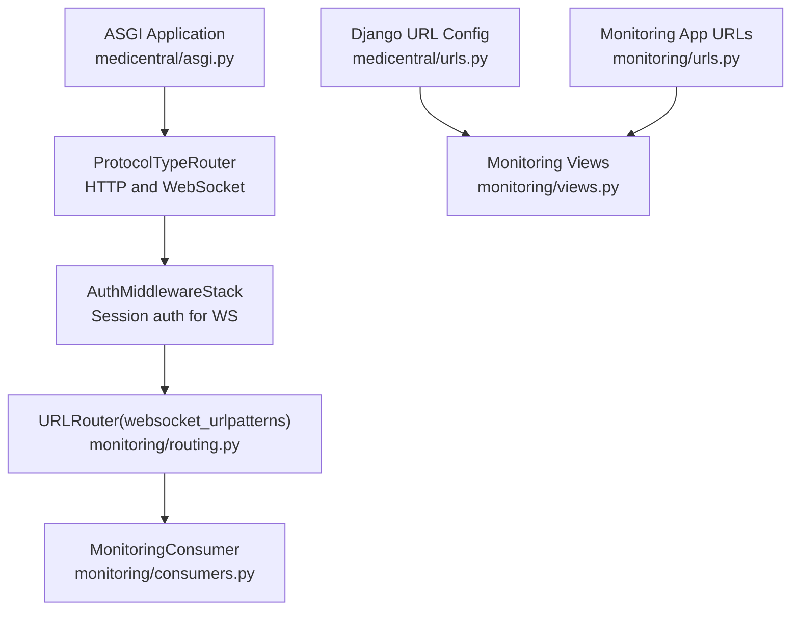
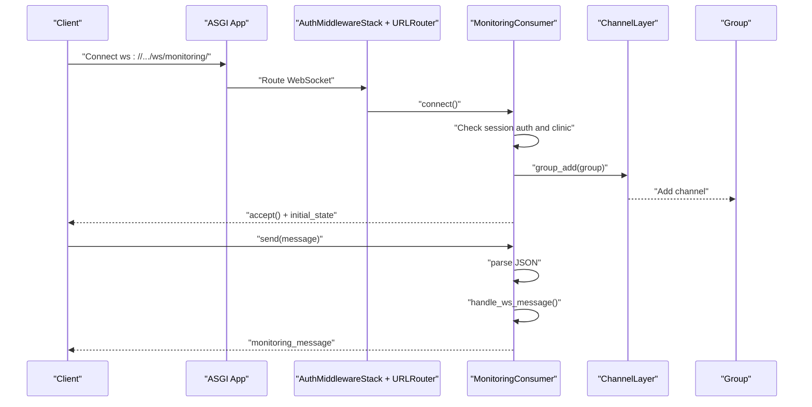
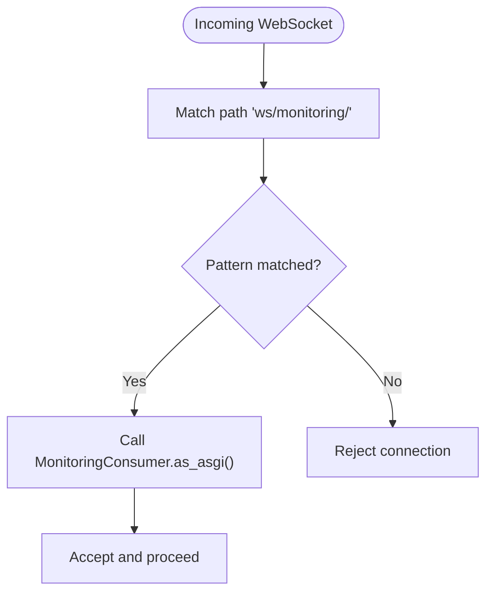
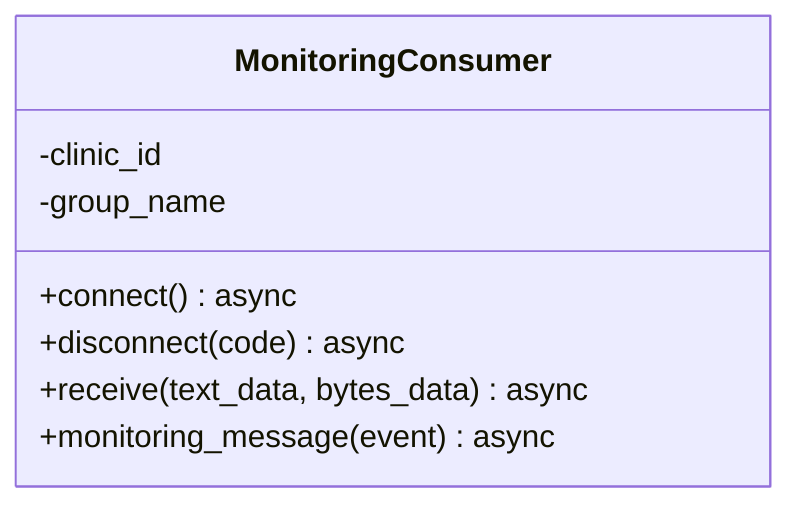
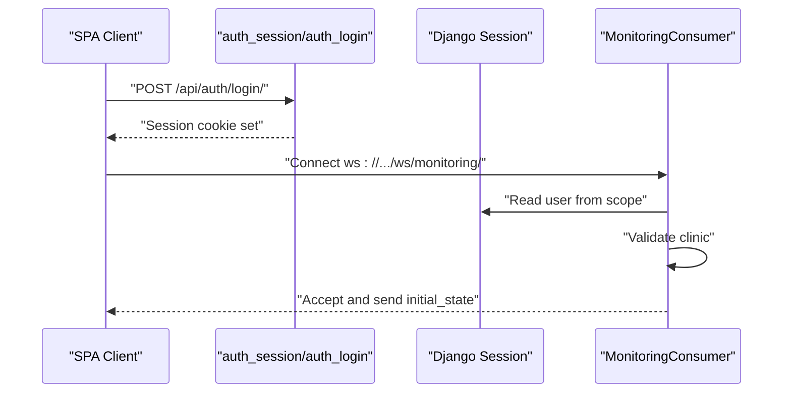
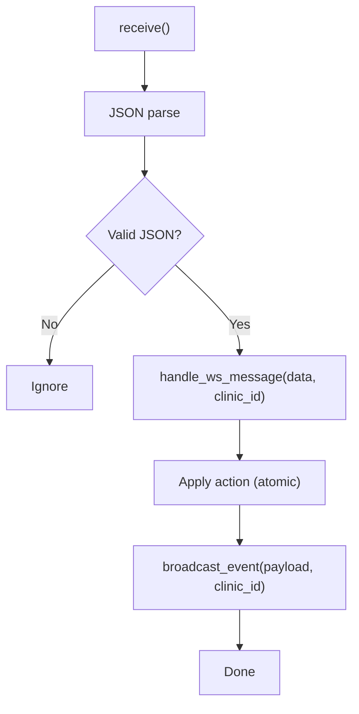
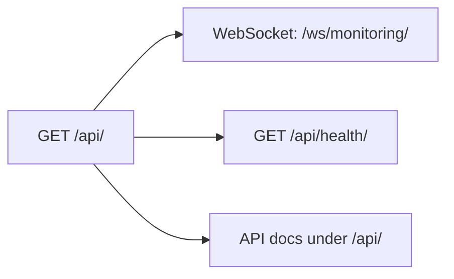
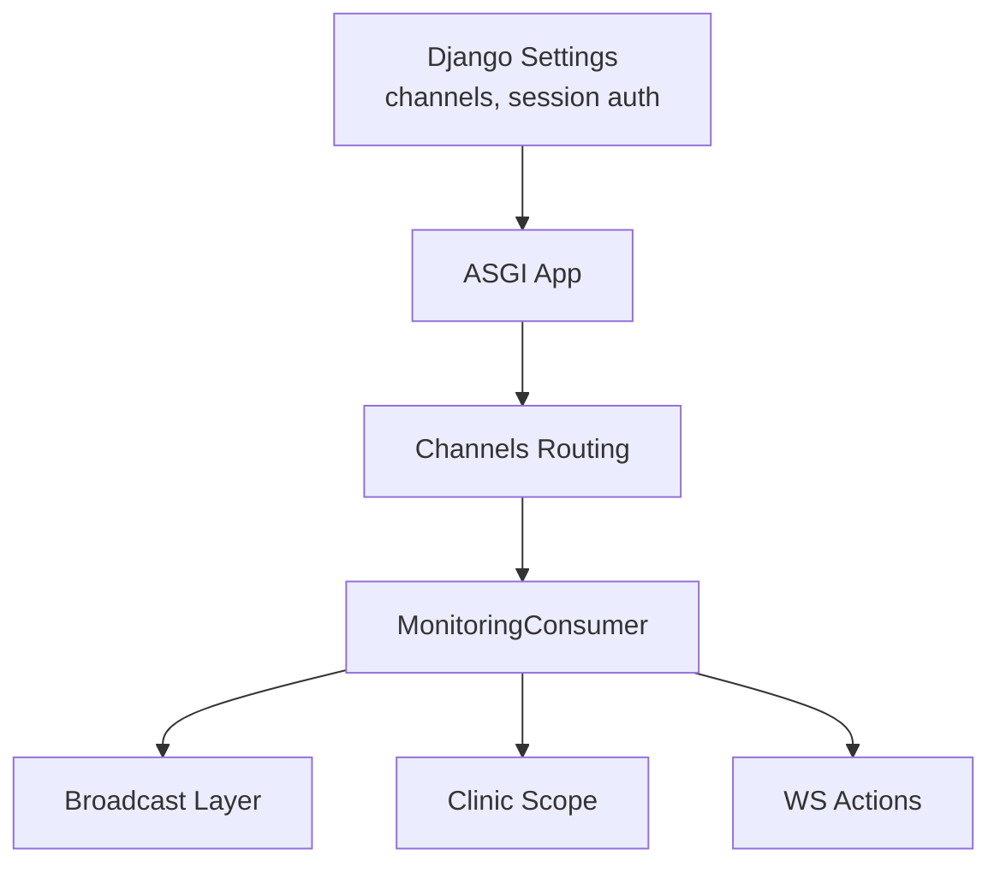

# WebSocket Routing Configuration

<cite>
**Referenced Files in This Document**
- [medicentral/asgi.py](file://backend/medicentral/asgi.py)
- [medicentral/settings.py](file://backend/medicentral/settings.py)
- [medicentral/urls.py](file://backend/medicentral/urls.py)
- [monitoring/routing.py](file://backend/monitoring/routing.py)
- [monitoring/consumers.py](file://backend/monitoring/consumers.py)
- [monitoring/views.py](file://backend/monitoring/views.py)
- [monitoring/auth_views.py](file://backend/monitoring/auth_views.py)
- [monitoring/ws_actions.py](file://backend/monitoring/ws_actions.py)
- [monitoring/broadcast.py](file://backend/monitoring/broadcast.py)
- [monitoring/clinic_scope.py](file://backend/monitoring/clinic_scope.py)
- [monitoring/urls.py](file://backend/monitoring/urls.py)
</cite>

## Table of Contents
1. [Introduction](#introduction)
2. [Project Structure](#project-structure)
3. [Core Components](#core-components)
4. [Architecture Overview](#architecture-overview)
5. [Detailed Component Analysis](#detailed-component-analysis)
6. [Dependency Analysis](#dependency-analysis)
7. [Performance Considerations](#performance-considerations)
8. [Troubleshooting Guide](#troubleshooting-guide)
9. [Conclusion](#conclusion)
10. [Appendices](#appendices)

## Introduction
This document explains the WebSocket routing configuration and URL endpoint management in the project. It focuses on how WebSocket URLs are mapped to consumer classes, how Django’s URL dispatcher integrates with Channels for WebSocket handling, and how the monitoring WebSocket endpoint is secured and monitored. It also covers URL patterns, path parameters, route resolution, client connection mechanics, and operational best practices for production.

## Project Structure
The WebSocket stack spans three layers:
- ASGI entrypoint configures protocol routing and middleware for HTTP and WebSocket.
- Django URL configuration wires the monitoring app’s HTTP endpoints.
- Channels routing defines WebSocket URL patterns and binds them to consumers.

**Diagram sources**
- [medicentral/asgi.py:14-21](file://backend/medicentral/asgi.py#L14-L21)
- [monitoring/routing.py:5-7](file://backend/monitoring/routing.py#L5-L7)
- [monitoring/consumers.py:12-46](file://backend/monitoring/consumers.py#L12-L46)
- [medicentral/urls.py:6-10](file://backend/medicentral/urls.py#L6-L10)
- [monitoring/urls.py:12-23](file://backend/monitoring/urls.py#L12-L23)

**Section sources**
- [medicentral/asgi.py:14-21](file://backend/medicentral/asgi.py#L14-L21)
- [medicentral/urls.py:6-10](file://backend/medicentral/urls.py#L6-L10)
- [monitoring/routing.py:5-7](file://backend/monitoring/routing.py#L5-L7)

## Core Components
- ASGI application: Initializes Channels and wraps the Django app with protocol routing for HTTP and WebSocket.
- Channels routing: Declares WebSocket URL patterns and binds them to consumers.
- Consumer: Implements connection lifecycle, authentication, authorization, and message handling.
- Authentication and session endpoints: Provide session-based login/logout and session introspection for SPA clients.
- Broadcast layer: Sends events to a per-clinic group for real-time updates.

Key responsibilities:
- Route resolution: WebSocket path “ws/monitoring/” resolves to MonitoringConsumer via URLRouter.
- Authentication: Session-based authentication is enforced via AuthMiddlewareStack.
- Authorization: Per-clinic scoping ensures users only receive data for their clinic.
- Eventing: Broadcast layer sends updates to all clients in a clinic’s group.

**Section sources**
- [medicentral/asgi.py:14-21](file://backend/medicentral/asgi.py#L14-L21)
- [monitoring/routing.py:5-7](file://backend/monitoring/routing.py#L5-L7)
- [monitoring/consumers.py:12-46](file://backend/monitoring/consumers.py#L12-L46)
- [monitoring/auth_views.py:14-56](file://backend/monitoring/auth_views.py#L14-L56)
- [monitoring/broadcast.py:10-19](file://backend/monitoring/broadcast.py#L10-L19)

## Architecture Overview
The WebSocket architecture integrates Django Channels with Django’s URL dispatcher and session middleware. The ASGI application configures:
- HTTP requests to the Django WSGI app.
- WebSocket requests to a router that enforces allowed hosts and session authentication, then routes to the monitoring WebSocket URL patterns.

**Diagram sources**
- [medicentral/asgi.py:14-21](file://backend/medicentral/asgi.py#L14-L21)
- [monitoring/routing.py:5-7](file://backend/monitoring/routing.py#L5-L7)
- [monitoring/consumers.py:12-46](file://backend/monitoring/consumers.py#L12-L46)
- [monitoring/ws_actions.py:31-47](file://backend/monitoring/ws_actions.py#L31-L47)

## Detailed Component Analysis

### WebSocket URL Patterns and Route Resolution
- Pattern: The WebSocket URL pattern is defined as a single static path “ws/monitoring/”.
- Resolution: URLRouter matches the incoming WebSocket path against websocket_urlpatterns and invokes the associated consumer’s ASGI instance.
- No path parameters: The current pattern does not capture dynamic segments; the consumer derives scoping from the authenticated user’s clinic.

**Diagram sources**
- [monitoring/routing.py:5-7](file://backend/monitoring/routing.py#L5-L7)

**Section sources**
- [monitoring/routing.py:5-7](file://backend/monitoring/routing.py#L5-L7)

### Consumer Lifecycle and Authentication
- Connection: The consumer verifies that the user is authenticated and linked to a clinic. If not, it closes the connection with explicit codes.
- Group membership: On accept, the consumer joins a group named after the clinic ID.
- Initial state: The consumer sends an initial snapshot of serialized patient data to newly connected clients.
- Message handling: Incoming text messages are parsed as JSON and delegated to a handler that performs clinic-scoped actions and broadcasts updates.

**Diagram sources**
- [monitoring/consumers.py:12-46](file://backend/monitoring/consumers.py#L12-L46)

**Section sources**
- [monitoring/consumers.py:12-46](file://backend/monitoring/consumers.py#L12-L46)

### Authentication and Authorization Model
- Session-based authentication: AuthMiddlewareStack ensures WebSocket connections are authenticated via Django sessions.
- Authorization: The consumer retrieves the user’s clinic and enforces that only authenticated users with a clinic association can connect. Superusers are supported.
- Frontend session API: The monitoring app exposes endpoints for session introspection and login/logout, enabling SPA-driven authentication flows.

**Diagram sources**
- [monitoring/auth_views.py:14-56](file://backend/monitoring/auth_views.py#L14-L56)
- [monitoring/consumers.py:12-30](file://backend/monitoring/consumers.py#L12-L30)

**Section sources**
- [monitoring/auth_views.py:14-56](file://backend/monitoring/auth_views.py#L14-L56)
- [monitoring/consumers.py:12-30](file://backend/monitoring/consumers.py#L12-L30)

### Event Handling and Broadcasting
- Handler: The consumer delegates incoming messages to a handler that interprets actions (e.g., toggling pin, adding notes, scheduling checks).
- Transactionality: Actions are executed atomically to maintain consistency.
- Broadcasting: After applying changes, the system broadcasts events to the clinic’s group, ensuring all clients reflect the latest state.

**Diagram sources**
- [monitoring/consumers.py:38-46](file://backend/monitoring/consumers.py#L38-L46)
- [monitoring/ws_actions.py:31-47](file://backend/monitoring/ws_actions.py#L31-L47)
- [monitoring/broadcast.py:10-19](file://backend/monitoring/broadcast.py#L10-L19)

**Section sources**
- [monitoring/consumers.py:38-46](file://backend/monitoring/consumers.py#L38-L46)
- [monitoring/ws_actions.py:31-47](file://backend/monitoring/ws_actions.py#L31-L47)
- [monitoring/broadcast.py:10-19](file://backend/monitoring/broadcast.py#L10-L19)

### Monitoring Endpoint and Health
- Root endpoint: The root view documents available endpoints, including the WebSocket endpoint.
- Health endpoint: A dedicated health view validates database connectivity.
- Monitoring app URLs: The monitoring app registers additional endpoints for departments, rooms, beds, devices, and ingestion.

**Diagram sources**
- [monitoring/views.py:450-477](file://backend/monitoring/views.py#L450-L477)
- [monitoring/views.py:466-477](file://backend/monitoring/views.py#L466-L477)
- [monitoring/urls.py:12-23](file://backend/monitoring/urls.py#L12-L23)

**Section sources**
- [monitoring/views.py:450-477](file://backend/monitoring/views.py#L450-L477)
- [monitoring/views.py:466-477](file://backend/monitoring/views.py#L466-L477)
- [monitoring/urls.py:12-23](file://backend/monitoring/urls.py#L12-L23)

## Dependency Analysis
- ASGI depends on Channels for protocol routing and middleware.
- Django settings configure Channels Redis or in-memory layers and session auth.
- Monitoring routing depends on the MonitoringConsumer.
- Consumer depends on clinic scoping, serializers, and the broadcast layer.

**Diagram sources**
- [medicentral/settings.py:170-183](file://backend/medicentral/settings.py#L170-L183)
- [medicentral/asgi.py:14-21](file://backend/medicentral/asgi.py#L14-L21)
- [monitoring/routing.py:5-7](file://backend/monitoring/routing.py#L5-L7)
- [monitoring/consumers.py:12-46](file://backend/monitoring/consumers.py#L12-L46)
- [monitoring/broadcast.py:10-19](file://backend/monitoring/broadcast.py#L10-L19)
- [monitoring/clinic_scope.py:15-23](file://backend/monitoring/clinic_scope.py#L15-L23)
- [monitoring/ws_actions.py:31-47](file://backend/monitoring/ws_actions.py#L31-L47)

**Section sources**
- [medicentral/settings.py:170-183](file://backend/medicentral/settings.py#L170-L183)
- [medicentral/asgi.py:14-21](file://backend/medicentral/asgi.py#L14-L21)
- [monitoring/routing.py:5-7](file://backend/monitoring/routing.py#L5-L7)
- [monitoring/consumers.py:12-46](file://backend/monitoring/consumers.py#L12-L46)
- [monitoring/broadcast.py:10-19](file://backend/monitoring/broadcast.py#L10-L19)
- [monitoring/clinic_scope.py:15-23](file://backend/monitoring/clinic_scope.py#L15-L23)
- [monitoring/ws_actions.py:31-47](file://backend/monitoring/ws_actions.py#L31-L47)

## Performance Considerations
- Channel layer selection:
  - Redis-backed ChannelLayer scales horizontally across workers/processes/servers.
  - In-memory ChannelLayer is suitable for development but not recommended for production.
- Group broadcasting:
  - Broadcasting to per-clinic groups minimizes cross-clinic traffic and reduces contention.
- Connection lifecycle:
  - Keep-alive and ping/pong are handled by the underlying Channels transport; avoid unnecessary per-message serialization.
- Database access:
  - Use database_sync_to_async for ORM operations inside the consumer to prevent blocking the event loop.
- Message parsing:
  - Validate and parse JSON early; drop malformed messages promptly to reduce overhead.
- Backpressure:
  - Avoid sending large payloads frequently; batch updates where possible.

[No sources needed since this section provides general guidance]

## Troubleshooting Guide
Common issues and resolutions:
- Connection rejected with authentication errors:
  - Ensure the client is authenticated and has an active session cookie.
  - Verify session endpoints and CSRF token handling.
- Connection closed without data:
  - Check that the user belongs to a clinic; superusers are supported.
- No updates received:
  - Confirm the client joined the correct clinic group and that broadcast events are being sent.
- Health and monitoring:
  - Use the health endpoint to verify database connectivity.
  - Use the root endpoint to confirm the WebSocket endpoint path.

**Section sources**
- [monitoring/consumers.py:12-30](file://backend/monitoring/consumers.py#L12-L30)
- [monitoring/views.py:466-477](file://backend/monitoring/views.py#L466-L477)
- [monitoring/views.py:450-477](file://backend/monitoring/views.py#L450-L477)

## Conclusion
The WebSocket routing configuration is intentionally minimal and secure:
- A single static WebSocket path maps to a robust consumer with session-based authentication and per-clinic authorization.
- The Channels routing integrates cleanly with Django’s URL dispatcher and session middleware.
- Broadcasting ensures scalable, real-time updates within clinic boundaries.
For production, prefer Redis-backed ChannelLayer, enforce allowed hosts, and monitor health endpoints regularly.

[No sources needed since this section summarizes without analyzing specific files]

## Appendices

### WebSocket URL Patterns and Examples
- WebSocket endpoint: ws/monitoring/
- Example client connection URL: ws://your-domain/ws/monitoring/
- Notes:
  - The pattern is static and does not include path parameters.
  - Clients must be authenticated and linked to a clinic to connect successfully.

**Section sources**
- [monitoring/routing.py:5-7](file://backend/monitoring/routing.py#L5-L7)
- [monitoring/views.py:460-462](file://backend/monitoring/views.py#L460-L462)

### Endpoint Testing Checklist
- Authenticate via session endpoints and obtain a session cookie.
- Connect to the WebSocket endpoint and verify acceptance and initial_state.
- Send a sample message and observe broadcasted updates.
- Disconnect and reconnect to verify group membership persistence.

**Section sources**
- [monitoring/auth_views.py:14-56](file://backend/monitoring/auth_views.py#L14-L56)
- [monitoring/consumers.py:12-46](file://backend/monitoring/consumers.py#L12-L46)
- [monitoring/ws_actions.py:31-47](file://backend/monitoring/ws_actions.py#L31-L47)