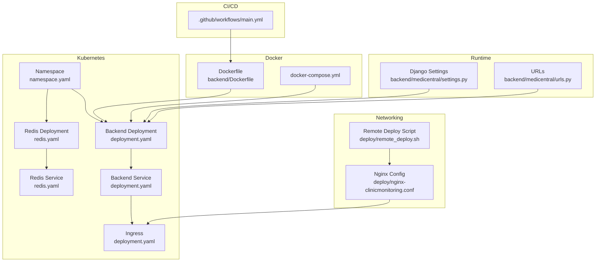
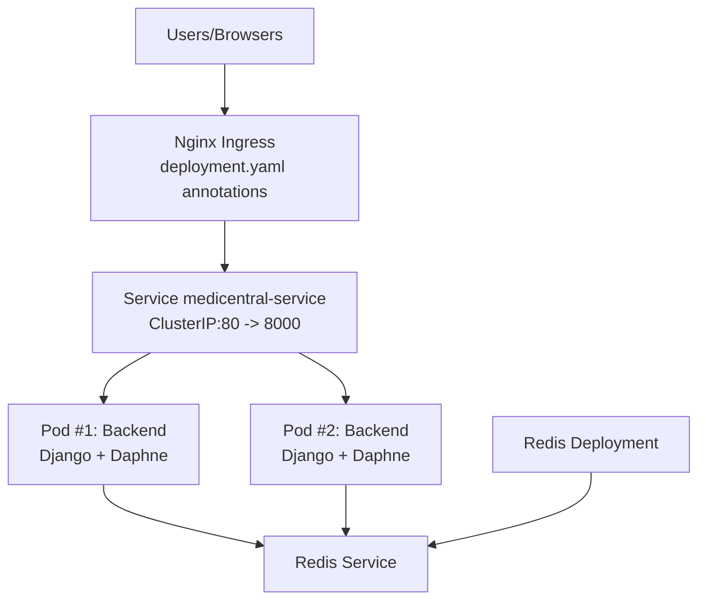
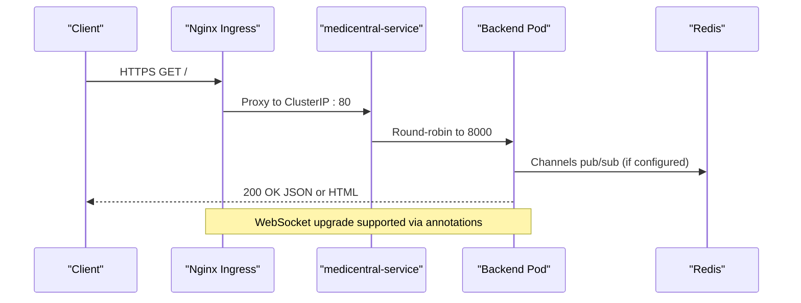
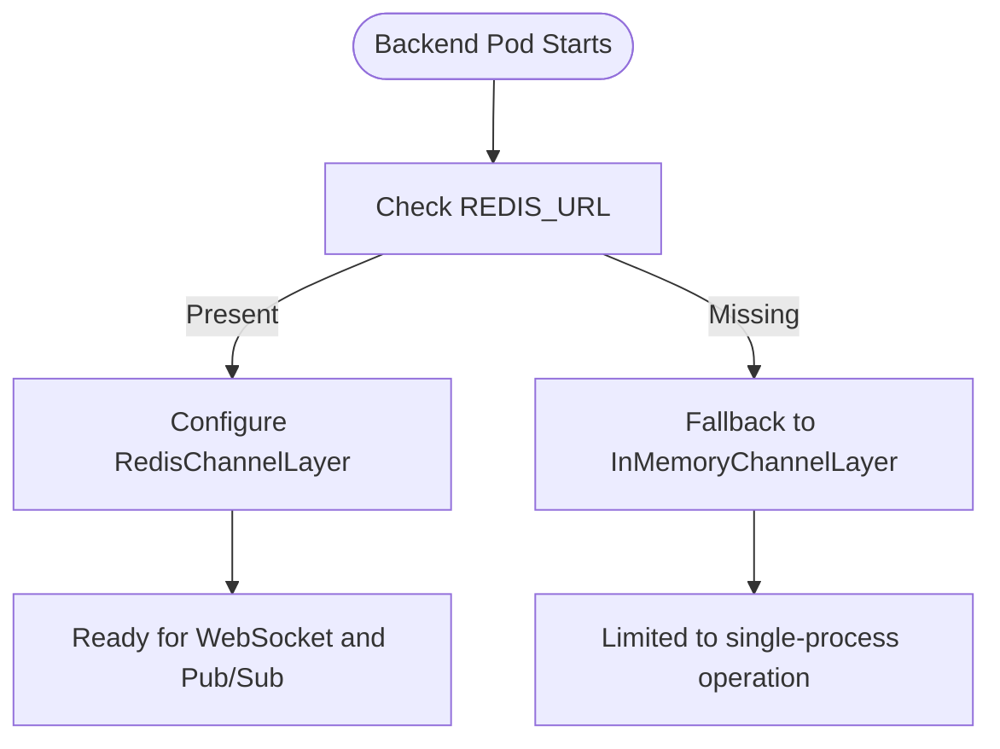
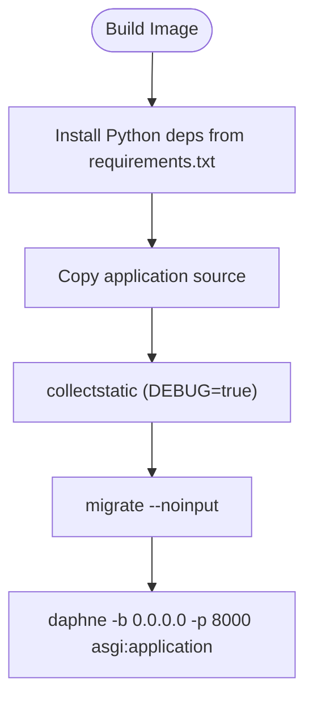
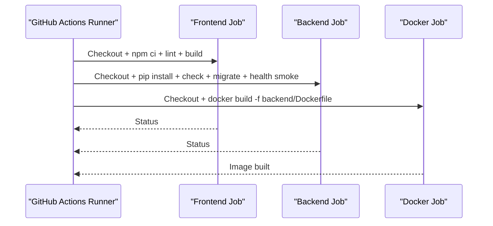
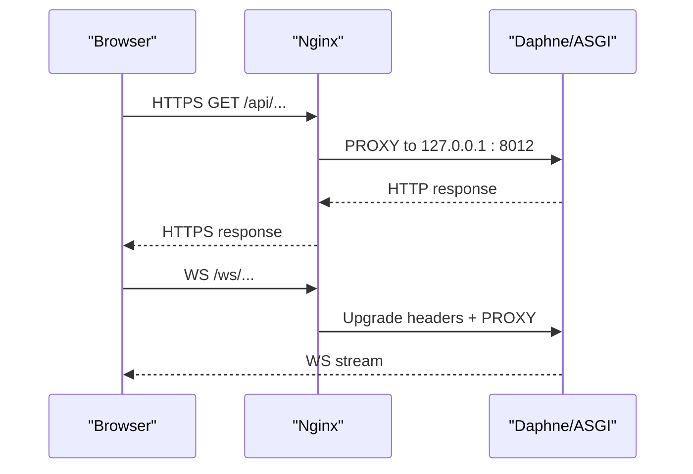
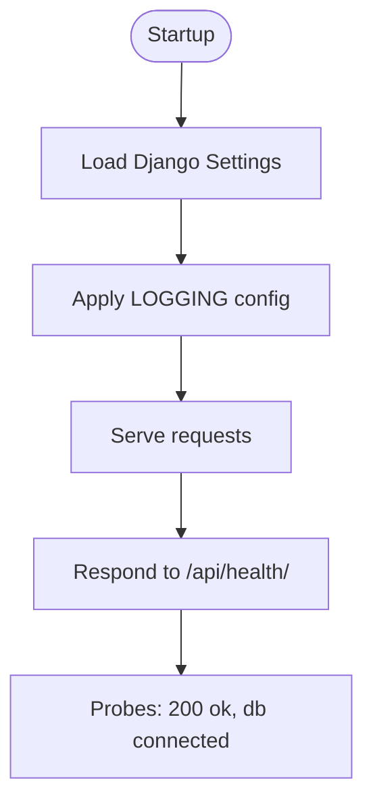
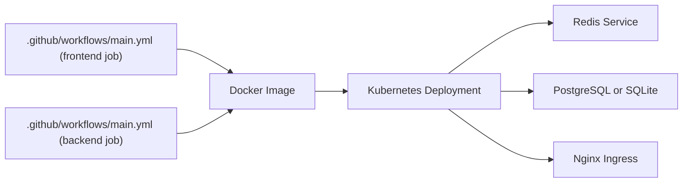

# Deployment Topology & Infrastructure

<cite>
**Referenced Files in This Document**
- [deployment.yaml](file://k8s/deployment.yaml)
- [redis.yaml](file://k8s/redis.yaml)
- [namespace.yaml](file://k8s/namespace.yaml)
- [Dockerfile](file://backend/Dockerfile)
- [docker-compose.yml](file://docker-compose.yml)
- [main.yml](file://.github/workflows/main.yml)
- [settings.py](file://backend/medicentral/settings.py)
- [urls.py](file://backend/medicentral/urls.py)
- [nginx-clinicmonitoring.conf](file://deploy/nginx-clinicmonitoring.conf)
- [remote_deploy.sh](file://deploy/remote_deploy.sh)
- [requirements.txt](file://backend/requirements.txt)
- [README.md](file://README.md)
</cite>

## Table of Contents
1. [Introduction](#introduction)
2. [Project Structure](#project-structure)
3. [Core Components](#core-components)
4. [Architecture Overview](#architecture-overview)
5. [Detailed Component Analysis](#detailed-component-analysis)
6. [Dependency Analysis](#dependency-analysis)
7. [Performance Considerations](#performance-considerations)
8. [Troubleshooting Guide](#troubleshooting-guide)
9. [Conclusion](#conclusion)
10. [Appendices](#appendices)

## Introduction
This document describes the production deployment topology and DevOps practices for the Medicentral platform. It covers Kubernetes multi-replica deployment, Docker containerization strategy, CI/CD via GitHub Actions, network infrastructure with ingress and WebSocket support, Redis for caching and pub/sub messaging, database configuration and backup, monitoring/logging/alerting, and security hardening. It also provides deployment checklists, scaling guidelines, and performance tuning recommendations.

## Project Structure
The repository organizes deployment assets and infrastructure as follows:
- Kubernetes manifests under k8s/ define the backend deployment, Redis, and ingress.
- Backend Dockerfile and docker-compose.yml describe containerization and local/staging setups.
- GitHub Actions workflow automates frontend build, backend checks, migrations, and Docker image build.
- Nginx configuration and remote deployment script document the traditional production stack.
- Django settings centralize runtime configuration, including database selection, Redis-backed channels, and security flags.

**Diagram sources**
- [namespace.yaml:1-5](file://k8s/namespace.yaml#L1-L5)
- [redis.yaml:1-41](file://k8s/redis.yaml#L1-L41)
- [deployment.yaml:1-101](file://k8s/deployment.yaml#L1-L101)
- [Dockerfile:1-27](file://backend/Dockerfile#L1-L27)
- [docker-compose.yml:1-29](file://docker-compose.yml#L1-L29)
- [main.yml:1-67](file://.github/workflows/main.yml#L1-L67)
- [nginx-clinicmonitoring.conf:1-112](file://deploy/nginx-clinicmonitoring.conf#L1-L112)
- [remote_deploy.sh:1-139](file://deploy/remote_deploy.sh#L1-L139)
- [settings.py:1-218](file://backend/medicentral/settings.py#L1-L218)
- [urls.py:1-11](file://backend/medicentral/urls.py#L1-L11)

**Section sources**
- [README.md:1-110](file://README.md#L1-L110)
- [deployment.yaml:1-101](file://k8s/deployment.yaml#L1-L101)
- [redis.yaml:1-41](file://k8s/redis.yaml#L1-L41)
- [namespace.yaml:1-5](file://k8s/namespace.yaml#L1-L5)
- [Dockerfile:1-27](file://backend/Dockerfile#L1-L27)
- [docker-compose.yml:1-29](file://docker-compose.yml#L1-L29)
- [main.yml:1-67](file://.github/workflows/main.yml#L1-L67)
- [nginx-clinicmonitoring.conf:1-112](file://deploy/nginx-clinicmonitoring.conf#L1-L112)
- [remote_deploy.sh:1-139](file://deploy/remote_deploy.sh#L1-L139)
- [settings.py:1-218](file://backend/medicentral/settings.py#L1-L218)
- [urls.py:1-11](file://backend/medicentral/urls.py#L1-L11)

## Core Components
- Kubernetes Backend Deployment: Multi-replica Django + Daphne with health probes, resource requests/limits, and Redis-backed Channels.
- Redis: Dedicated deployment and service for pub/sub and channel layer persistence across pods.
- Ingress: Nginx ingress with WebSocket support and long-running proxy timeouts.
- Containerization: Python slim base image, system packages for Postgres, static collection, and Daphne startup.
- CI/CD: GitHub Actions jobs for frontend, backend checks/migrations, and Docker image build.
- Networking: Reverse proxy configuration supporting TLS, WebSocket upgrades, and API/admin routing.
- Runtime Settings: Database selection (SQLite or PostgreSQL via DATABASE_URL), Redis-backed Channels, CORS/cookie security, and logging.

**Section sources**
- [deployment.yaml:11-63](file://k8s/deployment.yaml#L11-L63)
- [redis.yaml:1-41](file://k8s/redis.yaml#L1-L41)
- [Dockerfile:1-27](file://backend/Dockerfile#L1-L27)
- [main.yml:1-67](file://.github/workflows/main.yml#L1-L67)
- [nginx-clinicmonitoring.conf:1-112](file://deploy/nginx-clinicmonitoring.conf#L1-L112)
- [settings.py:101-119](file://backend/medicentral/settings.py#L101-L119)
- [settings.py:170-183](file://backend/medicentral/settings.py#L170-L183)

## Architecture Overview
The production architecture combines Kubernetes-managed backend pods with a Redis cluster for Channels and shared state, fronted by an Nginx ingress that terminates TLS and proxies both REST and WebSocket traffic.

**Diagram sources**
- [deployment.yaml:65-101](file://k8s/deployment.yaml#L65-L101)
- [redis.yaml:1-41](file://k8s/redis.yaml#L1-L41)

**Section sources**
- [deployment.yaml:1-101](file://k8s/deployment.yaml#L1-L101)
- [redis.yaml:1-41](file://k8s/redis.yaml#L1-L41)
- [nginx-clinicmonitoring.conf:1-112](file://deploy/nginx-clinicmonitoring.conf#L1-L112)

## Detailed Component Analysis

### Kubernetes Backend Deployment
- Multi-replica: Two backend pods for high availability.
- Ports: Exposes 8000 internally; Service targets 8000 and exposes 80.
- Environment: Includes Redis URL, allowed hosts, CORS origins, behind-proxy flag, and optional DATABASE_URL comment.
- Probes: HTTP GET /api/health/ on port 8000 for liveness/readiness.
- Resources: Requests and limits defined for CPU/memory.

**Diagram sources**
- [deployment.yaml:65-101](file://k8s/deployment.yaml#L65-L101)
- [settings.py:170-183](file://backend/medicentral/settings.py#L170-L183)

**Section sources**
- [deployment.yaml:11-63](file://k8s/deployment.yaml#L11-L63)

### Redis Deployment and Pub/Sub Messaging
- Single-replica Redis deployment with minimal CPU/memory requests/limits.
- Service exposes port 6379 for backend pods.
- Channels layer configured via REDIS_URL; required for multi-pod deployments.

**Diagram sources**
- [redis.yaml:1-41](file://k8s/redis.yaml#L1-L41)
- [settings.py:170-183](file://backend/medicentral/settings.py#L170-L183)

**Section sources**
- [redis.yaml:1-41](file://k8s/redis.yaml#L1-L41)
- [settings.py:170-183](file://backend/medicentral/settings.py#L170-L183)

### Docker Containerization Strategy
- Base image: Python slim bookworm.
- System dependencies: libpq for Postgres support.
- Static collection: Runs during build with DJANGO_DEBUG enabled.
- Entrypoint: Applies migrations and starts Daphne on 0.0.0.0:8000.
- Exposure: Port 8000.

**Diagram sources**
- [Dockerfile:1-27](file://backend/Dockerfile#L1-L27)
- [requirements.txt:1-14](file://backend/requirements.txt#L1-L14)

**Section sources**
- [Dockerfile:1-27](file://backend/Dockerfile#L1-L27)
- [requirements.txt:1-14](file://backend/requirements.txt#L1-L14)

### CI/CD Pipeline with GitHub Actions
- Triggers: On push and pull_request to main/master.
- Jobs:
  - frontend: Setup Node, install deps, lint, build.
  - backend: Setup Python, install deps, run Django checks, migrations, and a health smoke test.
  - docker-backend: Build backend image with Dockerfile.
- Optional: Registry push and cluster deployment steps are commented out and gated by secrets.

**Diagram sources**
- [main.yml:1-67](file://.github/workflows/main.yml#L1-L67)

**Section sources**
- [main.yml:1-67](file://.github/workflows/main.yml#L1-L67)

### Network Infrastructure and TLS Termination
- Ingress annotations enable long proxy timeouts and WebSocket support for the backend service.
- Traditional production stack uses Nginx with TLS via Certbot, reverse proxying API and WebSocket to backend.
- WebSocket upgrade handling is configured in Nginx with proper headers and extended timeouts.

**Diagram sources**
- [deployment.yaml:85-88](file://k8s/deployment.yaml#L85-L88)
- [nginx-clinicmonitoring.conf:1-112](file://deploy/nginx-clinicmonitoring.conf#L1-L112)

**Section sources**
- [deployment.yaml:80-101](file://k8s/deployment.yaml#L80-L101)
- [nginx-clinicmonitoring.conf:1-112](file://deploy/nginx-clinicmonitoring.conf#L1-L112)

### Database Configuration and Backup
- Database selection: If DATABASE_URL is present, PostgreSQL is used via dj_database_url; otherwise, SQLite is used.
- Connection pooling and SSL: Controlled via environment variables parsed by dj_database_url.
- Backup recommendation: For SQLite, back up the SQLite file; for PostgreSQL, use logical backups (e.g., pg_dump) and replication.

**Section sources**
- [settings.py:101-119](file://backend/medicentral/settings.py#L101-L119)
- [README.md:109-110](file://README.md#L109-L110)

### Monitoring and Logging
- Logging: Console handler with configurable log level; structured formatter; separate handlers for django and django.request.
- Health endpoint: /api/health/ returns status and database connectivity; used by Kubernetes probes and CI smoke tests.

**Diagram sources**
- [settings.py:185-217](file://backend/medicentral/settings.py#L185-L217)
- [urls.py:1-11](file://backend/medicentral/urls.py#L1-L11)

**Section sources**
- [settings.py:185-217](file://backend/medicentral/settings.py#L185-L217)
- [README.md:99-100](file://README.md#L99-L100)

### Security Hardening
- Django settings:
  - DEBUG must be false in production; SECRET_KEY is mandatory.
  - Allowed hosts, CORS, CSRF trusted origins, and session/cookie security flags.
  - HSTS and secure redirect flags controlled by environment variables.
  - SECURE_PROXY_SSL_HEADER set when behind proxy.
- Channels: Redis-backed layer required for multi-pod deployments; otherwise fallback to in-memory.
- TLS: Nginx terminates TLS with Certbot certificates; ingress supports WebSocket upgrades.

**Section sources**
- [settings.py:29-51](file://backend/medicentral/settings.py#L29-L51)
- [settings.py:155-168](file://backend/medicentral/settings.py#L155-L168)
- [settings.py:170-183](file://backend/medicentral/settings.py#L170-L183)
- [nginx-clinicmonitoring.conf:24-33](file://deploy/nginx-clinicmonitoring.conf#L24-L33)
- [deployment.yaml:38-41](file://k8s/deployment.yaml#L38-L41)

## Dependency Analysis
- Backend runtime depends on:
  - Redis for Channels pub/sub when scaled beyond one replica.
  - Database backend selected via environment variables.
  - Nginx/TLS termination for external exposure.
- CI/CD depends on:
  - Frontend build artifacts and backend checks.
  - Docker build step producing the backend image.

**Diagram sources**
- [main.yml:1-67](file://.github/workflows/main.yml#L1-L67)
- [deployment.yaml:1-101](file://k8s/deployment.yaml#L1-L101)
- [redis.yaml:1-41](file://k8s/redis.yaml#L1-L41)
- [settings.py:101-119](file://backend/medicentral/settings.py#L101-L119)

**Section sources**
- [main.yml:1-67](file://.github/workflows/main.yml#L1-L67)
- [deployment.yaml:1-101](file://k8s/deployment.yaml#L1-L101)
- [redis.yaml:1-41](file://k8s/redis.yaml#L1-L41)
- [settings.py:101-119](file://backend/medicentral/settings.py#L101-L119)

## Performance Considerations
- Resource sizing:
  - Increase CPU/memory requests/limits for higher concurrency and WebSocket loads.
  - Consider horizontal pod autoscaling based on CPU or custom metrics.
- Redis:
  - Use a managed Redis or clustered Redis for high throughput and low latency.
  - Monitor memory usage and eviction policies.
- Database:
  - Prefer PostgreSQL with connection pooling and read replicas for scale.
  - Tune connection max age and SSL requirements per environment.
- Ingress:
  - Keepalive and proxy timeouts configured for WebSocket-heavy workloads.
- Static files:
  - Serve via CDN or object storage; WhiteNoise is suitable for small deployments.

[No sources needed since this section provides general guidance]

## Troubleshooting Guide
- Health probe failures:
  - Verify /api/health/ responds with expected JSON and database connectivity.
  - Check readiness/liveness probe timing and backend migration status.
- Redis connectivity:
  - Confirm REDIS_URL points to redis-service and pod can reach the service.
- CORS and cookies:
  - Ensure CORS_ALLOWED_ORIGINS and CSRF_TRUSTED_ORIGINS match deployed domains.
  - Set DJANGO_BEHIND_PROXY=true when behind Nginx/Ingress.
- TLS and WebSocket:
  - Validate Nginx certificate paths and WebSocket upgrade headers.
  - Confirm ingress annotations for WebSocket services and proxy timeouts.
- Local/staging parity:
  - Use docker-compose for local development with Redis and SQLite.

**Section sources**
- [README.md:99-100](file://README.md#L99-L100)
- [deployment.yaml:52-63](file://k8s/deployment.yaml#L52-L63)
- [settings.py:40-51](file://backend/medicentral/settings.py#L40-L51)
- [settings.py:167-168](file://backend/medicentral/settings.py#L167-L168)
- [nginx-clinicmonitoring.conf:49-59](file://deploy/nginx-clinicmonitoring.conf#L49-L59)
- [docker-compose.yml:1-29](file://docker-compose.yml#L1-L29)

## Conclusion
Medicentral’s production deployment leverages Kubernetes for scalable backend hosting, Redis for Channels and pub/sub, and Nginx for TLS termination and WebSocket support. The GitHub Actions pipeline automates checks and image builds, while Django settings provide flexible runtime configuration for databases, security, and logging. The included checklists and recommendations help operators maintain reliability, performance, and security in production.

[No sources needed since this section summarizes without analyzing specific files]

## Appendices

### Deployment Checklist
- Prepare secrets and environment variables (production-grade DJANGO_SECRET_KEY, allowed hosts, CORS, Redis URL).
- Apply namespace, Redis, and backend manifests in order.
- Configure TLS certificates and ingress annotations.
- Validate health endpoint and WebSocket connectivity.
- Back up database and static assets regularly.

**Section sources**
- [namespace.yaml:1-5](file://k8s/namespace.yaml#L1-L5)
- [redis.yaml:1-41](file://k8s/redis.yaml#L1-L41)
- [deployment.yaml:1-101](file://k8s/deployment.yaml#L1-L101)
- [nginx-clinicmonitoring.conf:1-112](file://deploy/nginx-clinicmonitoring.conf#L1-L112)
- [README.md:105-110](file://README.md#L105-L110)

### Scaling Guidelines
- Horizontal scaling:
  - Use multiple backend replicas behind a Service.
  - Ensure Redis-backed Channels layer is configured.
- Vertical scaling:
  - Adjust CPU/memory requests/limits based on observed usage.
- Database scaling:
  - Migrate to PostgreSQL with read replicas and connection pooling.
- Caching:
  - Use Redis for rate limiting, session storage, and pub/sub.

**Section sources**
- [deployment.yaml:11-11](file://k8s/deployment.yaml#L11-L11)
- [redis.yaml:1-41](file://k8s/redis.yaml#L1-L41)
- [settings.py:170-183](file://backend/medicentral/settings.py#L170-L183)

### Disaster Recovery Procedures
- Database:
  - For PostgreSQL: restore from latest logical backup; verify connectivity and migrations.
  - For SQLite: restore from latest snapshot of the SQLite file.
- Redis:
  - Restore persisted dataset if applicable; reconfigure Channels hosts.
- Application:
  - Re-apply Kubernetes manifests and rebuild images if needed.
- Testing:
  - Validate health endpoint and WebSocket streams after restoration.

**Section sources**
- [README.md:109-110](file://README.md#L109-L110)
- [settings.py:101-119](file://backend/medicentral/settings.py#L101-L119)
- [redis.yaml:1-41](file://k8s/redis.yaml#L1-L41)