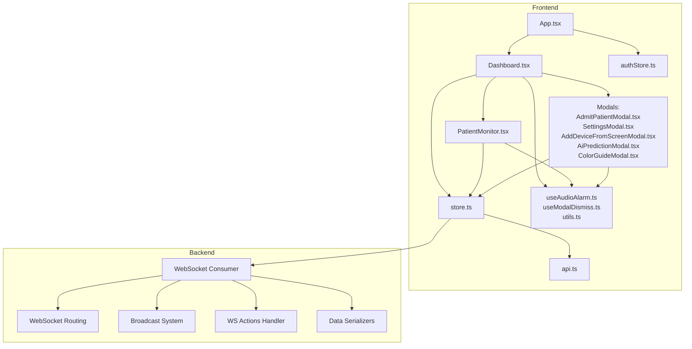
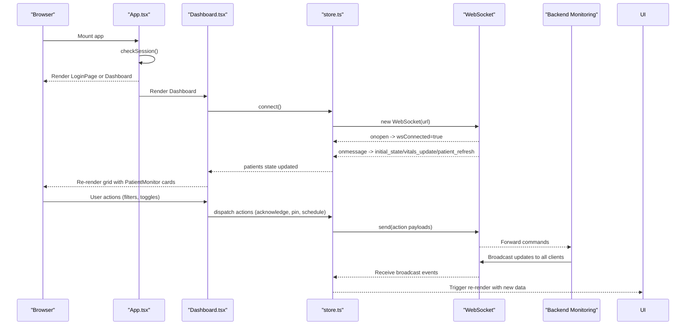
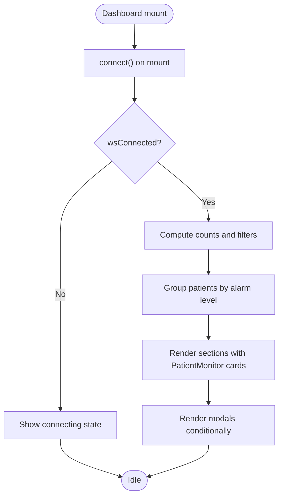
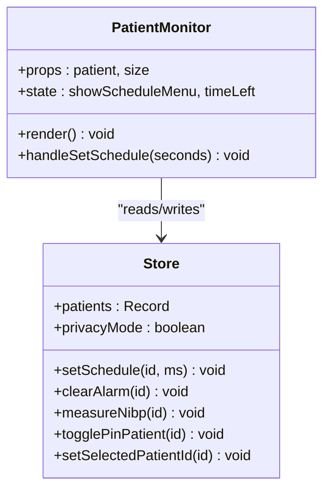
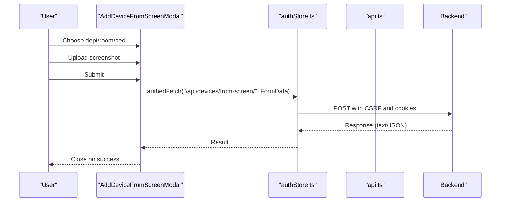
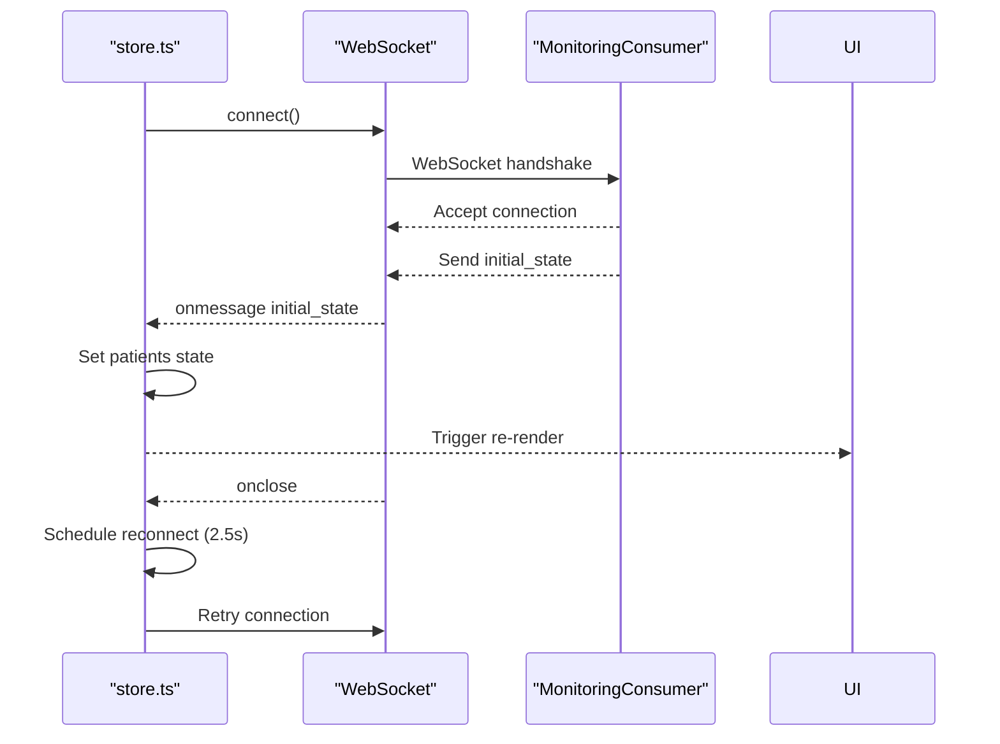
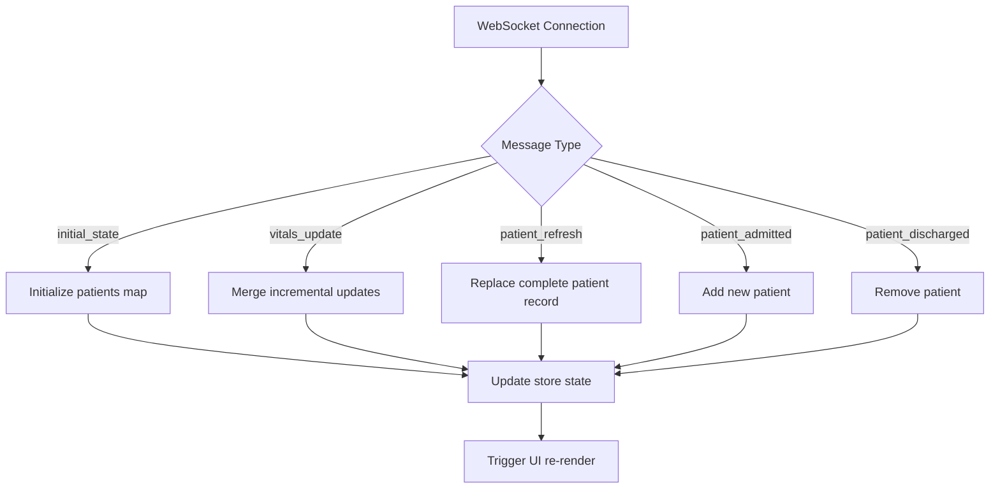
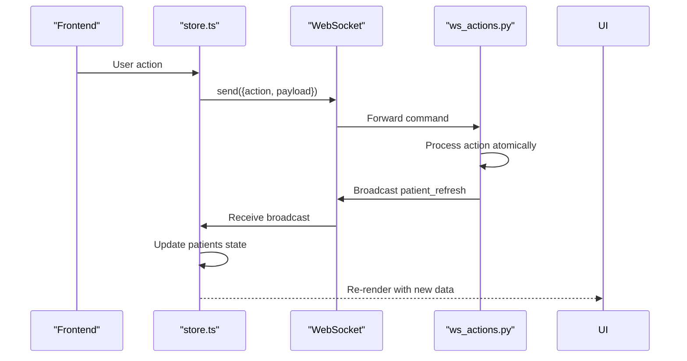
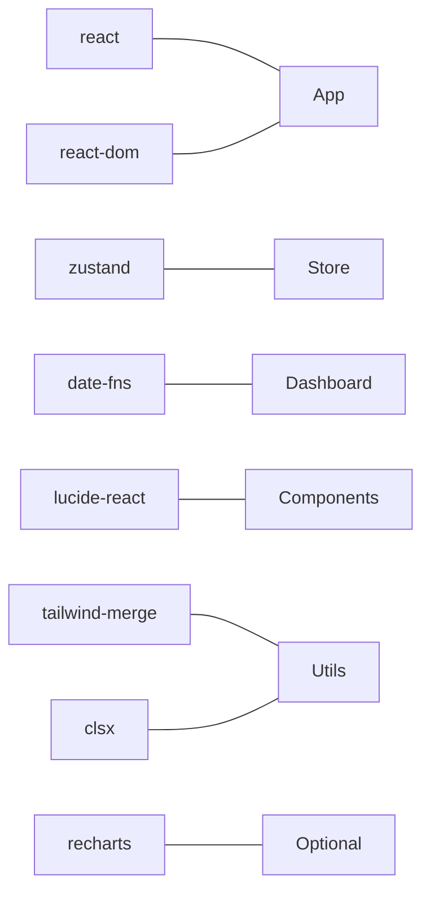

# Dashboard Interface

<cite>
**Referenced Files in This Document**
- [Dashboard.tsx](file://frontend/src/components/Dashboard.tsx)
- [PatientMonitor.tsx](file://frontend/src/components/PatientMonitor.tsx)
- [AddDeviceFromScreenModal.tsx](file://frontend/src/components/AddDeviceFromScreenModal.tsx)
- [AdmitPatientModal.tsx](file://frontend/src/components/AdmitPatientModal.tsx)
- [SettingsModal.tsx](file://frontend/src/components/SettingsModal.tsx)
- [AiPredictionModal.tsx](file://frontend/src/components/AiPredictionModal.tsx)
- [ColorGuideModal.tsx](file://frontend/src/components/ColorGuideModal.tsx)
- [App.tsx](file://frontend/src/App.tsx)
- [store.ts](file://frontend/src/store.ts)
- [api.ts](file://frontend/src/lib/api.ts)
- [useAudioAlarm.ts](file://frontend/src/hooks/useAudioAlarm.ts)
- [useModalDismiss.ts](file://frontend/src/hooks/useModalDismiss.ts)
- [utils.ts](file://frontend/src/lib/utils.ts)
- [authStore.ts](file://frontend/src/authStore.ts)
- [consumers.py](file://backend/monitoring/consumers.py)
- [routing.py](file://backend/monitoring/routing.py)
- [broadcast.py](file://backend/monitoring/broadcast.py)
- [ws_actions.py](file://backend/monitoring/ws_actions.py)
- [serializers.py](file://backend/monitoring/serializers.py)
- [package.json](file://frontend/package.json)
</cite>

## Update Summary
**Changes Made**
- Enhanced WebSocket connectivity documentation with real-time data flow patterns
- Added detailed explanation of live vital signs display capabilities
- Updated architecture diagrams to reflect WebSocket integration
- Expanded real-time data binding patterns and state synchronization
- Added backend WebSocket consumer implementation details
- Included message types and payload structures for WebSocket communication

## Table of Contents
1. [Introduction](#introduction)
2. [Project Structure](#project-structure)
3. [Core Components](#core-components)
4. [Architecture Overview](#architecture-overview)
5. [Detailed Component Analysis](#detailed-component-analysis)
6. [Real-Time WebSocket Implementation](#real-time-websocket-implementation)
7. [Dependency Analysis](#dependency-analysis)
8. [Performance Considerations](#performance-considerations)
9. [Troubleshooting Guide](#troubleshooting-guide)
10. [Conclusion](#conclusion)
11. [Appendices](#appendices)

## Introduction
This document describes the main dashboard interface and patient monitoring components for the clinical monitoring application. It covers the Dashboard layout and grid system, the PatientMonitor card with vitals visualization and alarm states, administrative modals for device configuration and patient management, responsive design patterns, real-time data binding via WebSocket, state synchronization, visual hierarchy and color coding, accessibility, performance optimization strategies, and integration patterns.

**Updated** Enhanced with comprehensive WebSocket connectivity implementation for live vital signs display and real-time patient monitoring updates.

## Project Structure
The frontend is a React application using TypeScript and Zustand for global state. The dashboard is the primary view rendered after successful authentication. Real-time updates are handled through a WebSocket connection to the backend monitoring channel with bidirectional communication for both data streaming and command execution.



**Diagram sources**
- [App.tsx:11-33](file://frontend/src/App.tsx#L11-L33)
- [Dashboard.tsx:32-428](file://frontend/src/components/Dashboard.tsx#L32-L428)
- [PatientMonitor.tsx:13-372](file://frontend/src/components/PatientMonitor.tsx#L13-L372)
- [store.ts:173-352](file://frontend/src/store.ts#L173-L352)
- [api.ts:14-34](file://frontend/src/lib/api.ts#L14-L34)
- [authStore.ts:16-79](file://frontend/src/authStore.ts#L16-L79)
- [useAudioAlarm.ts:12-91](file://frontend/src/hooks/useAudioAlarm.ts#L12-L91)
- [useModalDismiss.ts:23-45](file://frontend/src/hooks/useModalDismiss.ts#L23-L45)
- [utils.ts:4-7](file://frontend/src/lib/utils.ts#L4-L7)
- [consumers.py:12-46](file://backend/monitoring/consumers.py#L12-L46)
- [routing.py:5-7](file://backend/monitoring/routing.py#L5-L7)
- [broadcast.py:10-20](file://backend/monitoring/broadcast.py#L10-L20)
- [ws_actions.py:32-229](file://backend/monitoring/ws_actions.py#L32-L229)
- [serializers.py:13-87](file://backend/monitoring/serializers.py#L13-L87)

**Section sources**
- [App.tsx:11-33](file://frontend/src/App.tsx#L11-L33)
- [package.json:13-34](file://frontend/package.json#L13-L34)

## Core Components
- Dashboard: Orchestrates navigation, filters, real-time data, and modal composition. Implements responsive grid layouts and status indicators with WebSocket connectivity.
- PatientMonitor: Renders individual patient vitals cards with alarm styling, NEWS2 scoring, scheduled checks, and actionable controls with live data updates.
- Modals: Administrative interfaces for admitting patients, configuring devices from screenshots, viewing AI predictions, and color guidance.
- Global State: WebSocket connection, patient data, filters, privacy mode, audio mute, and actions to mutate state and send commands to the backend.
- Hooks: Audio alarm playback and modal dismissal/body scroll management.
- WebSocket Infrastructure: Bidirectional communication between frontend and backend for real-time updates and command execution.

**Section sources**
- [Dashboard.tsx:32-428](file://frontend/src/components/Dashboard.tsx#L32-L428)
- [PatientMonitor.tsx:13-372](file://frontend/src/components/PatientMonitor.tsx#L13-L372)
- [store.ts:173-352](file://frontend/src/store.ts#L173-L352)
- [useAudioAlarm.ts:12-91](file://frontend/src/hooks/useAudioAlarm.ts#L12-L91)
- [useModalDismiss.ts:23-45](file://frontend/src/hooks/useModalDismiss.ts#L23-L45)

## Architecture Overview
The dashboard integrates React components with a centralized store for state and WebSocket for real-time updates. Authentication is handled separately and gates access to the dashboard. Modals encapsulate administrative tasks and provide guided workflows. The WebSocket implementation enables bidirectional communication for both data streaming and command execution.



**Diagram sources**
- [App.tsx:16-32](file://frontend/src/App.tsx#L16-L32)
- [Dashboard.tsx:49-54](file://frontend/src/components/Dashboard.tsx#L49-L54)
- [store.ts:219-352](file://frontend/src/store.ts#L219-L352)
- [api.ts:22-34](file://frontend/src/lib/api.ts#L22-L34)
- [consumers.py:13-36](file://backend/monitoring/consumers.py#L13-L36)
- [broadcast.py:10-20](file://backend/monitoring/broadcast.py#L10-L20)

## Detailed Component Analysis

### Dashboard Component
Responsibilities:
- Initializes WebSocket connection and audio alarms.
- Manages filters (all, critical, warning, pinned) and department filtering.
- Computes counts per severity and groups patients into sections.
- Renders a responsive grid of PatientMonitor cards sized by severity.
- Provides administrative controls and modals.

Key patterns:
- Memoization for derived computations (counts, filtered lists).
- Responsive grid classes tailored to breakpoints.
- Accessibility: skip link, ARIA live regions for connectivity, labels, and keyboard navigation support.
- Real-time data handling with WebSocket connection lifecycle management.



**Diagram sources**
- [Dashboard.tsx:49-106](file://frontend/src/components/Dashboard.tsx#L49-L106)
- [Dashboard.tsx:340-385](file://frontend/src/components/Dashboard.tsx#L340-L385)

**Section sources**
- [Dashboard.tsx:32-428](file://frontend/src/components/Dashboard.tsx#L32-L428)

### PatientMonitor Component
Responsibilities:
- Visualizes vitals (HR, SpO2, NIBP) with color-coded labels.
- Displays NEWS2 score badge and alarm level indicator.
- Handles scheduled checks countdown and menu interactions.
- Supports toggling pin, clearing special alarms, measuring NIBP, and selecting patient.
- Privacy-aware name masking.

Rendering strategy:
- Dynamic grid layout based on card size (large/medium/small).
- Conditional rendering of badges and icons depending on size and data availability.
- Hover-triggered controls (pin, NIBP measure, schedule menu).
- Real-time updates through WebSocket data binding.



**Diagram sources**
- [PatientMonitor.tsx:13-372](file://frontend/src/components/PatientMonitor.tsx#L13-L372)
- [store.ts:173-217](file://frontend/src/store.ts#L173-L217)

**Section sources**
- [PatientMonitor.tsx:13-372](file://frontend/src/components/PatientMonitor.tsx#L13-L372)

### Modal Components

#### AddDeviceFromScreenModal
Purpose:
- Configure a monitor device by selecting department/room/bed and uploading a screenshot of the monitor's network/Hl7 screen.
- Integrates with backend vision endpoint to extract device identifiers.

Workflow:
- Select hierarchy: department → room → bed.
- Upload image; submit FormData to backend.
- On success, triggers refresh of infrastructure data.



**Diagram sources**
- [AddDeviceFromScreenModal.tsx:69-105](file://frontend/src/components/AddDeviceFromScreenModal.tsx#L69-L105)
- [authStore.ts:98-106](file://frontend/src/authStore.ts#L98-L106)
- [api.ts:14-19](file://frontend/src/lib/api.ts#L14-L19)

**Section sources**
- [AddDeviceFromScreenModal.tsx:28-262](file://frontend/src/components/AddDeviceFromScreenModal.tsx#L28-L262)

#### AdmitPatientModal
Purpose:
- Admit a new patient by assigning them to a bed and capturing basic demographics.
- Loads infrastructure data and validates availability.

Behavior:
- Loads departments/rooms/beds via authenticated fetch.
- Submits admission command via WebSocket actions.

**Section sources**
- [AdmitPatientModal.tsx:22-312](file://frontend/src/components/AdmitPatientModal.tsx#L22-L312)
- [store.ts:212-214](file://frontend/src/store.ts#L212-L214)

#### SettingsModal
Purpose:
- Administrative hub for structure (departments/rooms/beds), device management, patient actions, and integration diagnostics.
- Includes device connection checks, online marking, and bulk scheduling.

Highlights:
- Tabs for structure, devices, patients, integration.
- Custom prompts and confirm dialogs to avoid browser-native dialogs in iframe contexts.
- Device connection check results with HL7 diagnostics and firewall hints.

**Section sources**
- [SettingsModal.tsx:93-954](file://frontend/src/components/SettingsModal.tsx#L93-L954)

#### AiPredictionModal
Purpose:
- Summarizes AI risk predictions for patients flagged as high-risk, including probability, estimated time, reasons, and recommendations.

**Section sources**
- [AiPredictionModal.tsx:10-130](file://frontend/src/components/AiPredictionModal.tsx#L10-L130)

#### ColorGuideModal
Purpose:
- Explains the visual semantics of alarm colors, NEWS2 scoring, and UI indicators for quick orientation in clinical workflows.

**Section sources**
- [ColorGuideModal.tsx:17-179](file://frontend/src/components/ColorGuideModal.tsx#L17-L179)

## Real-Time WebSocket Implementation

### WebSocket Connection Lifecycle
The dashboard establishes a persistent WebSocket connection to the backend monitoring service upon mount and manages the connection lifecycle with automatic reconnection logic.



**Diagram sources**
- [store.ts:219-352](file://frontend/src/store.ts#L219-L352)
- [consumers.py:13-36](file://backend/monitoring/consumers.py#L13-L36)

### Real-Time Data Flow Patterns
The WebSocket implementation supports multiple message types for different update scenarios:

**Message Types:**
- `initial_state`: Full patient dataset initialization
- `vitals_update`: Incremental vital signs updates
- `patient_refresh`: Complete patient record refresh
- `patient_admitted`: New patient admission notification
- `patient_discharged`: Patient discharge notification

**Data Structures:**
- `VitalsUpdatePayload`: Individual patient update with vitals, alarm state, and metadata
- `PatientData`: Complete patient record with all clinical information
- `AlarmState`: Current alarm level and associated metadata



**Diagram sources**
- [store.ts:237-317](file://frontend/src/store.ts#L237-L317)
- [store.ts:120-135](file://frontend/src/store.ts#L120-L135)
- [store.ts:95-118](file://frontend/src/store.ts#L95-L118)

### Bidirectional Command Execution
The WebSocket connection supports two-way communication where the frontend can send commands to the backend and receive updates in return.

**Available Commands:**
- `toggle_pin`: Toggle patient pin status
- `acknowledge_alarm`: Acknowledge non-critical alarms
- `set_schedule`: Set scheduled check intervals
- `set_all_schedules`: Bulk schedule updates
- `clear_alarm`: Clear purple (critical) alarms
- `update_limits`: Update alarm thresholds
- `measure_nibp`: Trigger NIBP measurement
- `admit_patient`: Admit new patient
- `discharge_patient`: Discharge patient

**Command Processing Flow:**


**Diagram sources**
- [store.ts:187-217](file://frontend/src/store.ts#L187-L217)
- [ws_actions.py:32-229](file://backend/monitoring/ws_actions.py#L32-L229)

**Section sources**
- [store.ts:173-352](file://frontend/src/store.ts#L173-L352)
- [api.ts:22-34](file://frontend/src/lib/api.ts#L22-L34)
- [consumers.py:12-46](file://backend/monitoring/consumers.py#L12-L46)
- [broadcast.py:10-20](file://backend/monitoring/broadcast.py#L10-L20)
- [ws_actions.py:32-229](file://backend/monitoring/ws_actions.py#L32-L229)

### Responsive Design and Grid Layouts
- Sticky top bar adapts to narrow widths with wrapping and truncation.
- Patient grids:
  - Critical: larger cards in a denser grid.
  - Warning: medium cards in a wider grid.
  - Stable: small cards in a very wide grid.
- Breakpoint-specific column counts ensure optimal density across devices.

Accessibility:
- Skip link to main content.
- Live region for connectivity status.
- Semantic labels and ARIA attributes on interactive elements.

**Section sources**
- [Dashboard.tsx:135-306](file://frontend/src/components/Dashboard.tsx#L135-L306)
- [Dashboard.tsx:340-385](file://frontend/src/components/Dashboard.tsx#L340-L385)

### Visual Hierarchy and Color Coding
- Alarm levels mapped to distinct borders, backgrounds, and subtle animations.
- NEWS2 badge color-codes overall condition.
- Icons and tooltips clarify intent for actions like NIBP measurement, scheduling, and pinning.
- Online/offline status is visually prominent in the header.

**Section sources**
- [PatientMonitor.tsx:73-79](file://frontend/src/components/PatientMonitor.tsx#L73-L79)
- [PatientMonitor.tsx:176-184](file://frontend/src/components/PatientMonitor.tsx#L176-L184)
- [Dashboard.tsx:149-156](file://frontend/src/components/Dashboard.tsx#L149-L156)

### Accessibility Considerations
- Keyboard navigation and focus management.
- Screen reader-friendly labels and roles (dialog, menu, button).
- ARIA live regions for connectivity and dynamic counts.
- Sufficient color contrast and motion-safe animations.

**Section sources**
- [Dashboard.tsx:110-115](file://frontend/src/components/Dashboard.tsx#L110-L115)
- [PatientMonitor.tsx:98-107](file://frontend/src/components/PatientMonitor.tsx#L98-L107)
- [useModalDismiss.ts:23-45](file://frontend/src/hooks/useModalDismiss.ts#L23-L45)

## Dependency Analysis
External libraries and their roles:
- React and React DOM: UI framework.
- Zustand: Global state management.
- date-fns: Relative time formatting and localization.
- lucide-react: UI icons.
- tailwind-merge/clsx: Safe class merging.
- recharts: Optional charting library present in dependencies.



**Diagram sources**
- [package.json:13-34](file://frontend/package.json#L13-L34)

**Section sources**
- [package.json:13-34](file://frontend/package.json#L13-L34)

## Performance Considerations
- Memoization:
  - Derived computations (counts, filtered lists) use memoization to prevent unnecessary recalculations.
- Component memoization:
  - PatientMonitor is memoized to avoid re-rendering unchanged cards.
- Efficient updates:
  - WebSocket updates merge incremental changes into the patients map.
- Virtualization:
  - Not implemented in the current code; consider virtualizing large patient lists if performance becomes a concern.
- Rendering strategy:
  - Conditional rendering of sections reduces DOM size when categories are empty.
- Image optimization:
  - Background image uses eager loading and appropriate attributes.
- Connection management:
  - Automatic reconnection with exponential backoff for resilience.

Recommendations:
- For very large deployments, implement virtual scrolling for the patient grid.
- Debounce search input to reduce frequent recomputations.
- Lazy-load modals to reduce initial bundle size.
- Implement connection health monitoring and user notifications.

**Section sources**
- [Dashboard.tsx:61-98](file://frontend/src/components/Dashboard.tsx#L61-L98)
- [PatientMonitor.tsx:13](file://frontend/src/components/PatientMonitor.tsx#L13)
- [store.ts:267-293](file://frontend/src/store.ts#L267-L293)

## Troubleshooting Guide
Common issues and resolutions:
- WebSocket not connecting:
  - Verify backend URL resolution and CORS. Check connectivity status indicator in the header.
  - Ensure Django Channels is running and configured correctly.
  - Check browser console for WebSocket handshake errors.
- No patients displayed:
  - Ensure backend is emitting initial_state and vitals_update messages.
  - Verify authentication is working properly.
  - Check network tab for WebSocket upgrade failures.
- Alerts not audible:
  - Confirm audio is not muted and browser autoplay policies are satisfied by user gestures.
- Modals not closing:
  - Use Escape key or click outside; ensure stacking order and body scroll lock are functioning.
- Device configuration failures:
  - Confirm infrastructure selection and image upload; check backend response for errors.
- Real-time updates not appearing:
  - Check WebSocket connection status in header.
  - Verify backend broadcasting is active.
  - Ensure patient data is being generated/updated in the backend.

Operational hooks and utilities:
- Audio alarm hook resumes audio context on first interaction.
- Modal dismissal hook manages Escape and body scroll locking.
- Connection lifecycle management with automatic reconnection.

**Section sources**
- [store.ts:319-335](file://frontend/src/store.ts#L319-L335)
- [useAudioAlarm.ts:20-35](file://frontend/src/hooks/useAudioAlarm.ts#L20-L35)
- [useModalDismiss.ts:23-45](file://frontend/src/hooks/useModalDismiss.ts#L23-L45)

## Conclusion
The dashboard provides a responsive, accessible, and real-time clinical monitoring interface with robust WebSocket connectivity. Its modular component design, comprehensive state management, and bidirectional communication enable efficient oversight of multiple patients with live vital signs display. Administrative modals streamline device and patient workflows while maintaining security through proper authentication and authorization. With targeted performance enhancements and proper connection management, the system scales to large deployments while maintaining usability and safety in clinical environments.

## Appendices

### Component Composition Strategies
- Dashboard composes PatientMonitor cards and modals; modals compose forms and administrative helpers.
- Hooks encapsulate cross-cutting concerns (audio, dismissal) and are reused across components.
- Utilities centralize class merging and shared helpers.
- WebSocket integration provides seamless real-time data flow between frontend and backend.

**Section sources**
- [Dashboard.tsx:412-426](file://frontend/src/components/Dashboard.tsx#L412-L426)
- [useAudioAlarm.ts:12-91](file://frontend/src/hooks/useAudioAlarm.ts#L12-L91)
- [useModalDismiss.ts:23-45](file://frontend/src/hooks/useModalDismiss.ts#L23-L45)
- [utils.ts:4-7](file://frontend/src/lib/utils.ts#L4-L7)

### WebSocket Message Schema Reference
**Frontend to Backend Messages:**
```typescript
{
  action: 'toggle_pin' | 'acknowledge_alarm' | 'set_schedule' | 'set_all_schedules' | 'clear_alarm' | 'update_limits' | 'measure_nibp' | 'admit_patient' | 'discharge_patient',
  patientId?: string,
  intervalMs?: number,
  limits?: Partial<AlarmLimits>,
  note?: Omit<ClinicalNote, 'id' | 'time'>
}
```

**Backend to Frontend Messages:**
```typescript
{
  type: 'initial_state' | 'vitals_update' | 'patient_refresh' | 'patient_admitted' | 'patient_discharged',
  patients?: PatientData[],
  updates?: VitalsUpdatePayload[],
  patient?: PatientData,
  patientId?: string
}
```

**Section sources**
- [store.ts:120-135](file://frontend/src/store.ts#L120-L135)
- [ws_actions.py:32-229](file://backend/monitoring/ws_actions.py#L32-L229)
- [consumers.py:26-36](file://backend/monitoring/consumers.py#L26-L36)