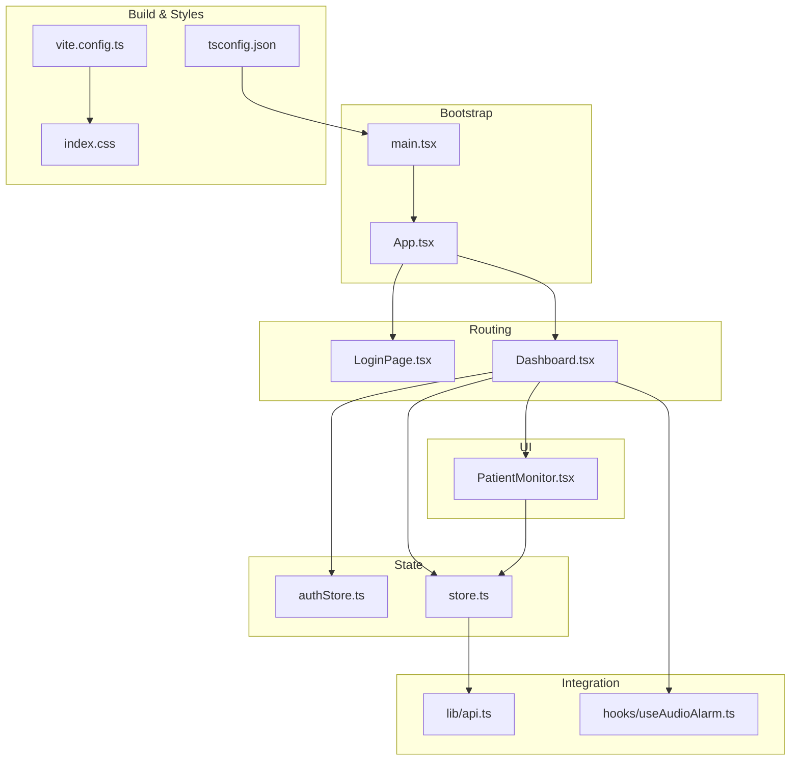
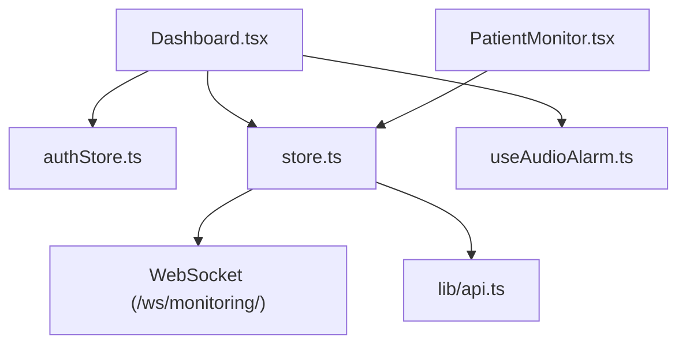
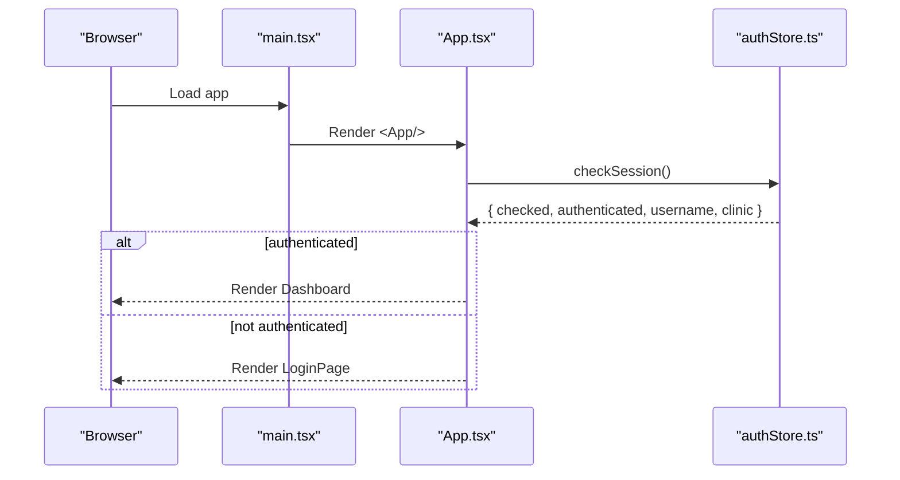
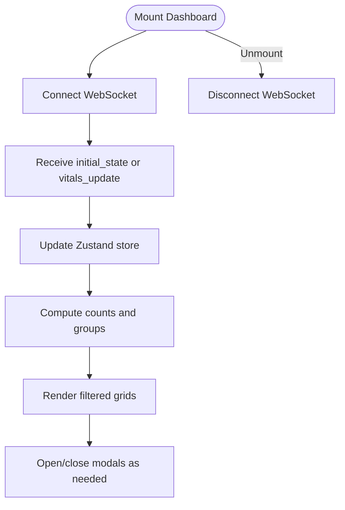
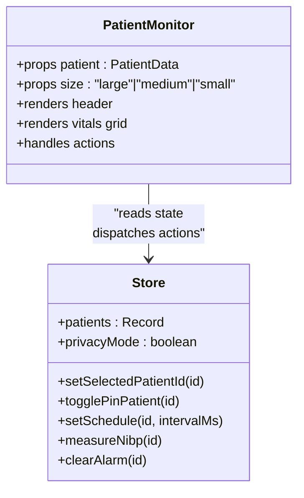
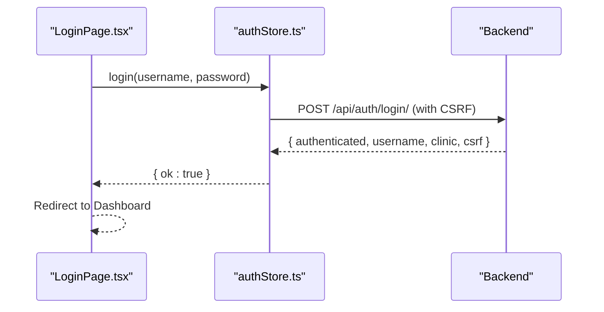
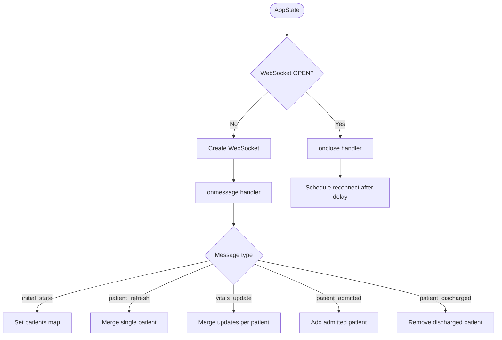
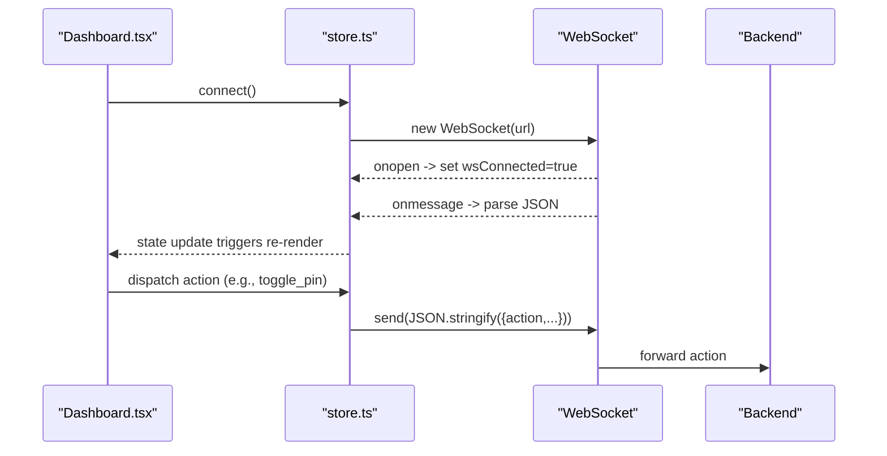
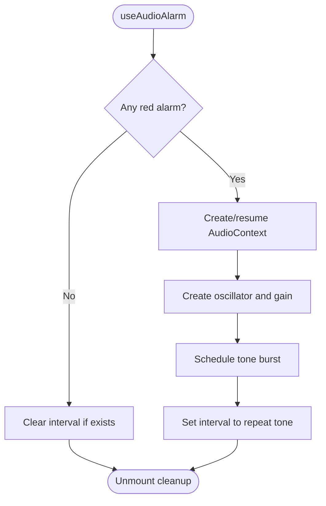
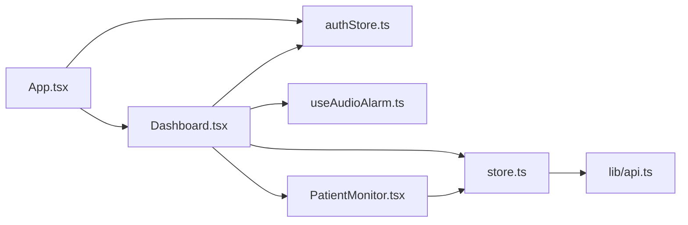

# Frontend Architecture

<cite>
**Referenced Files in This Document**
- [App.tsx](file://frontend/src/App.tsx)
- [main.tsx](file://frontend/src/main.tsx)
- [Dashboard.tsx](file://frontend/src/components/Dashboard.tsx)
- [PatientMonitor.tsx](file://frontend/src/components/PatientMonitor.tsx)
- [LoginPage.tsx](file://frontend/src/components/LoginPage.tsx)
- [authStore.ts](file://frontend/src/authStore.ts)
- [store.ts](file://frontend/src/store.ts)
- [api.ts](file://frontend/src/lib/api.ts)
- [useAudioAlarm.ts](file://frontend/src/hooks/useAudioAlarm.ts)
- [index.css](file://frontend/src/index.css)
- [vite.config.ts](file://frontend/vite.config.ts)
- [package.json](file://frontend/package.json)
- [tsconfig.json](file://frontend/tsconfig.json)
</cite>

## Table of Contents
1. [Introduction](#introduction)
2. [Project Structure](#project-structure)
3. [Core Components](#core-components)
4. [Architecture Overview](#architecture-overview)
5. [Detailed Component Analysis](#detailed-component-analysis)
6. [Dependency Analysis](#dependency-analysis)
7. [Performance Considerations](#performance-considerations)
8. [Troubleshooting Guide](#troubleshooting-guide)
9. [Conclusion](#conclusion)
10. [Appendices](#appendices)

## Introduction
This document describes the frontend architecture of the React/Vite-based monitoring dashboard. It covers the application’s component hierarchy, routing configuration, state management with Zustand, real-time data visualization and WebSocket integration, styling with Tailwind CSS and dark mode, global state patterns, component composition strategies, performance optimizations, build configuration with Vite, asset management, development workflow, responsive design, accessibility, browser compatibility, and integration with the backend API layer.

## Project Structure
The frontend is organized around a small set of core files:
- Application bootstrap and root component
- Authentication store and login page
- Global state store for patients and WebSocket lifecycle
- Dashboard layout and patient tiles
- Utility modules for API and audio alarms
- Build configuration and styling

**Diagram sources**
- [main.tsx:1-16](file://frontend/src/main.tsx#L1-L16)
- [App.tsx:11-33](file://frontend/src/App.tsx#L11-L33)
- [LoginPage.tsx:1-84](file://frontend/src/components/LoginPage.tsx#L1-L84)
- [Dashboard.tsx:32-54](file://frontend/src/components/Dashboard.tsx#L32-L54)
- [PatientMonitor.tsx:13-372](file://frontend/src/components/PatientMonitor.tsx#L13-L372)
- [authStore.ts:16-79](file://frontend/src/authStore.ts#L16-L79)
- [store.ts:173-352](file://frontend/src/store.ts#L173-L352)
- [api.ts:15-34](file://frontend/src/lib/api.ts#L15-L34)
- [useAudioAlarm.ts:12-91](file://frontend/src/hooks/useAudioAlarm.ts#L12-L91)
- [vite.config.ts:6-34](file://frontend/vite.config.ts#L6-L34)
- [tsconfig.json:1-27](file://frontend/tsconfig.json#L1-L27)
- [index.css:1-2](file://frontend/src/index.css#L1-L2)

**Section sources**
- [main.tsx:1-16](file://frontend/src/main.tsx#L1-L16)
- [App.tsx:11-33](file://frontend/src/App.tsx#L11-L33)
- [vite.config.ts:6-34](file://frontend/vite.config.ts#L6-L34)
- [tsconfig.json:1-27](file://frontend/tsconfig.json#L1-L27)
- [index.css:1-2](file://frontend/src/index.css#L1-L2)

## Core Components
- Root application and routing:
  - The root renders the App component and sets up strict mode.
  - App checks session and conditionally renders LoginPage or Dashboard.
- Dashboard:
  - Orchestrates filters, search, WebSocket connection, modal management, and patient grid rendering.
  - Integrates audio alarms and provides navigation controls.
- PatientMonitor:
  - Renders a single patient tile with vital signs, alarms, NEWS2 score, battery, scheduling, and actions.
- Authentication store:
  - Handles session checks, login, logout, and CSRF-protected requests.
- Global state store:
  - Manages patients, WebSocket lifecycle, UI flags, and actions sent to the backend via WebSocket.
- API utilities:
  - Provides normalized API and WebSocket URLs with environment-aware logic.
- Audio alarm hook:
  - Generates a repeating tone for critical alarms with browser autoplay policy handling.

**Section sources**
- [App.tsx:11-33](file://frontend/src/App.tsx#L11-L33)
- [Dashboard.tsx:32-54](file://frontend/src/components/Dashboard.tsx#L32-L54)
- [PatientMonitor.tsx:13-372](file://frontend/src/components/PatientMonitor.tsx#L13-L372)
- [authStore.ts:16-79](file://frontend/src/authStore.ts#L16-L79)
- [store.ts:173-352](file://frontend/src/store.ts#L173-L352)
- [api.ts:15-34](file://frontend/src/lib/api.ts#L15-L34)
- [useAudioAlarm.ts:12-91](file://frontend/src/hooks/useAudioAlarm.ts#L12-L91)

## Architecture Overview
The frontend follows a unidirectional data flow:
- UI components subscribe to Zustand stores for state and dispatch actions.
- WebSocket messages update the global store, which re-renders affected components.
- Authentication store manages session state and protected API calls.
- Tailwind CSS provides a dark-mode-first design system with responsive utilities.

**Diagram sources**
- [Dashboard.tsx:32-54](file://frontend/src/components/Dashboard.tsx#L32-L54)
- [PatientMonitor.tsx:13-372](file://frontend/src/components/PatientMonitor.tsx#L13-L372)
- [authStore.ts:16-79](file://frontend/src/authStore.ts#L16-L79)
- [store.ts:173-352](file://frontend/src/store.ts#L173-L352)
- [api.ts:22-34](file://frontend/src/lib/api.ts#L22-L34)
- [useAudioAlarm.ts:12-91](file://frontend/src/hooks/useAudioAlarm.ts#L12-L91)

## Detailed Component Analysis

### Application Bootstrap and Routing
- main.tsx creates the root and mounts App.
- App initializes authentication session on mount and renders either LoginPage or Dashboard depending on authentication state.

**Diagram sources**
- [main.tsx:11-15](file://frontend/src/main.tsx#L11-L15)
- [App.tsx:16-32](file://frontend/src/App.tsx#L16-L32)
- [authStore.ts:23-38](file://frontend/src/authStore.ts#L23-L38)

**Section sources**
- [main.tsx:1-16](file://frontend/src/main.tsx#L1-L16)
- [App.tsx:11-33](file://frontend/src/App.tsx#L11-L33)
- [authStore.ts:16-79](file://frontend/src/authStore.ts#L16-L79)

### Dashboard Layout and Filters
- Establishes top navigation bar with search, severity filters, department filter, status indicators, and controls.
- Connects to WebSocket on mount and disconnects on unmount.
- Computes counts and grouped lists for critical, warning, and stable patients.
- Renders modals for admission, settings, AI prediction, and color guide.

**Diagram sources**
- [Dashboard.tsx:49-54](file://frontend/src/components/Dashboard.tsx#L49-L54)
- [store.ts:255-293](file://frontend/src/store.ts#L255-L293)

**Section sources**
- [Dashboard.tsx:32-429](file://frontend/src/components/Dashboard.tsx#L32-L429)
- [store.ts:237-335](file://frontend/src/store.ts#L237-L335)

### Patient Tile Composition
- Renders patient header (name, room, doctor, NEWS2), alarm badge, pin/battery/schedule controls, and vitals grid.
- Supports three sizes (large, medium, small) with responsive layouts.
- Implements privacy mode to mask names and integrates actions (toggle pin, set schedule, measure NIBP, clear alarm).

**Diagram sources**
- [PatientMonitor.tsx:13-372](file://frontend/src/components/PatientMonitor.tsx#L13-L372)
- [store.ts:173-217](file://frontend/src/store.ts#L173-L217)

**Section sources**
- [PatientMonitor.tsx:13-372](file://frontend/src/components/PatientMonitor.tsx#L13-L372)
- [store.ts:173-217](file://frontend/src/store.ts#L173-L217)

### Authentication Store and Protected Requests
- Maintains session state and CSRF token.
- Provides login, logout, and session check with credential handling.
- Exposes helpers for authenticated fetch with CSRF protection.

**Diagram sources**
- [LoginPage.tsx:11-20](file://frontend/src/components/LoginPage.tsx#L11-L20)
- [authStore.ts:40-64](file://frontend/src/authStore.ts#L40-L64)

**Section sources**
- [authStore.ts:16-79](file://frontend/src/authStore.ts#L16-L79)
- [LoginPage.tsx:1-84](file://frontend/src/components/LoginPage.tsx#L1-L84)

### Global State Management with Zustand
- Defines models for PatientData, VitalsUpdatePayload, AlarmState, and AlarmLimits.
- Provides actions to connect/disconnect WebSocket, update patients, toggle UI flags, and dispatch commands to backend.
- Handles WebSocket message types: initial_state, patient_refresh, vitals_update, patient_admitted, patient_discharged.
- Implements automatic reconnection with exponential backoff-like delay.

**Diagram sources**
- [store.ts:173-352](file://frontend/src/store.ts#L173-L352)
- [store.ts:237-317](file://frontend/src/store.ts#L237-L317)

**Section sources**
- [store.ts:143-352](file://frontend/src/store.ts#L143-L352)

### Real-Time Data Visualization and Canvas-Based ECG Rendering
- The repository does not include a dedicated ECG canvas renderer. The PatientMonitor component displays numeric vitals and alarm badges but does not render waveform data.
- To implement high-frequency ECG rendering:
  - Introduce a dedicated ECGCanvas component that subscribes to the global store for ECG samples.
  - Use a canvas element with requestAnimationFrame for smooth updates.
  - Apply debouncing and decimation strategies to limit redraw frequency while preserving detail.
  - Employ a ring buffer to store recent samples and render only the visible window.
  - Ensure the component is resilient to rapid updates and memory growth.

[No sources needed since this section provides implementation guidance not present in the codebase]

### WebSocket Integration Patterns
- The store constructs the WebSocket URL using environment-aware logic and connects on demand.
- Message handling supports bulk initial state, incremental updates, and discrete events.
- Actions dispatched from UI components are serialized and sent to the backend when the socket is open.

**Diagram sources**
- [store.ts:219-338](file://frontend/src/store.ts#L219-L338)
- [api.ts:22-34](file://frontend/src/lib/api.ts#L22-L34)

**Section sources**
- [store.ts:219-338](file://frontend/src/store.ts#L219-L338)
- [api.ts:22-34](file://frontend/src/lib/api.ts#L22-L34)

### Alarm Notifications and Audio Feedback
- The useAudioAlarm hook monitors critical alarms and plays a repeating tone using Web Audio API.
- It resumes the AudioContext after the first user gesture to satisfy autoplay policies.
- The hook cleans up intervals and contexts on unmount.

**Diagram sources**
- [useAudioAlarm.ts:12-91](file://frontend/src/hooks/useAudioAlarm.ts#L12-L91)

**Section sources**
- [useAudioAlarm.ts:12-91](file://frontend/src/hooks/useAudioAlarm.ts#L12-L91)

### Styling Architecture and Dark Mode
- Tailwind CSS is integrated via the official Vite plugin.
- The design system emphasizes a dark theme with zinc/grayscale backgrounds and accent colors for status (green/yellow/red/purple).
- Responsive utilities are used extensively for grid layouts and typography.
- Accessibility attributes (aria-label, aria-live, aria-expanded) are applied across interactive elements.

**Section sources**
- [index.css:1-2](file://frontend/src/index.css#L1-L2)
- [vite.config.ts:1-10](file://frontend/vite.config.ts#L1-L10)
- [Dashboard.tsx:109-429](file://frontend/src/components/Dashboard.tsx#L109-L429)
- [PatientMonitor.tsx:96-372](file://frontend/src/components/PatientMonitor.tsx#L96-L372)

### Component Composition Strategies
- Dashboard composes PatientMonitor tiles and modals, managing search and filter state locally while delegating patient actions to the global store.
- PatientMonitor encapsulates UI for a single patient, exposing actions via callbacks to the parent.
- Hooks like useAudioAlarm are composed into Dashboard to provide cross-cutting behavior.

**Section sources**
- [Dashboard.tsx:32-429](file://frontend/src/components/Dashboard.tsx#L32-L429)
- [PatientMonitor.tsx:13-372](file://frontend/src/components/PatientMonitor.tsx#L13-L372)
- [useAudioAlarm.ts:12-91](file://frontend/src/hooks/useAudioAlarm.ts#L12-L91)

### Build Configuration and Development Workflow
- Vite is configured with React plugin and Tailwind CSS plugin.
- Environment variables are injected for API keys.
- Path aliases are defined for clean imports.
- Proxy routes forward /api and /ws to the backend server.
- TypeScript is configured with modern targets and DOM libraries.

**Section sources**
- [vite.config.ts:6-34](file://frontend/vite.config.ts#L6-L34)
- [package.json:6-12](file://frontend/package.json#L6-L12)
- [tsconfig.json:1-27](file://frontend/tsconfig.json#L1-L27)

## Dependency Analysis
- Internal dependencies:
  - App depends on authStore for session state.
  - Dashboard depends on authStore and store for UI state and WebSocket lifecycle.
  - PatientMonitor depends on store for actions and reads current patient data.
  - useAudioAlarm depends on store for patient list and audio mute flag.
  - store.ts depends on api.ts for WebSocket URL construction.
- External dependencies:
  - React and ReactDOM for UI.
  - Zustand for state management.
  - Tailwind CSS and related tooling for styling.
  - date-fns for localization-aware formatting.
  - lucide-react for icons.
  - framer-motion for animations.

**Diagram sources**
- [App.tsx:7-9](file://frontend/src/App.tsx#L7-L9)
- [Dashboard.tsx:2-12](file://frontend/src/components/Dashboard.tsx#L2-L12)
- [PatientMonitor.tsx:2-4](file://frontend/src/components/PatientMonitor.tsx#L2-L4)
- [authStore.ts:16-79](file://frontend/src/authStore.ts#L16-L79)
- [store.ts:173-352](file://frontend/src/store.ts#L173-L352)
- [api.ts:15-34](file://frontend/src/lib/api.ts#L15-L34)
- [useAudioAlarm.ts:12-91](file://frontend/src/hooks/useAudioAlarm.ts#L12-L91)

**Section sources**
- [package.json:13-32](file://frontend/package.json#L13-L32)

## Performance Considerations
- Memoization:
  - Dashboard uses useMemo for derived computations and filtered lists to avoid unnecessary renders.
  - PatientMonitor is wrapped with React.memo to prevent re-renders when props are unchanged.
- Efficient updates:
  - Zustand allows granular state updates; avoid spreading large objects unless necessary.
- Rendering:
  - Use CSS transforms and GPU-accelerated properties for animations.
  - Prefer virtualized lists for very large patient grids.
- WebSocket:
  - Debounce UI actions and batch updates to reduce message volume.
  - Close and reopen connections on network changes if needed.
- Assets:
  - Lazy-load modals and heavy components to improve initial load.

[No sources needed since this section provides general guidance]

## Troubleshooting Guide
- WebSocket connectivity:
  - Verify backend endpoint and CORS/proxy settings.
  - Check browser console for connection errors and logs emitted in the store.
- Authentication:
  - Ensure cookies are accepted and CSRF tokens are included in POST requests.
  - Confirm session endpoint returns expected fields.
- Audio alarms:
  - Browser autoplay policies require a user gesture to resume AudioContext.
  - Test with a critical alarm present and ensure audio is not muted.
- Styling:
  - Tailwind classes should be valid; ensure the plugin is loaded and CSS is imported.
- Build issues:
  - Confirm Vite plugins are installed and environment variables are set.
  - Check TypeScript configuration for module resolution and JSX support.

**Section sources**
- [store.ts:319-335](file://frontend/src/store.ts#L319-L335)
- [authStore.ts:40-78](file://frontend/src/authStore.ts#L40-L78)
- [useAudioAlarm.ts:20-35](file://frontend/src/hooks/useAudioAlarm.ts#L20-L35)
- [vite.config.ts:9,18-32](file://frontend/vite.config.ts#L9,18-L32)
- [tsconfig.json:18-25](file://frontend/tsconfig.json#L18-L25)

## Conclusion
The frontend employs a clean separation of concerns with Zustand for state, React for UI composition, and Tailwind for styling. WebSocket integration enables real-time updates, while hooks encapsulate cross-cutting behaviors like audio feedback. The architecture supports scalability through memoization, efficient updates, and modular components. Extending visualization capabilities (e.g., ECG canvas) would follow established patterns of subscribing to global state and rendering efficiently.

## Appendices

### Backend API Integration Examples
- Login flow:
  - Call the login action with credentials; the store persists session and CSRF token.
- WebSocket actions:
  - Dispatch actions (e.g., toggle_pin, set_schedule) via the store; ensure the socket is open before sending.

**Section sources**
- [authStore.ts:40-64](file://frontend/src/authStore.ts#L40-L64)
- [store.ts:187-217](file://frontend/src/store.ts#L187-L217)

### Accessibility and Responsive Design Notes
- Use semantic HTML and ARIA attributes for interactive elements.
- Provide keyboard navigation and focus management.
- Ensure sufficient color contrast and readable text sizes.
- Test responsive breakpoints and adjust grid layouts as needed.

[No sources needed since this section provides general guidance]