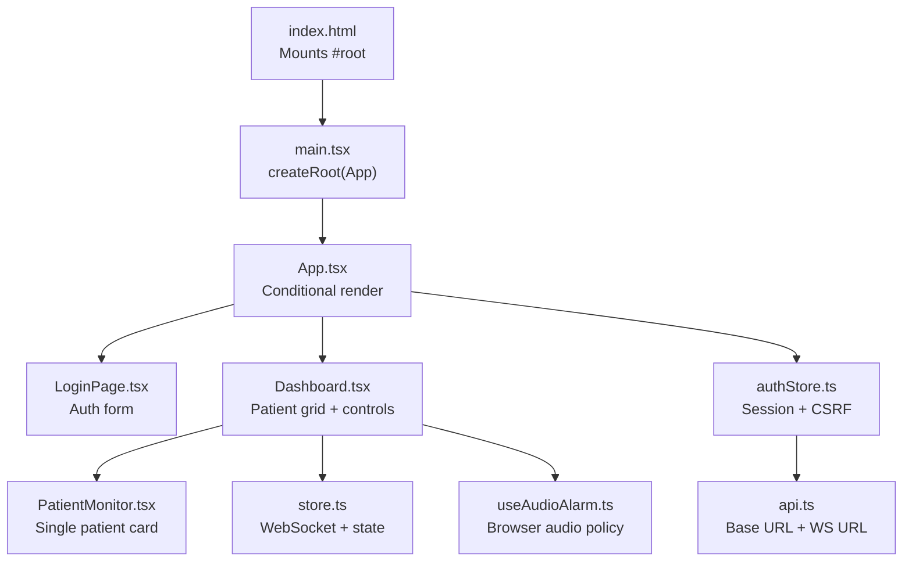
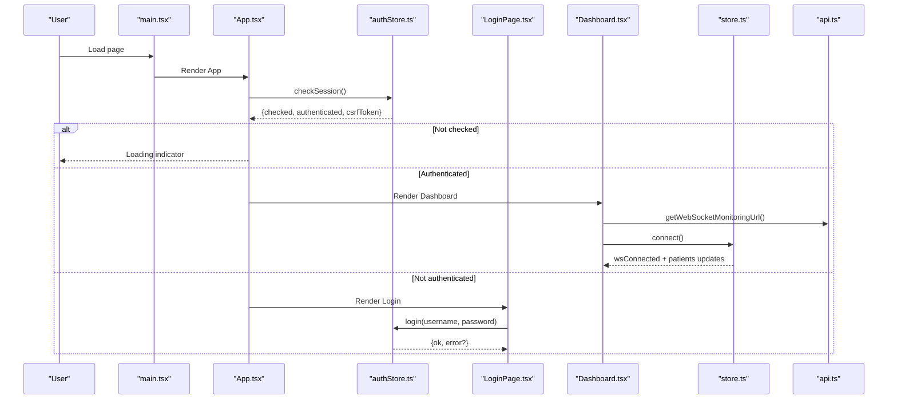
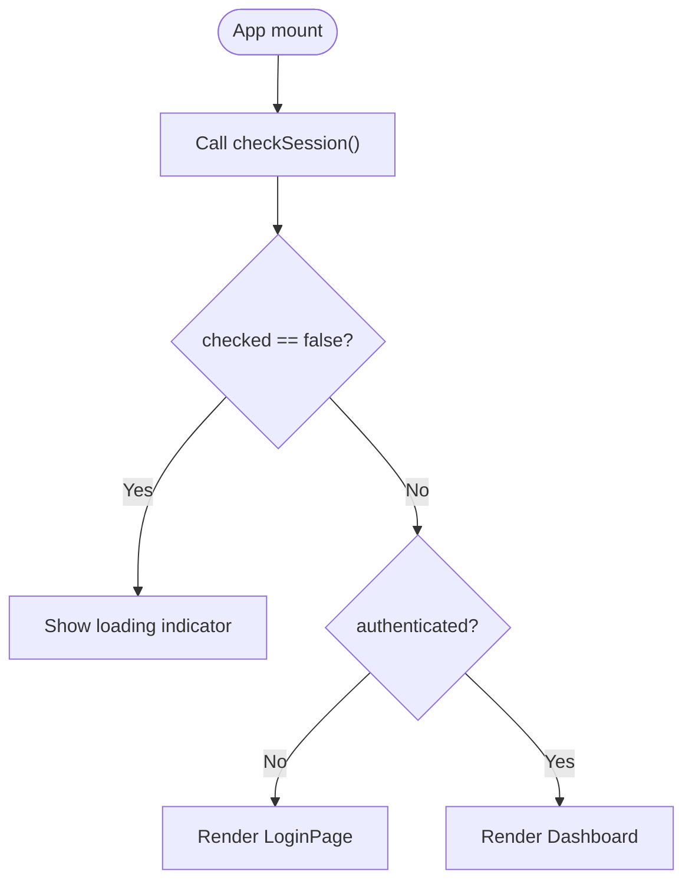
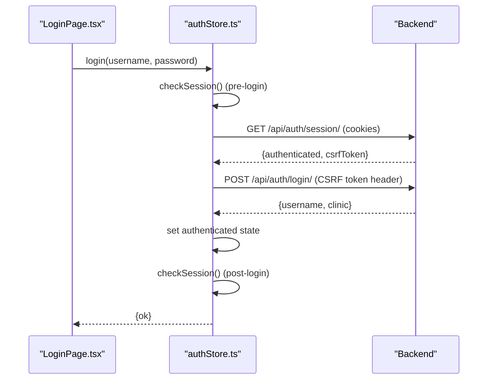
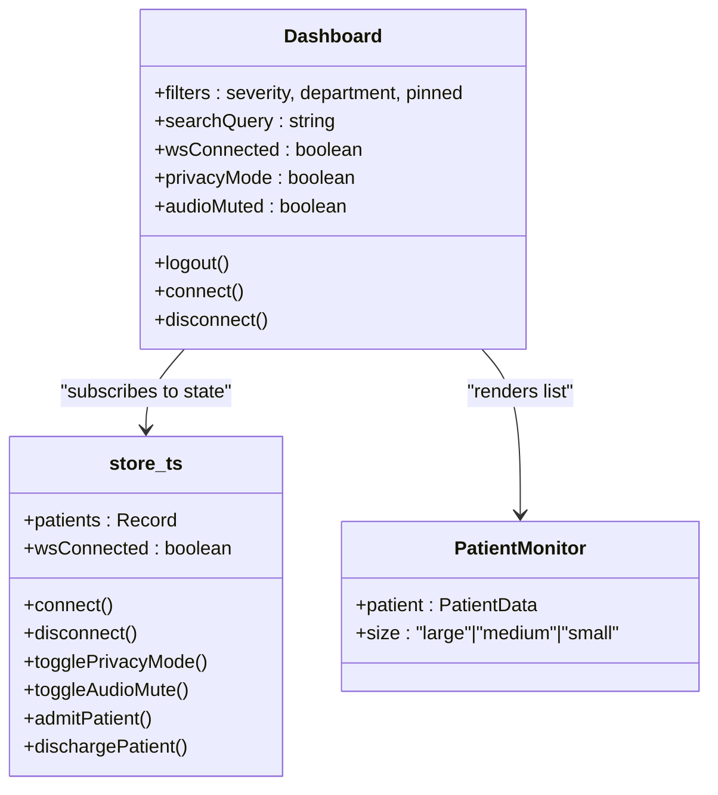
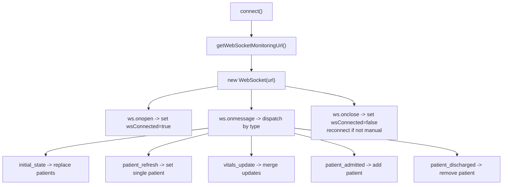
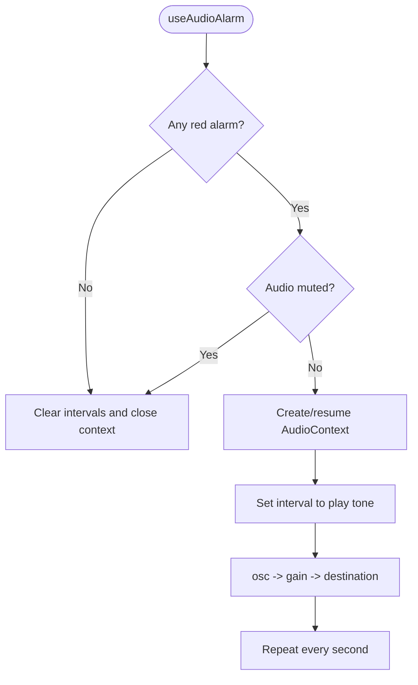
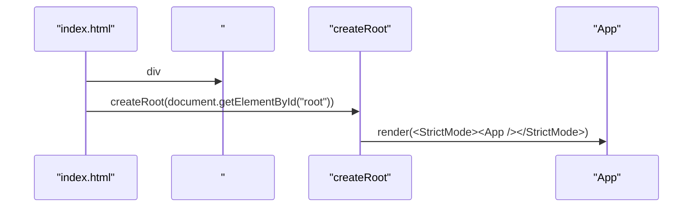
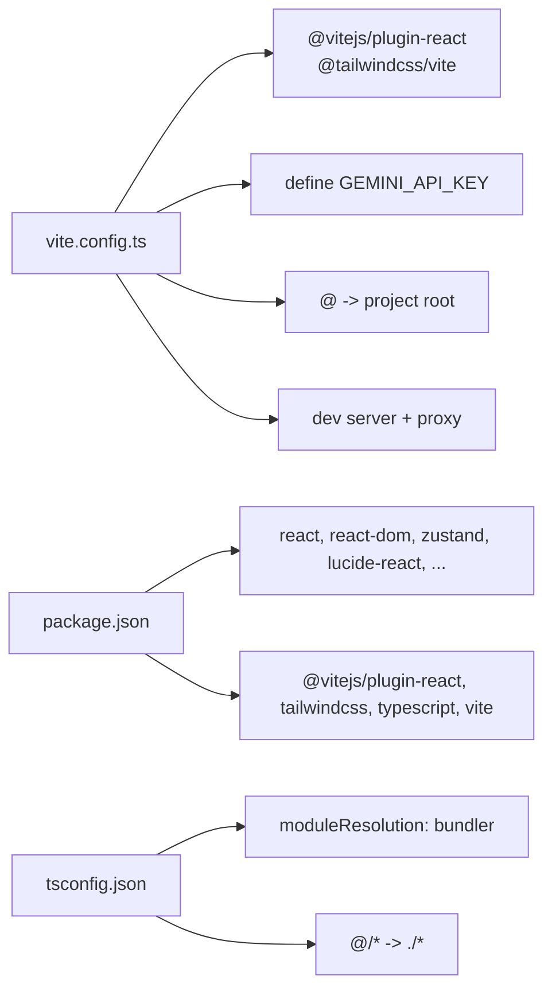

# React Application Structure

<cite>
**Referenced Files in This Document**
- [App.tsx](file://frontend/src/App.tsx)
- [main.tsx](file://frontend/src/main.tsx)
- [vite.config.ts](file://frontend/vite.config.ts)
- [package.json](file://frontend/package.json)
- [tsconfig.json](file://frontend/tsconfig.json)
- [authStore.ts](file://frontend/src/authStore.ts)
- [Dashboard.tsx](file://frontend/src/components/Dashboard.tsx)
- [LoginPage.tsx](file://frontend/src/components/LoginPage.tsx)
- [api.ts](file://frontend/src/lib/api.ts)
- [store.ts](file://frontend/src/store.ts)
- [useAudioAlarm.ts](file://frontend/src/hooks/useAudioAlarm.ts)
- [PatientMonitor.tsx](file://frontend/src/components/PatientMonitor.tsx)
- [index.html](file://frontend/index.html)
</cite>

## Table of Contents
1. [Introduction](#introduction)
2. [Project Structure](#project-structure)
3. [Core Components](#core-components)
4. [Architecture Overview](#architecture-overview)
5. [Detailed Component Analysis](#detailed-component-analysis)
6. [Dependency Analysis](#dependency-analysis)
7. [Performance Considerations](#performance-considerations)
8. [Troubleshooting Guide](#troubleshooting-guide)
9. [Conclusion](#conclusion)
10. [Appendices](#appendices)

## Introduction
This document explains the React application structure and configuration for the frontend. It covers the main App component architecture, authentication flow, conditional rendering based on session status, component hierarchy, Vite configuration (build, proxy, development server), entry point mounting, routing patterns, lazy loading and code-splitting strategies, development workflow (HMR), build optimization, environment variable handling, asset management, and integration with external libraries.

## Project Structure
The frontend is organized around a small set of core files and a clear separation of concerns:
- Entry point mounts the root React component to the DOM
- App orchestrates authentication checks and renders either Login or Dashboard
- Authentication state is managed via a Zustand store
- Dashboard composes multiple domain-specific components and manages real-time data via WebSocket
- Utilities encapsulate API base URLs and WebSocket connection construction
- Vite handles development server, proxying, and build steps

**Diagram sources**
- [index.html](file://frontend/index.html)
- [main.tsx](file://frontend/src/main.tsx)
- [App.tsx](file://frontend/src/App.tsx)
- [LoginPage.tsx](file://frontend/src/components/LoginPage.tsx)
- [Dashboard.tsx](file://frontend/src/components/Dashboard.tsx)
- [PatientMonitor.tsx](file://frontend/src/components/PatientMonitor.tsx)
- [store.ts](file://frontend/src/store.ts)
- [useAudioAlarm.ts](file://frontend/src/hooks/useAudioAlarm.ts)
- [authStore.ts](file://frontend/src/authStore.ts)
- [api.ts](file://frontend/src/lib/api.ts)

**Section sources**
- [index.html](file://frontend/index.html)
- [main.tsx](file://frontend/src/main.tsx)
- [App.tsx](file://frontend/src/App.tsx)

## Core Components
- App: Performs session check on mount and conditionally renders LoginPage or Dashboard while showing a loading state until session status is resolved.
- LoginPage: Provides a simple login form and delegates authentication to the auth store.
- Dashboard: Central hub for patient monitoring, filters, search, settings, and modals; initializes WebSocket connectivity and audio alerts.
- authStore: Encapsulates session state, CSRF handling, and authenticated fetch helpers.
- store: Manages patient data, WebSocket lifecycle, UI flags (privacy/audio), and actions sent to the backend via WebSocket.
- api: Normalizes backend origin and constructs WebSocket URLs for monitoring.
- useAudioAlarm: Handles browser autoplay policy and plays repeating tones when critical alarms are present.
- PatientMonitor: Reusable component for displaying patient vitals and controls.

**Section sources**
- [App.tsx](file://frontend/src/App.tsx)
- [LoginPage.tsx](file://frontend/src/components/LoginPage.tsx)
- [Dashboard.tsx](file://frontend/src/components/Dashboard.tsx)
- [authStore.ts](file://frontend/src/authStore.ts)
- [store.ts](file://frontend/src/store.ts)
- [api.ts](file://frontend/src/lib/api.ts)
- [useAudioAlarm.ts](file://frontend/src/hooks/useAudioAlarm.ts)
- [PatientMonitor.tsx](file://frontend/src/components/PatientMonitor.tsx)

## Architecture Overview
The app follows a unidirectional data flow:
- App reads authentication state from authStore and decides which view to render
- Dashboard initializes WebSocket connections and subscribes to real-time updates
- store maintains the canonical patient dataset and exposes actions to mutate state and communicate with the backend
- authStore centralizes session and CSRF logic and provides helpers for authenticated requests
- api normalizes backend origins and builds WebSocket URLs

**Diagram sources**
- [main.tsx](file://frontend/src/main.tsx)
- [App.tsx](file://frontend/src/App.tsx)
- [authStore.ts](file://frontend/src/authStore.ts)
- [LoginPage.tsx](file://frontend/src/components/LoginPage.tsx)
- [Dashboard.tsx](file://frontend/src/components/Dashboard.tsx)
- [store.ts](file://frontend/src/store.ts)
- [api.ts](file://frontend/src/lib/api.ts)

## Detailed Component Analysis

### App Component and Conditional Rendering
- On mount, App triggers a session check and waits for the checked flag to become true
- If authenticated, renders Dashboard; otherwise renders LoginPage
- Uses a minimal loading indicator while resolving session state

**Diagram sources**
- [App.tsx](file://frontend/src/App.tsx)
- [authStore.ts](file://frontend/src/authStore.ts)

**Section sources**
- [App.tsx](file://frontend/src/App.tsx)

### Authentication Flow and CSRF Handling
- Session retrieval uses a fetch with credentials to maintain cookies
- Login posts credentials with CSRF token header derived from the store
- Logout clears session and refreshes session state
- Helpers provide consistent authenticated fetch behavior and CSRF header injection

**Diagram sources**
- [LoginPage.tsx](file://frontend/src/components/LoginPage.tsx)
- [authStore.ts](file://frontend/src/authStore.ts)

**Section sources**
- [authStore.ts](file://frontend/src/authStore.ts)

### Dashboard Composition and Real-Time Updates
- Initializes audio alarm hook and WebSocket connection on mount
- Maintains filters (severity, department, pinned) and search query
- Renders grouped grids for critical, warning, and stable patients
- Opens modals for details, admissions, settings, AI predictions, and color guide
- Uses memoization and computed counts to optimize re-renders

**Diagram sources**
- [Dashboard.tsx](file://frontend/src/components/Dashboard.tsx)
- [store.ts](file://frontend/src/store.ts)
- [PatientMonitor.tsx](file://frontend/src/components/PatientMonitor.tsx)

**Section sources**
- [Dashboard.tsx](file://frontend/src/components/Dashboard.tsx)
- [store.ts](file://frontend/src/store.ts)
- [PatientMonitor.tsx](file://frontend/src/components/PatientMonitor.tsx)

### WebSocket Integration and Data Model
- WebSocket URL is constructed from normalized backend origin or falls back to current location
- On open, sets connection flag; on close, schedules reconnect unless manually disconnected
- Message types handled: initial_state, patient_refresh, vitals_update, patient_admitted, patient_discharged
- Patient data model includes vitals, alarms, limits, history, NEWS2 score, pinned state, and optional clinical data

**Diagram sources**
- [store.ts](file://frontend/src/store.ts)
- [api.ts](file://frontend/src/lib/api.ts)

**Section sources**
- [store.ts](file://frontend/src/store.ts)
- [api.ts](file://frontend/src/lib/api.ts)

### Audio Alarms and Browser Autoplay Policy
- Detects presence of critical alarms and audio mute state
- Creates an AudioContext lazily and resumes on user gesture
- Plays a short repeating tone while critical alarms exist and audio is not muted

**Diagram sources**
- [useAudioAlarm.ts](file://frontend/src/hooks/useAudioAlarm.ts)
- [store.ts](file://frontend/src/store.ts)

**Section sources**
- [useAudioAlarm.ts](file://frontend/src/hooks/useAudioAlarm.ts)
- [store.ts](file://frontend/src/store.ts)

### Routing Patterns and Lazy Loading
- No client-side routing library is imported; navigation is handled via conditional rendering in App and internal modal toggles in Dashboard
- To implement route-based lazy loading and code-splitting, wrap components with dynamic imports and use a router (e.g., React Router). Example pattern:
  - Create route entries mapping paths to dynamically imported components
  - Use Suspense boundaries to show loading states during chunk download
  - Keep frequently visited routes preloaded or cache-friendly
- Current code does not include route definitions; adding a router would require:
  - Installing a router package
  - Defining routes and lazy-loaded components
  - Configuring a Suspense boundary at the app root

[No sources needed since this section provides general guidance]

### Entry Point and DOM Mounting
- index.html defines the #root element
- main.tsx creates a root and renders App inside React.StrictMode
- The app expects a script tag to load the TypeScript entry module

**Diagram sources**
- [index.html](file://frontend/index.html)
- [main.tsx](file://frontend/src/main.tsx)

**Section sources**
- [index.html](file://frontend/index.html)
- [main.tsx](file://frontend/src/main.tsx)

## Dependency Analysis
- Build and toolchain: Vite, TypeScript, Tailwind CSS
- Runtime libraries: React, React DOM, Zustand for state, Lucide icons, date-fns, framer-motion, recharts
- Development dependencies: Vite plugin for React, Tailwind, TypeScript, autoprefixer, Tailwind CSS

**Diagram sources**
- [vite.config.ts](file://frontend/vite.config.ts)
- [package.json](file://frontend/package.json)
- [tsconfig.json](file://frontend/tsconfig.json)

**Section sources**
- [vite.config.ts](file://frontend/vite.config.ts)
- [package.json](file://frontend/package.json)
- [tsconfig.json](file://frontend/tsconfig.json)

## Performance Considerations
- Memoization: Dashboard uses useMemo for derived lists and counts; PatientMonitor is memoized to prevent unnecessary re-renders
- Efficient filtering: Computed filters avoid re-sorting unless inputs change
- WebSocket batching: Updates are merged per patient to minimize state churn
- Asset prefetching: Images are marked eager/fetchPriority/high to improve perceived load
- Audio context lifecycle: Closed on unmount to release resources
- Build optimization: Vite’s default bundling and tree-shaking reduce bundle size; consider enabling compression and analyzing bundle with a plugin if needed

**Section sources**
- [Dashboard.tsx](file://frontend/src/components/Dashboard.tsx)
- [PatientMonitor.tsx](file://frontend/src/components/PatientMonitor.tsx)
- [store.ts](file://frontend/src/store.ts)
- [useAudioAlarm.ts](file://frontend/src/hooks/useAudioAlarm.ts)

## Troubleshooting Guide
- Root element missing: If #root is absent, the app throws an error at startup
- Authentication loop: If session check fails or CSRF mismatch occurs, login may repeatedly fail; verify backend cookies and CSRF headers
- WebSocket connection: If wsConnected remains false, confirm backend availability and CORS/proxy settings
- Proxy misconfiguration: API calls under /api and /ws must reach the backend host; verify Vite proxy targets
- Environment variables: GEMINI_API_KEY is injected into the app via define; ensure it is present in the environment

**Section sources**
- [main.tsx](file://frontend/src/main.tsx)
- [authStore.ts](file://frontend/src/authStore.ts)
- [store.ts](file://frontend/src/store.ts)
- [vite.config.ts](file://frontend/vite.config.ts)

## Conclusion
The application employs a clean, component-driven architecture with a centralized state store and a straightforward authentication flow. Vite provides a fast development experience with a built-in proxy and HMR. Real-time updates are handled via WebSocket, and the UI adapts dynamically to session state and incoming data. Extending the app with client-side routing and lazy loading is straightforward and recommended for scalability.

## Appendices

### Vite Configuration Highlights
- Plugins: React Fast Refresh and Tailwind CSS integration
- Environment injection: GEMINI_API_KEY is injected into the app
- Path alias: @ resolves to project root for concise imports
- Dev server: Port 5173, proxy for /api and /ws to backend, HMR controlled by DISABLE_HMR
- Build scripts: dev, build, preview, lint, clean

**Section sources**
- [vite.config.ts](file://frontend/vite.config.ts)
- [package.json](file://frontend/package.json)

### Environment Variable Handling
- Backend origin: VITE_BACKEND_ORIGIN determines whether API paths are absolute or relative
- WebSocket URL: Constructed from normalized origin or current location
- API helpers: apiUrl(path) returns absolute or relative path depending on origin
- GEMINI_API_KEY: Injected via define for runtime access

**Section sources**
- [api.ts](file://frontend/src/lib/api.ts)
- [vite.config.ts](file://frontend/vite.config.ts)

### Asset Management and Static Files
- Public assets: Place images and icons under frontend/public and reference them with leading slash (e.g., /logo-fjsti.png)
- CSS: Global styles are imported in main.tsx; Tailwind utilities are used extensively
- Image attributes: Prefer loading/eager and fetchPriority/high for hero images

**Section sources**
- [index.html](file://frontend/index.html)
- [Dashboard.tsx](file://frontend/src/components/Dashboard.tsx)

### Component Composition Patterns
- Container/presentational separation: Dashboard orchestrates state and passes props to PatientMonitor
- Props drilling minimization: Zustand store avoids deep prop chains for shared state
- Modal composition: Dashboard conditionally renders modals as overlays
- Event delegation: Actions like toggle pin, acknowledge alarm, and scheduling are dispatched via store methods

**Section sources**
- [Dashboard.tsx](file://frontend/src/components/Dashboard.tsx)
- [PatientMonitor.tsx](file://frontend/src/components/PatientMonitor.tsx)
- [store.ts](file://frontend/src/store.ts)