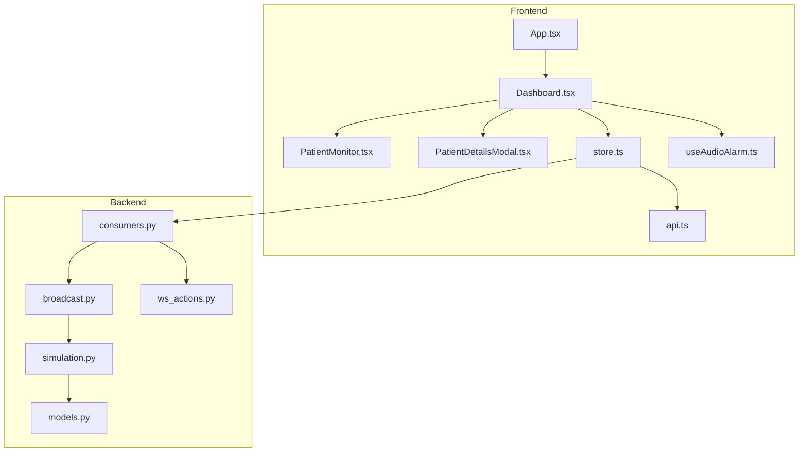
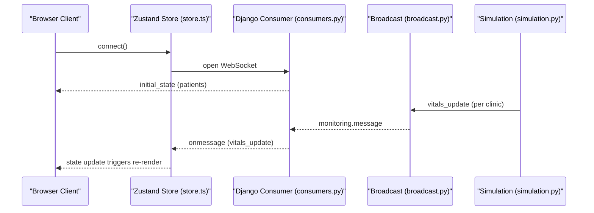
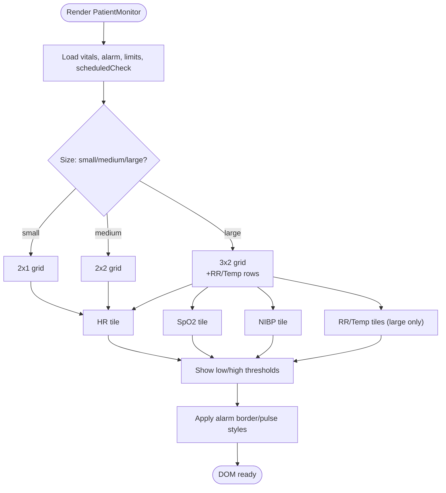
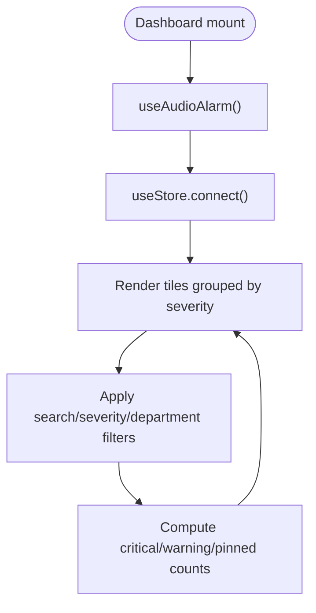
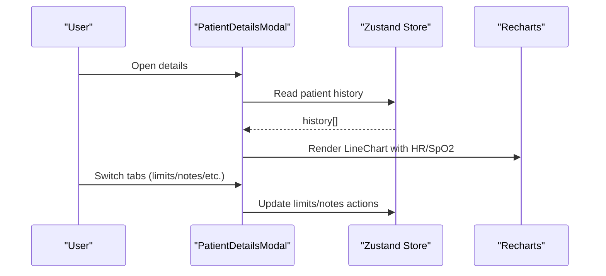
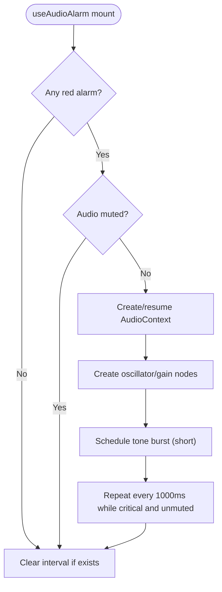
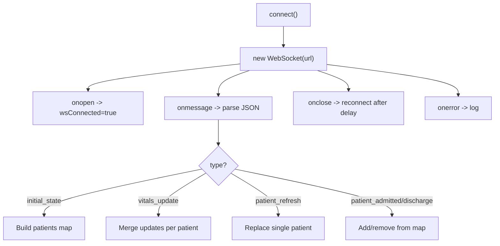
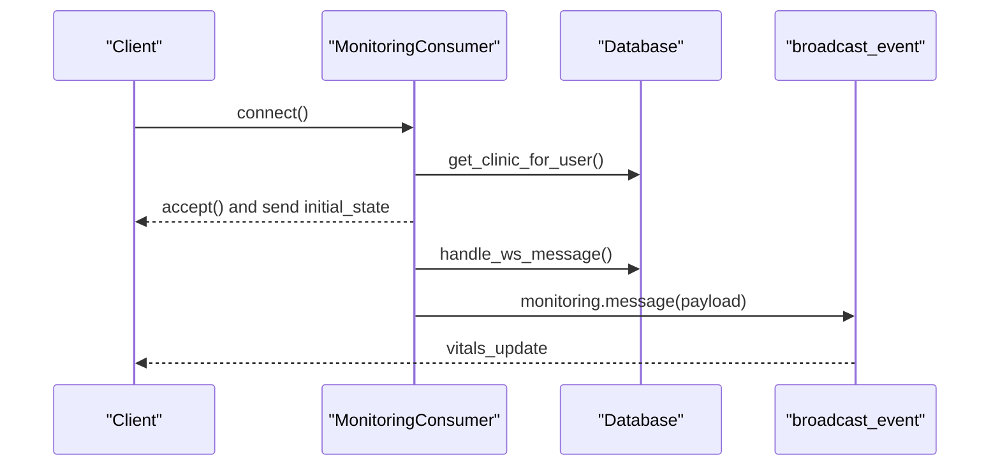
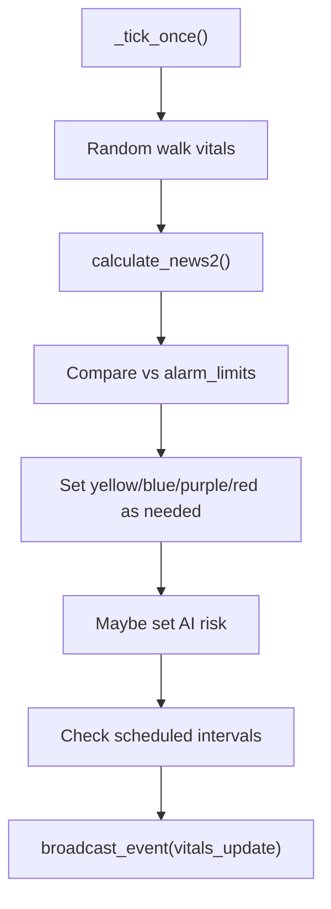
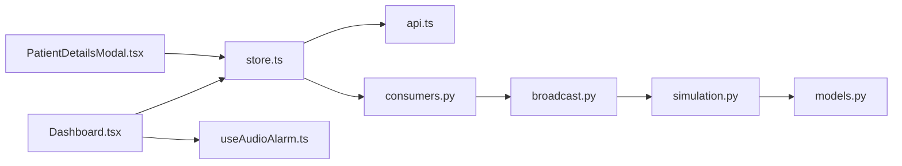

# Real-time Data Visualization

<cite>
**Referenced Files in This Document**
- [PatientMonitor.tsx](file://frontend/src/components/PatientMonitor.tsx)
- [Dashboard.tsx](file://frontend/src/components/Dashboard.tsx)
- [PatientDetailsModal.tsx](file://frontend/src/components/PatientDetailsModal.tsx)
- [useAudioAlarm.ts](file://frontend/src/hooks/useAudioAlarm.ts)
- [store.ts](file://frontend/src/store.ts)
- [api.ts](file://frontend/src/lib/api.ts)
- [App.tsx](file://frontend/src/App.tsx)
- [consumers.py](file://backend/monitoring/consumers.py)
- [broadcast.py](file://backend/monitoring/broadcast.py)
- [models.py](file://backend/monitoring/models.py)
- [ws_actions.py](file://backend/monitoring/ws_actions.py)
- [simulation.py](file://backend/monitoring/simulation.py)
- [architecture.md](file://architecture.md)
</cite>

## Table of Contents
1. [Introduction](#introduction)
2. [Project Structure](#project-structure)
3. [Core Components](#core-components)
4. [Architecture Overview](#architecture-overview)
5. [Detailed Component Analysis](#detailed-component-analysis)
6. [Dependency Analysis](#dependency-analysis)
7. [Performance Considerations](#performance-considerations)
8. [Troubleshooting Guide](#troubleshooting-guide)
9. [Conclusion](#conclusion)

## Introduction
This document explains the real-time data visualization and audio alarm systems powering the clinical monitoring dashboard. It covers:
- How patient vitals are visualized across multiple screen sizes and contexts
- The WebSocket-driven live updates and reconnection strategy
- The alarm system including audio and visual indicators
- Backend simulation and broadcasting of vitals updates
- Performance strategies for continuous streams and historical data

## Project Structure
The system comprises:
- Frontend (React 19 with Vite) managing real-time state, rendering, and user interactions
- Backend (Django Channels) handling WebSocket connections, broadcasting, and simulated data generation
- Shared data models and serialization logic

**Diagram sources**
- [App.tsx:11-33](file://frontend/src/App.tsx#L11-L33)
- [Dashboard.tsx:32-54](file://frontend/src/components/Dashboard.tsx#L32-L54)
- [PatientMonitor.tsx:13-371](file://frontend/src/components/PatientMonitor.tsx#L13-L371)
- [PatientDetailsModal.tsx:82-94](file://frontend/src/components/PatientDetailsModal.tsx#L82-L94)
- [store.ts:173-352](file://frontend/src/store.ts#L173-L352)
- [api.ts:5-34](file://frontend/src/lib/api.ts#L5-L34)
- [useAudioAlarm.ts:12-91](file://frontend/src/hooks/useAudioAlarm.ts#L12-L91)
- [consumers.py:12-45](file://backend/monitoring/consumers.py#L12-L45)
- [broadcast.py:10-19](file://backend/monitoring/broadcast.py#L10-L19)
- [models.py:141-224](file://backend/monitoring/models.py#L141-L224)
- [simulation.py:99-270](file://backend/monitoring/simulation.py#L99-L270)
- [ws_actions.py:32-228](file://backend/monitoring/ws_actions.py#L32-L228)

**Section sources**
- [App.tsx:11-33](file://frontend/src/App.tsx#L11-L33)
- [Dashboard.tsx:32-54](file://frontend/src/components/Dashboard.tsx#L32-L54)
- [store.ts:173-352](file://frontend/src/store.ts#L173-L352)
- [consumers.py:12-45](file://backend/monitoring/consumers.py#L12-L45)
- [broadcast.py:10-19](file://backend/monitoring/broadcast.py#L10-L19)
- [models.py:141-224](file://backend/monitoring/models.py#L141-L224)
- [simulation.py:99-270](file://backend/monitoring/simulation.py#L99-L270)
- [ws_actions.py:32-228](file://backend/monitoring/ws_actions.py#L32-L228)

## Core Components
- PatientMonitor: renders individual patient tiles with numeric vitals, thresholds, and alarm visuals
- Dashboard: orchestrates layout, filters, connectivity status, and initializes audio alarms
- PatientDetailsModal: shows detailed trends and historical data
- useAudioAlarm: manages browser autoplay policy and periodic audio alerts
- Zustand store: WebSocket lifecycle, message parsing, and state updates
- Django Channels consumer: handles authentication, groups, initial state, and broadcasting
- Broadcast utility: sends vitals updates to clients per clinic
- Simulation engine: generates periodic vitals updates and broadcasts them

**Section sources**
- [PatientMonitor.tsx:13-371](file://frontend/src/components/PatientMonitor.tsx#L13-L371)
- [Dashboard.tsx:32-54](file://frontend/src/components/Dashboard.tsx#L32-L54)
- [PatientDetailsModal.tsx:402-424](file://frontend/src/components/PatientDetailsModal.tsx#L402-L424)
- [useAudioAlarm.ts:12-91](file://frontend/src/hooks/useAudioAlarm.ts#L12-L91)
- [store.ts:173-352](file://frontend/src/store.ts#L173-L352)
- [consumers.py:12-45](file://backend/monitoring/consumers.py#L12-L45)
- [broadcast.py:10-19](file://backend/monitoring/broadcast.py#L10-L19)
- [simulation.py:99-270](file://backend/monitoring/simulation.py#L99-L270)

## Architecture Overview
The system uses a publish-subscribe pattern over WebSockets:
- Clients connect to Django Channels group per clinic
- Backend simulates or ingests vitals and publishes updates
- Clients update state via the store and re-render efficiently

**Diagram sources**
- [store.ts:219-352](file://frontend/src/store.ts#L219-L352)
- [consumers.py:13-36](file://backend/monitoring/consumers.py#L13-L36)
- [broadcast.py:10-19](file://backend/monitoring/broadcast.py#L10-L19)
- [simulation.py:267-270](file://backend/monitoring/simulation.py#L267-L270)

## Detailed Component Analysis

### PatientMonitor: Numeric Tiles and Visual Alarms
- Renders HR, SpO2, NIBP, and optionally RR/temp on large tiles
- Displays alarm level borders and animated pulses for active alarms
- Shows NEWS2 score, device battery, scheduled checks, and pinning
- Supports privacy mode masking

**Diagram sources**
- [PatientMonitor.tsx:13-371](file://frontend/src/components/PatientMonitor.tsx#L13-L371)

**Section sources**
- [PatientMonitor.tsx:13-371](file://frontend/src/components/PatientMonitor.tsx#L13-L371)

### Dashboard: Layout, Filters, Connectivity, and Audio
- Initializes WebSocket connection and audio alarm hook
- Provides severity and department filters
- Displays online/offline status and counts
- Renders critical/warning/stable tiles in responsive grids

**Diagram sources**
- [Dashboard.tsx:32-54](file://frontend/src/components/Dashboard.tsx#L32-L54)
- [Dashboard.tsx:76-98](file://frontend/src/components/Dashboard.tsx#L76-L98)
- [Dashboard.tsx:104-106](file://frontend/src/components/Dashboard.tsx#L104-L106)

**Section sources**
- [Dashboard.tsx:32-54](file://frontend/src/components/Dashboard.tsx#L32-L54)
- [Dashboard.tsx:76-98](file://frontend/src/components/Dashboard.tsx#L76-L98)
- [Dashboard.tsx:104-106](file://frontend/src/components/Dashboard.tsx#L104-L106)

### PatientDetailsModal: Historical Trends and Controls
- Displays a responsive line chart of HR and SpO2 over the last 5 minutes
- Provides tabs for overview, alarm limits, medications, labs, and notes
- Allows exporting history to CSV and adding clinical notes

**Diagram sources**
- [PatientDetailsModal.tsx:135-142](file://frontend/src/components/PatientDetailsModal.tsx#L135-L142)
- [PatientDetailsModal.tsx:402-424](file://frontend/src/components/PatientDetailsModal.tsx#L402-L424)

**Section sources**
- [PatientDetailsModal.tsx:135-142](file://frontend/src/components/PatientDetailsModal.tsx#L135-L142)
- [PatientDetailsModal.tsx:402-424](file://frontend/src/components/PatientDetailsModal.tsx#L402-L424)

### Audio Alarm System
- Creates an AudioContext on first user gesture to satisfy autoplay policies
- Plays a repeating short tone when any patient is in critical (red) alarm and audio is not muted
- Cleans up intervals and closes the context on unmount

**Diagram sources**
- [useAudioAlarm.ts:12-91](file://frontend/src/hooks/useAudioAlarm.ts#L12-L91)

**Section sources**
- [useAudioAlarm.ts:12-91](file://frontend/src/hooks/useAudioAlarm.ts#L12-L91)

### Zustand Store: WebSocket Lifecycle and Message Parsing
- Manages WebSocket connection, reconnection, and cleanup
- Parses initial_state, vitals_update, and single-patient refreshes
- Applies partial updates to patient records and maintains selected state

**Diagram sources**
- [store.ts:219-352](file://frontend/src/store.ts#L219-L352)

**Section sources**
- [store.ts:219-352](file://frontend/src/store.ts#L219-L352)

### Backend Consumers and Broadcasting
- Authenticates users and adds clients to a clinic-specific group
- Sends initial state and forwards vitals updates to clients
- Receives client actions and persists changes

**Diagram sources**
- [consumers.py:13-36](file://backend/monitoring/consumers.py#L13-L36)
- [broadcast.py:10-19](file://backend/monitoring/broadcast.py#L10-L19)
- [ws_actions.py:32-228](file://backend/monitoring/ws_actions.py#L32-L228)

**Section sources**
- [consumers.py:13-36](file://backend/monitoring/consumers.py#L13-L36)
- [broadcast.py:10-19](file://backend/monitoring/broadcast.py#L10-L19)
- [ws_actions.py:32-228](file://backend/monitoring/ws_actions.py#L32-L228)

### Simulation Engine and Alarm Thresholds
- Periodically updates vitals, calculates NEWS2 scores, and applies thresholds
- Generates historical entries and cleans old samples
- Triggers AI risk predictions and scheduled checks

**Diagram sources**
- [simulation.py:99-270](file://backend/monitoring/simulation.py#L99-L270)

**Section sources**
- [simulation.py:99-270](file://backend/monitoring/simulation.py#L99-L270)

## Dependency Analysis
- Frontend depends on Zustand for state, Recharts for detailed charts, and Lucide icons for UI
- Backend depends on Django Channels for WebSocket, and models for persistence
- Architecture document confirms canvas-based ECG rendering is used elsewhere in the system

**Diagram sources**
- [store.ts:3-3](file://frontend/src/store.ts#L3-L3)
- [api.ts:5-34](file://frontend/src/lib/api.ts#L5-L34)
- [consumers.py:12-45](file://backend/monitoring/consumers.py#L12-L45)
- [broadcast.py:10-19](file://backend/monitoring/broadcast.py#L10-L19)
- [simulation.py:99-270](file://backend/monitoring/simulation.py#L99-L270)
- [models.py:141-224](file://backend/monitoring/models.py#L141-L224)
- [Dashboard.tsx:32-54](file://frontend/src/components/Dashboard.tsx#L32-L54)
- [useAudioAlarm.ts:12-91](file://frontend/src/hooks/useAudioAlarm.ts#L12-L91)
- [PatientDetailsModal.tsx:82-94](file://frontend/src/components/PatientDetailsModal.tsx#L82-L94)

**Section sources**
- [store.ts:3-3](file://frontend/src/store.ts#L3-L3)
- [api.ts:5-34](file://frontend/src/lib/api.ts#L5-L34)
- [consumers.py:12-45](file://backend/monitoring/consumers.py#L12-L45)
- [broadcast.py:10-19](file://backend/monitoring/broadcast.py#L10-L19)
- [simulation.py:99-270](file://backend/monitoring/simulation.py#L99-L270)
- [models.py:141-224](file://backend/monitoring/models.py#L141-L224)
- [Dashboard.tsx:32-54](file://frontend/src/components/Dashboard.tsx#L32-L54)
- [useAudioAlarm.ts:12-91](file://frontend/src/hooks/useAudioAlarm.ts#L12-L91)
- [PatientDetailsModal.tsx:82-94](file://frontend/src/components/PatientDetailsModal.tsx#L82-L94)

## Performance Considerations
- Canvas-based ECG rendering is used for high-frequency waveforms to avoid jank from standard SVG-based charting libraries
- Zustand minimizes re-renders by updating only changed fields and batching merges
- Backend trims historical entries to maintain bounded memory usage
- Responsive chart sizing uses container queries and debounced rendering in the details modal
- Reconnection strategy with exponential backoff prevents resource exhaustion during network issues

[No sources needed since this section provides general guidance]

## Troubleshooting Guide
- WebSocket not connecting:
  - Verify backend authentication and clinic association
  - Check group membership and initial state delivery
- No vitals updates:
  - Confirm simulation thread is running and broadcasting
  - Inspect backend logs for HL7 vitals parsing
- Audio alerts not playing:
  - Ensure a user gesture occurred to resume AudioContext
  - Check mute state and presence of red alarms
- Excessive memory usage:
  - Confirm historical trimming logic is active
  - Review chart data window sizes and debounce settings

**Section sources**
- [consumers.py:13-36](file://backend/monitoring/consumers.py#L13-L36)
- [simulation.py:130-136](file://backend/monitoring/simulation.py#L130-L136)
- [useAudioAlarm.ts:21-35](file://frontend/src/hooks/useAudioAlarm.ts#L21-L35)
- [PatientDetailsModal.tsx:408-424](file://frontend/src/components/PatientDetailsModal.tsx#L408-L424)

## Conclusion
The system combines efficient frontend rendering with robust backend broadcasting to deliver real-time patient monitoring. The architecture emphasizes:
- High-performance visualization for continuous streams
- Clear alarm semantics with both audio and visual feedback
- Scalable WebSocket infrastructure with resilient reconnection
- Practical controls for thresholds, scheduling, and historical insights