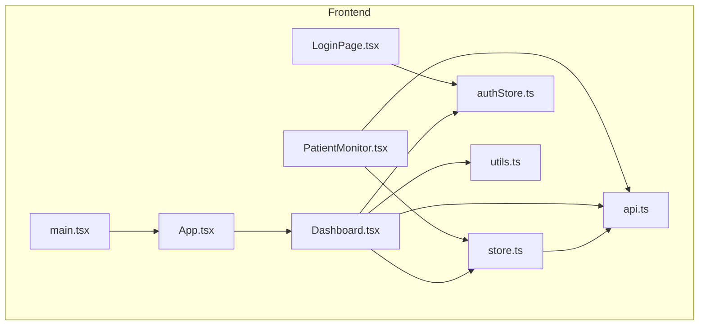
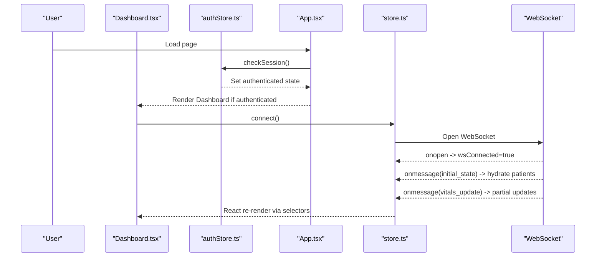
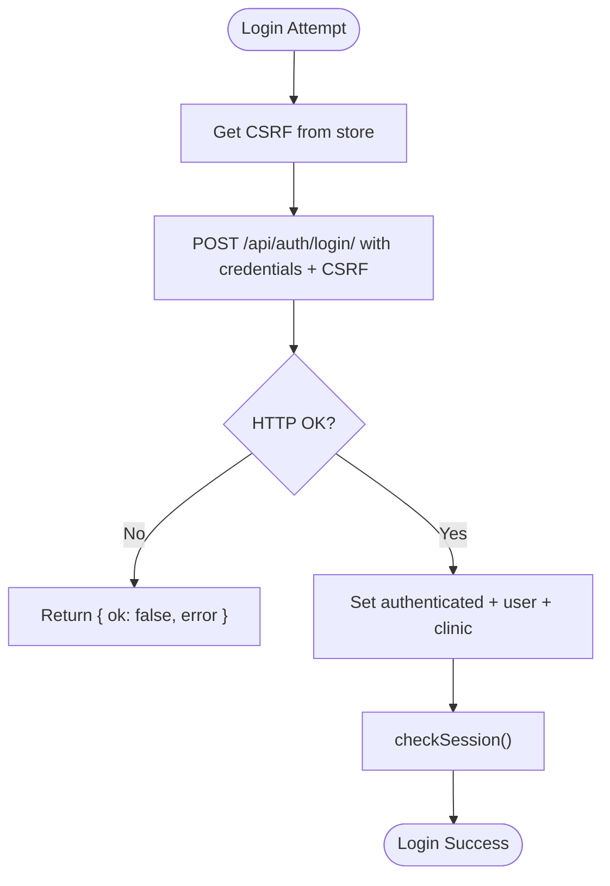
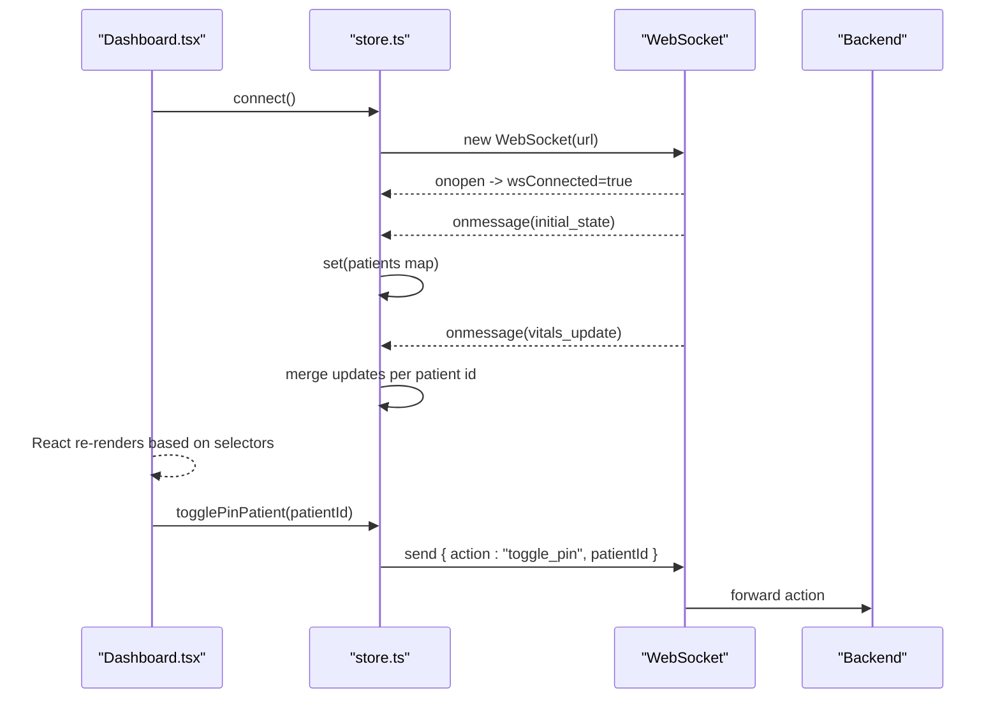
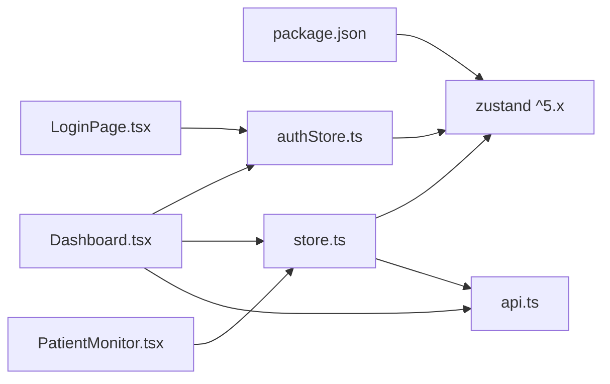

# State Management System

<cite>
**Referenced Files in This Document**
- [store.ts](file://frontend/src/store.ts)
- [authStore.ts](file://frontend/src/authStore.ts)
- [App.tsx](file://frontend/src/App.tsx)
- [main.tsx](file://frontend/src/main.tsx)
- [Dashboard.tsx](file://frontend/src/components/Dashboard.tsx)
- [PatientMonitor.tsx](file://frontend/src/components/PatientMonitor.tsx)
- [LoginPage.tsx](file://frontend/src/components/LoginPage.tsx)
- [api.ts](file://frontend/src/lib/api.ts)
- [utils.ts](file://frontend/src/lib/utils.ts)
- [package.json](file://frontend/package.json)
</cite>

## Table of Contents
1. [Introduction](#introduction)
2. [Project Structure](#project-structure)
3. [Core Components](#core-components)
4. [Architecture Overview](#architecture-overview)
5. [Detailed Component Analysis](#detailed-component-analysis)
6. [Dependency Analysis](#dependency-analysis)
7. [Performance Considerations](#performance-considerations)
8. [Troubleshooting Guide](#troubleshooting-guide)
9. [Conclusion](#conclusion)
10. [Appendices](#appendices)

## Introduction
This document explains the Zustand-based state management system used in the frontend. The system consists of two primary stores:
- Authentication store: manages session state, login/logout, and CSRF handling.
- Application store: manages real-time patient data, WebSocket connectivity, UI flags, and actions to mutate state via the WebSocket.

It covers global state architecture, store implementations, subscriptions and updates, selectors and performance, server-origin handling, error handling, debugging, and integration patterns with React components.

## Project Structure
The state management lives in dedicated files under the frontend/src directory:
- Global application store: [store.ts](file://frontend/src/store.ts)
- Authentication store: [authStore.ts](file://frontend/src/authStore.ts)
- Entry point and app shell: [main.tsx](file://frontend/src/main.tsx), [App.tsx](file://frontend/src/App.tsx)
- UI components consuming state: [Dashboard.tsx](file://frontend/src/components/Dashboard.tsx), [PatientMonitor.tsx](file://frontend/src/components/PatientMonitor.tsx), [LoginPage.tsx](file://frontend/src/components/LoginPage.tsx)
- Utilities: [api.ts](file://frontend/src/lib/api.ts), [utils.ts](file://frontend/src/lib/utils.ts)
- Dependencies: [package.json](file://frontend/package.json)



**Diagram sources**
- [main.tsx:1-16](file://frontend/src/main.tsx#L1-L16)
- [App.tsx:1-34](file://frontend/src/App.tsx#L1-L34)
- [Dashboard.tsx:1-429](file://frontend/src/components/Dashboard.tsx#L1-L429)
- [PatientMonitor.tsx:1-372](file://frontend/src/components/PatientMonitor.tsx#L1-L372)
- [LoginPage.tsx:1-84](file://frontend/src/components/LoginPage.tsx#L1-L84)
- [store.ts:1-353](file://frontend/src/store.ts#L1-L353)
- [authStore.ts:1-107](file://frontend/src/authStore.ts#L1-L107)
- [api.ts:1-35](file://frontend/src/lib/api.ts#L1-L35)
- [utils.ts:1-8](file://frontend/src/lib/utils.ts#L1-L8)

**Section sources**
- [main.tsx:1-16](file://frontend/src/main.tsx#L1-L16)
- [App.tsx:1-34](file://frontend/src/App.tsx#L1-L34)
- [store.ts:1-353](file://frontend/src/store.ts#L1-L353)
- [authStore.ts:1-107](file://frontend/src/authStore.ts#L1-L107)
- [api.ts:1-35](file://frontend/src/lib/api.ts#L1-L35)
- [utils.ts:1-8](file://frontend/src/lib/utils.ts#L1-L8)

## Core Components
- Authentication Store
  - Purpose: Manage session lifecycle, CSRF tokens, and authentication state.
  - Key actions: checkSession, login, logout.
  - State shape: checked, authenticated, username, clinicName, csrfToken.
  - Integration: Used in App shell and LoginPage to gate navigation and render protected content.

- Application Store
  - Purpose: Manage real-time patient data, WebSocket connection, UI flags, and actions to mutate backend state via WebSocket.
  - Key state: patients map, socket, wsConnected, privacyMode, searchQuery, selectedPatientId, isAudioMuted.
  - Key actions: connect/disconnect, togglePrivacyMode, setSearchQuery, setSelectedPatientId, toggleAudioMute, togglePinPatient, addClinicalNote, acknowledgeAlarm, setSchedule, setAllSchedules, clearAlarm, updateLimits, measureNibp, admitPatient, dischargePatient.
  - Real-time updates: onMessage handlers for initial_state, vitals_update, patient_refresh, patient_admitted, patient_discharged.

- Utilities
  - API helpers: apiUrl for backend origin normalization and getWebSocketMonitoringUrl for WebSocket endpoint resolution.
  - UI helpers: cn for Tailwind class merging.

**Section sources**
- [authStore.ts:5-79](file://frontend/src/authStore.ts#L5-L79)
- [store.ts:143-352](file://frontend/src/store.ts#L143-L352)
- [api.ts:10-34](file://frontend/src/lib/api.ts#L10-L34)
- [utils.ts:4-7](file://frontend/src/lib/utils.ts#L4-L7)

## Architecture Overview
Zustand stores are created with functional slices and accessed via React hooks. The authentication store initializes on app load and gates rendering of protected routes. The application store connects to a WebSocket for real-time updates and dispatches actions to the backend through the same channel.



**Diagram sources**
- [App.tsx:11-33](file://frontend/src/App.tsx#L11-L33)
- [authStore.ts:23-38](file://frontend/src/authStore.ts#L23-L38)
- [Dashboard.tsx:49-54](file://frontend/src/components/Dashboard.tsx#L49-L54)
- [store.ts:219-352](file://frontend/src/store.ts#L219-L352)

## Detailed Component Analysis

### Authentication Store
- Session checking
  - checkSession performs a session endpoint request with credentials and sets checked, authenticated, username, clinicName, and csrfToken.
- Login/logout
  - login fetches CSRF, posts credentials with X-CSRFToken header, updates authenticated state, and refreshes session.
  - logout posts logout with CSRF and clears auth state, then refreshes session.
- CSRF handling
  - apiHeaders and authedFetch centralize adding CSRF for non-GET requests.



**Diagram sources**
- [authStore.ts:40-78](file://frontend/src/authStore.ts#L40-L78)

**Section sources**
- [authStore.ts:5-79](file://frontend/src/authStore.ts#L5-L79)
- [api.ts:82-106](file://frontend/src/lib/api.ts#L82-L106)

### Application Store
- Real-time data model
  - PatientData includes vitals, alarm state, alarm limits, history, NEWS2 score, pinned flag, and ancillary lists.
  - VitalsUpdatePayload describes incremental updates received via WebSocket.
- WebSocket lifecycle
  - connect creates a WebSocket using getWebSocketMonitoringUrl, handles onopen/onmessage/onerror/onclose, and auto-reconnects except on manual disconnect.
  - disconnect closes the socket and clears state.
- Message handling
  - initial_state: hydrates patients map.
  - vitals_update: merges partial updates per patient id.
  - patient_refresh: replaces a single patient.
  - patient_admitted: adds a new patient.
  - patient_discharged: removes a patient and clears selection if needed.
- Actions
  - UI toggles and selections: togglePrivacyMode, setSearchQuery, setSelectedPatientId, toggleAudioMute.
  - Backend mutations via WebSocket: togglePinPatient, addClinicalNote, acknowledgeAlarm, setSchedule, setAllSchedules, clearAlarm, updateLimits, measureNibp, admitPatient, dischargePatient.



**Diagram sources**
- [store.ts:219-352](file://frontend/src/store.ts#L219-L352)
- [Dashboard.tsx:49-54](file://frontend/src/components/Dashboard.tsx#L49-L54)

**Section sources**
- [store.ts:143-352](file://frontend/src/store.ts#L143-L352)
- [api.ts:21-34](file://frontend/src/lib/api.ts#L21-L34)

### UI Integration Patterns
- App shell
  - App initializes authentication by calling checkSession on mount and renders LoginPage if not authenticated or Dashboard otherwise.
- Dashboard
  - Subscribes to authentication (clinicName, username, logout) and application store (patients, wsConnected, flags, actions).
  - Connects to WebSocket on mount and disconnects on unmount.
  - Uses memoization and derived counts for performance.
- PatientMonitor
  - Consumes patient props and store selectors for privacyMode, scheduling, alarms, and actions like togglePin, clearAlarm, measureNibp, setSchedule, and selection.
- LoginPage
  - Uses login from authStore and displays errors returned by login.

```mermaid
classDiagram
class AuthStore {
+boolean checked
+boolean authenticated
+string|null username
+string|null clinicName
+string csrfToken
+checkSession() Promise~void~
+login(username,password) Promise~{ok,error?}~
+logout() Promise~void~
}
class AppStore {
+Record~string,PatientData~ patients
+WebSocket|null socket
+boolean wsConnected
+boolean privacyMode
+string searchQuery
+string|null selectedPatientId
+boolean isAudioMuted
+connect() void
+disconnect() void
+togglePrivacyMode() void
+setSearchQuery(q) void
+setSelectedPatientId(id) void
+toggleAudioMute() void
+togglePinPatient(id) void
+addClinicalNote(id,note) void
+acknowledgeAlarm(id) void
+setSchedule(id,intervalMs) void
+setAllSchedules(intervalMs) void
+clearAlarm(id) void
+updateLimits(id,limits) void
+measureNibp(id) void
+admitPatient(data) void
+dischargePatient(id) void
}
class Dashboard {
+useAuthStore selectors
+useStore selectors + actions
+connect/disconnect lifecycle
}
class PatientMonitor {
+useStore selectors + actions
}
Dashboard --> AuthStore : "subscribes"
Dashboard --> AppStore : "subscribes"
PatientMonitor --> AppStore : "subscribes"
```

**Diagram sources**
- [authStore.ts:5-79](file://frontend/src/authStore.ts#L5-L79)
- [store.ts:143-352](file://frontend/src/store.ts#L143-L352)
- [Dashboard.tsx:32-108](file://frontend/src/components/Dashboard.tsx#L32-L108)
- [PatientMonitor.tsx:13-21](file://frontend/src/components/PatientMonitor.tsx#L13-L21)

**Section sources**
- [App.tsx:11-33](file://frontend/src/App.tsx#L11-L33)
- [Dashboard.tsx:32-108](file://frontend/src/components/Dashboard.tsx#L32-L108)
- [PatientMonitor.tsx:13-21](file://frontend/src/components/PatientMonitor.tsx#L13-L21)
- [LoginPage.tsx:4-20](file://frontend/src/components/LoginPage.tsx#L4-L20)

## Dependency Analysis
- Zustand version is declared in dependencies.
- Components depend on Zustand selectors and actions to subscribe to and mutate state.
- WebSocket URL resolution depends on backend origin configuration.



**Diagram sources**
- [package.json:23-23](file://frontend/package.json#L23-L23)
- [authStore.ts:1-1](file://frontend/src/authStore.ts#L1-L1)
- [store.ts:1-1](file://frontend/src/store.ts#L1-L1)
- [Dashboard.tsx:1-4](file://frontend/src/components/Dashboard.tsx#L1-L4)
- [PatientMonitor.tsx:1-4](file://frontend/src/components/PatientMonitor.tsx#L1-L4)
- [LoginPage.tsx:1-2](file://frontend/src/components/LoginPage.tsx#L1-L2)
- [api.ts:1-35](file://frontend/src/lib/api.ts#L1-L35)

**Section sources**
- [package.json:13-33](file://frontend/package.json#L13-L33)
- [api.ts:10-34](file://frontend/src/lib/api.ts#L10-L34)

## Performance Considerations
- Selectors and memoization
  - Components select only needed slices (e.g., privacyMode, vitals, alarm) to minimize re-renders.
  - useMemo is used for derived computations (e.g., filteredPatients, counts) to avoid recomputation on unrelated state changes.
- Normalized state
  - patients is stored as a map keyed by patient id, enabling efficient partial updates and O(1) lookups.
- Efficient updates
  - WebSocket updates merge only changed fields per patient and replace the patient object reference to trigger targeted re-renders.
- UI flags
  - Flags like privacyMode and isAudioMuted are toggled locally without network roundtrips.
- Rendering
  - PatientMonitor uses React.memo to prevent unnecessary re-renders for unchanged patients.

**Section sources**
- [Dashboard.tsx:61-98](file://frontend/src/components/Dashboard.tsx#L61-L98)
- [store.ts:267-293](file://frontend/src/store.ts#L267-L293)
- [PatientMonitor.tsx:13-13](file://frontend/src/components/PatientMonitor.tsx#L13-L13)

## Troubleshooting Guide
- WebSocket connection issues
  - Check backend origin resolution via getWebSocketMonitoringUrl and ensure VITE_BACKEND_ORIGIN is configured correctly.
  - Verify onclose triggers reconnection unless manualDisconnect is set.
- Parsing errors
  - onmessage parsing is wrapped in try/catch; unexpected message formats log an error and do not crash the store.
- Authentication failures
  - Login returns structured errors; inspect returned error field and network responses.
  - CSRF issues commonly arise from missing or stale tokens; ensure checkSession runs before login and that authedFetch includes CSRF for non-GET requests.
- UI does not update
  - Ensure components subscribe to the correct slices and that state updates occur via store actions (not direct mutation).
  - Confirm WebSocket messages match expected types (initial_state, vitals_update, etc.).

**Section sources**
- [store.ts:237-317](file://frontend/src/store.ts#L237-L317)
- [authStore.ts:52-63](file://frontend/src/authStore.ts#L52-L63)
- [api.ts:21-34](file://frontend/src/lib/api.ts#L21-L34)

## Conclusion
The Zustand-based state management cleanly separates concerns:
- Authentication store handles session and CSRF.
- Application store manages real-time data and WebSocket interactions.
Selectors and memoization keep UI responsive, while normalized state and targeted updates optimize performance. The system integrates seamlessly with React via hooks and provides robust error handling and reconnection strategies.

## Appendices

### Best Practices and Usage Patterns
- Prefer slice selectors in components to subscribe to minimal state.
- Use actions from the application store to mutate backend state via WebSocket.
- Centralize API and WebSocket URLs in api.ts for consistent origin handling.
- Keep UI flags local to the store to avoid unnecessary network traffic.
- Use memoization for expensive derived computations in containers.

### Example Paths
- Authentication initialization: [App.tsx:16-18](file://frontend/src/App.tsx#L16-L18)
- Login flow: [authStore.ts:40-63](file://frontend/src/authStore.ts#L40-L63)
- Real-time hydration: [store.ts:255-264](file://frontend/src/store.ts#L255-L264)
- Incremental updates: [store.ts:267-293](file://frontend/src/store.ts#L267-L293)
- WebSocket lifecycle: [store.ts:219-352](file://frontend/src/store.ts#L219-L352)
- Privacy masking: [PatientMonitor.tsx:81-83](file://frontend/src/components/PatientMonitor.tsx#L81-L83)