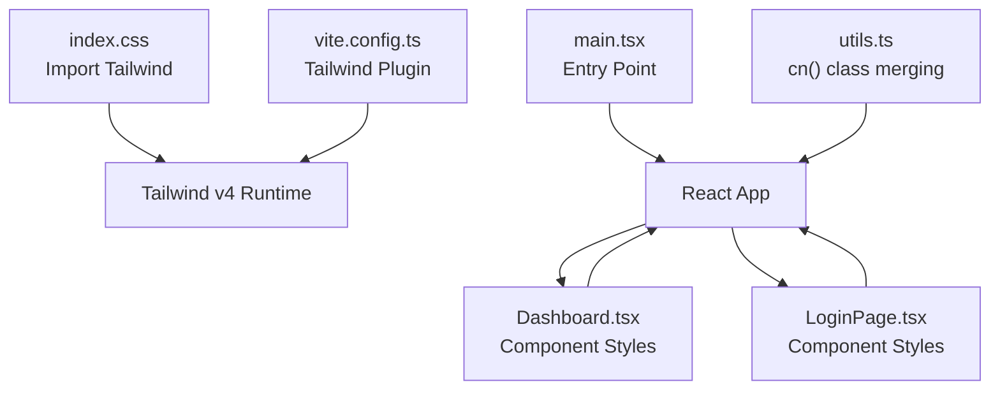
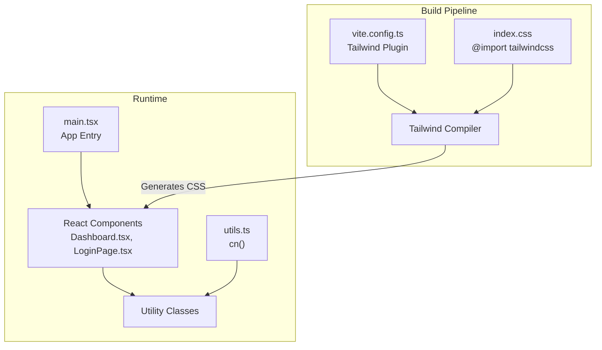
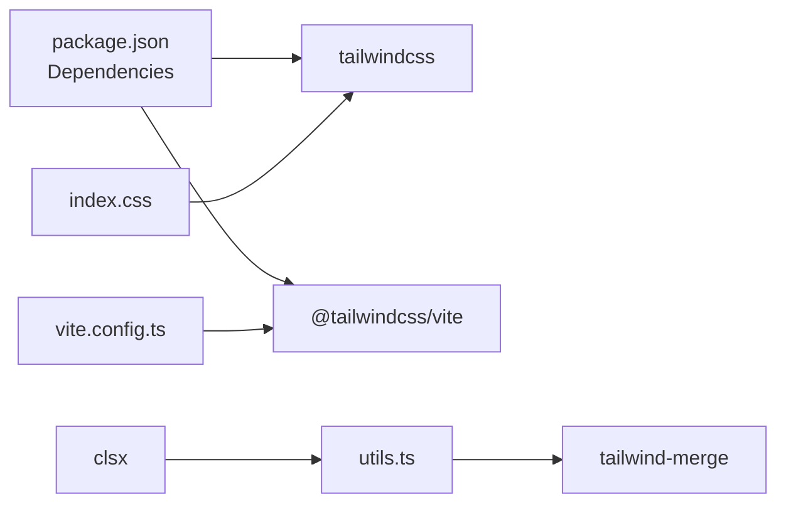

# Styling Architecture

<cite>
**Referenced Files in This Document**
- [index.css](file://frontend/src/index.css)
- [main.tsx](file://frontend/src/main.tsx)
- [vite.config.ts](file://frontend/vite.config.ts)
- [package.json](file://frontend/package.json)
- [utils.ts](file://frontend/src/lib/utils.ts)
- [App.tsx](file://frontend/src/App.tsx)
- [Dashboard.tsx](file://frontend/src/components/Dashboard.tsx)
- [LoginPage.tsx](file://frontend/src/components/LoginPage.tsx)
</cite>

## Table of Contents
1. [Introduction](#introduction)
2. [Project Structure](#project-structure)
3. [Core Components](#core-components)
4. [Architecture Overview](#architecture-overview)
5. [Detailed Component Analysis](#detailed-component-analysis)
6. [Dependency Analysis](#dependency-analysis)
7. [Performance Considerations](#performance-considerations)
8. [Troubleshooting Guide](#troubleshooting-guide)
9. [Conclusion](#conclusion)
10. [Appendices](#appendices)

## Introduction
This document describes the styling architecture for the frontend of the Medicentral project. It explains how Tailwind CSS is integrated via Vite, how utility-first classes are applied across components, and how custom CSS and helper utilities support consistent, maintainable, and accessible UI development. The design emphasizes a dark theme suitable for clinical environments, with attention to contrast, readability, and reduced eye strain. Alarm color coding and clinical-appropriate palettes are used to communicate status effectively. The document also covers build-time optimizations, browser compatibility strategies, and maintenance practices for large-scale UI development.

## Project Structure
The styling pipeline is organized around a minimal CSS entry that imports Tailwind directives, a Vite configuration that integrates Tailwind, and React components that apply utility classes. A small helper utility merges Tailwind classes safely to avoid conflicts.

**Diagram sources**
- [index.css:1-2](file://frontend/src/index.css#L1-L2)
- [main.tsx:1-16](file://frontend/src/main.tsx#L1-L16)
- [vite.config.ts:1-35](file://frontend/vite.config.ts#L1-L35)
- [utils.ts:1-7](file://frontend/src/lib/utils.ts#L1-L7)
- [Dashboard.tsx:1-429](file://frontend/src/components/Dashboard.tsx#L1-L429)
- [LoginPage.tsx:1-84](file://frontend/src/components/LoginPage.tsx#L1-L84)

**Section sources**
- [index.css:1-2](file://frontend/src/index.css#L1-L2)
- [main.tsx:1-16](file://frontend/src/main.tsx#L1-L16)
- [vite.config.ts:1-35](file://frontend/vite.config.ts#L1-L35)
- [utils.ts:1-7](file://frontend/src/lib/utils.ts#L1-L7)

## Core Components
- Tailwind CSS integration is configured via the Vite plugin and imported at the application entry point.
- A utility function merges Tailwind classes safely, preventing duplicates and ensuring predictable overrides.
- Components apply a consistent dark palette with semantic colors for status, actions, and backgrounds.

Key implementation references:
- Tailwind import and plugin configuration: [index.css:1-2](file://frontend/src/index.css#L1-L2), [vite.config.ts:1-35](file://frontend/vite.config.ts#L1-L35)
- Class merging utility: [utils.ts:1-7](file://frontend/src/lib/utils.ts#L1-L7)
- Dark theme usage in components: [App.tsx:20-26](file://frontend/src/App.tsx#L20-L26), [Dashboard.tsx:109-130](file://frontend/src/components/Dashboard.tsx#L109-L130), [LoginPage.tsx:23-24](file://frontend/src/components/LoginPage.tsx#L23-L24)

**Section sources**
- [index.css:1-2](file://frontend/src/index.css#L1-L2)
- [vite.config.ts:1-35](file://frontend/vite.config.ts#L1-L35)
- [utils.ts:1-7](file://frontend/src/lib/utils.ts#L1-L7)
- [App.tsx:20-26](file://frontend/src/App.tsx#L20-L26)
- [Dashboard.tsx:109-130](file://frontend/src/components/Dashboard.tsx#L109-L130)
- [LoginPage.tsx:23-24](file://frontend/src/components/LoginPage.tsx#L23-L24)

## Architecture Overview
The styling architecture follows a utility-first model with Tailwind classes applied directly in JSX. The build pipeline compiles Tailwind directives, generating production-ready CSS. Components encapsulate styling locally, while shared utilities and a global entry ensure consistency.

**Diagram sources**
- [vite.config.ts:1-35](file://frontend/vite.config.ts#L1-L35)
- [index.css:1-2](file://frontend/src/index.css#L1-L2)
- [utils.ts:1-7](file://frontend/src/lib/utils.ts#L1-L7)
- [main.tsx:1-16](file://frontend/src/main.tsx#L1-L16)
- [Dashboard.tsx:1-429](file://frontend/src/components/Dashboard.tsx#L1-L429)
- [LoginPage.tsx:1-84](file://frontend/src/components/LoginPage.tsx#L1-L84)

## Detailed Component Analysis

### Utility-First Approach and Dark Theme
- Components consistently use a dark color scheme with zinc grays and accent colors (emerald, red, yellow, blue, purple) for status and actions.
- Backgrounds use layered approaches: fixed backgrounds with overlay effects and backdrop blur for depth and readability.
- Inputs, buttons, and status indicators adopt consistent borders, focus rings, and transitions to improve usability.

Examples:
- Dark skeleton and loading state: [App.tsx:20-26](file://frontend/src/App.tsx#L20-L26)
- Background image with overlay and blur: [Dashboard.tsx:117-130](file://frontend/src/components/Dashboard.tsx#L117-L130)
- Header and navigation styling: [Dashboard.tsx:135-306](file://frontend/src/components/Dashboard.tsx#L135-L306)
- Login form styling: [LoginPage.tsx:23-81](file://frontend/src/components/LoginPage.tsx#L23-L81)

**Section sources**
- [App.tsx:20-26](file://frontend/src/App.tsx#L20-L26)
- [Dashboard.tsx:117-130](file://frontend/src/components/Dashboard.tsx#L117-L130)
- [Dashboard.tsx:135-306](file://frontend/src/components/Dashboard.tsx#L135-L306)
- [LoginPage.tsx:23-81](file://frontend/src/components/LoginPage.tsx#L23-L81)

### Alarm Color Coding and Status Semantics
- Red indicates critical conditions; yellow, blue, and purple indicate warnings; emerald indicates stable conditions.
- Buttons and indicators reflect severity with color, borders, and subtle animations (e.g., pulsing dots) to draw attention without overwhelming.

Examples:
- Severity filters and counts: [Dashboard.tsx:40-106](file://frontend/src/components/Dashboard.tsx#L40-L106)
- Critical section header: [Dashboard.tsx:344-346](file://frontend/src/components/Dashboard.tsx#L344-L346)
- Warning section header: [Dashboard.tsx:359-361](file://frontend/src/components/Dashboard.tsx#L359-L361)
- Stable section header: [Dashboard.tsx:374-376](file://frontend/src/components/Dashboard.tsx#L374-L376)

**Section sources**
- [Dashboard.tsx:40-106](file://frontend/src/components/Dashboard.tsx#L40-L106)
- [Dashboard.tsx:344-346](file://frontend/src/components/Dashboard.tsx#L344-L346)
- [Dashboard.tsx:359-361](file://frontend/src/components/Dashboard.tsx#L359-L361)
- [Dashboard.tsx:374-376](file://frontend/src/components/Dashboard.tsx#L374-L376)

### Typography and Spacing Systems
- Sans-serif font stack is applied globally via a base class on the root container.
- Text sizes and weights are chosen for readability in clinical environments (e.g., bold time displays, monospaced fonts for timestamps).
- Consistent padding and margin scales are used across components to maintain rhythm and alignment.

Examples:
- Font family and selection highlight: [Dashboard.tsx](file://frontend/src/components/Dashboard.tsx#L109)
- Bold time and date typography: [Dashboard.tsx:25-28](file://frontend/src/components/Dashboard.tsx#L25-L28)
- Monospace timestamp: [Dashboard.tsx](file://frontend/src/components/Dashboard.tsx#L27)

**Section sources**
- [Dashboard.tsx](file://frontend/src/components/Dashboard.tsx#L109)
- [Dashboard.tsx:25-28](file://frontend/src/components/Dashboard.tsx#L25-L28)

### Responsive Design Patterns
- Components adapt layout using responsive utilities (e.g., grid column counts, padding, and width adjustments).
- Breakpoints are handled through Tailwind’s responsive prefixes to ensure readability and usability across devices.

Examples:
- Responsive grid layouts: [Dashboard.tsx:348-384](file://frontend/src/components/Dashboard.tsx#L348-L384)
- Responsive header spacing and widths: [Dashboard.tsx:163-176](file://frontend/src/components/Dashboard.tsx#L163-L176), [Dashboard.tsx:222-227](file://frontend/src/components/Dashboard.tsx#L222-L227)

**Section sources**
- [Dashboard.tsx:348-384](file://frontend/src/components/Dashboard.tsx#L348-L384)
- [Dashboard.tsx:163-176](file://frontend/src/components/Dashboard.tsx#L163-L176)
- [Dashboard.tsx:222-227](file://frontend/src/components/Dashboard.tsx#L222-L227)

### Accessibility and Contrast
- High contrast color pairs are used for text and backgrounds to reduce eye strain.
- Focus states and keyboard navigability are supported through explicit focus styles and ARIA attributes.
- Status indicators use color plus shape/text to convey meaning, aiding users with color vision deficiency.

Examples:
- Focus-visible styles for keyboard navigation: [Dashboard.tsx:112-115](file://frontend/src/components/Dashboard.tsx#L112-L115)
- Status indicators with live regions: [Dashboard.tsx:150-156](file://frontend/src/components/Dashboard.tsx#L150-L156)
- Accessible button labels and roles: [Dashboard.tsx:250-275](file://frontend/src/components/Dashboard.tsx#L250-L275), [Dashboard.tsx:286-303](file://frontend/src/components/Dashboard.tsx#L286-L303)

**Section sources**
- [Dashboard.tsx:112-115](file://frontend/src/components/Dashboard.tsx#L112-L115)
- [Dashboard.tsx:150-156](file://frontend/src/components/Dashboard.tsx#L150-L156)
- [Dashboard.tsx:250-275](file://frontend/src/components/Dashboard.tsx#L250-L275)
- [Dashboard.tsx:286-303](file://frontend/src/components/Dashboard.tsx#L286-L303)

### CSS-in-JS Integration
- There is no CSS-in-JS library in use. Styling relies entirely on Tailwind utility classes applied directly in JSX, with a small helper for safe class merging.

References:
- Class merging utility: [utils.ts:1-7](file://frontend/src/lib/utils.ts#L1-L7)
- No CSS-in-JS dependencies found in package manifest: [package.json:13-34](file://frontend/package.json#L13-L34)

**Section sources**
- [utils.ts:1-7](file://frontend/src/lib/utils.ts#L1-L7)
- [package.json:13-34](file://frontend/package.json#L13-L34)

## Dependency Analysis
Tailwind CSS is integrated via the official Vite plugin. The runtime import directive in the CSS entry triggers Tailwind’s compilation. A small utility merges classes to prevent conflicts.

**Diagram sources**
- [package.json:13-34](file://frontend/package.json#L13-L34)
- [vite.config.ts:1-35](file://frontend/vite.config.ts#L1-L35)
- [index.css:1-2](file://frontend/src/index.css#L1-L2)
- [utils.ts:1-7](file://frontend/src/lib/utils.ts#L1-L7)

**Section sources**
- [package.json:13-34](file://frontend/package.json#L13-L34)
- [vite.config.ts:1-35](file://frontend/vite.config.ts#L1-L35)
- [index.css:1-2](file://frontend/src/index.css#L1-L2)
- [utils.ts:1-7](file://frontend/src/lib/utils.ts#L1-L7)

## Performance Considerations
- Build-time optimizations: Tailwind v4 is integrated via the Vite plugin, enabling efficient compilation and asset handling during development and production builds.
- Class merging: Using the utility reduces redundant classes and prevents cascade conflicts, simplifying maintenance and minimizing CSS output.
- Image optimization: Background images are loaded with performance hints to prioritize rendering in clinical dashboards.
- Backdrop blur and overlay effects: Used selectively to enhance readability without heavy GPU usage.

References:
- Tailwind plugin in Vite: [vite.config.ts:1-35](file://frontend/vite.config.ts#L1-L35)
- Class merging utility: [utils.ts:1-7](file://frontend/src/lib/utils.ts#L1-L7)
- Background image loading hints: [Dashboard.tsx:118-125](file://frontend/src/components/Dashboard.tsx#L118-L125)

**Section sources**
- [vite.config.ts:1-35](file://frontend/vite.config.ts#L1-L35)
- [utils.ts:1-7](file://frontend/src/lib/utils.ts#L1-L7)
- [Dashboard.tsx:118-125](file://frontend/src/components/Dashboard.tsx#L118-L125)

## Troubleshooting Guide
- Tailwind classes not applying:
  - Verify the Tailwind plugin is enabled in the Vite configuration and the CSS entry imports Tailwind directives.
  - References: [vite.config.ts:1-35](file://frontend/vite.config.ts#L1-L35), [index.css:1-2](file://frontend/src/index.css#L1-L2)
- Conflicting classes:
  - Use the class merging utility to combine classes safely.
  - Reference: [utils.ts:1-7](file://frontend/src/lib/utils.ts#L1-L7)
- Build errors or missing styles:
  - Ensure the Tailwind CSS version matches the Vite plugin version and that the dev script runs without errors.
  - Reference: [package.json:25-32](file://frontend/package.json#L25-L32)

**Section sources**
- [vite.config.ts:1-35](file://frontend/vite.config.ts#L1-L35)
- [index.css:1-2](file://frontend/src/index.css#L1-L2)
- [utils.ts:1-7](file://frontend/src/lib/utils.ts#L1-L7)
- [package.json:25-32](file://frontend/package.json#L25-L32)

## Conclusion
The styling architecture leverages Tailwind CSS with a utility-first philosophy, delivering a consistent, accessible, and performance-conscious UI tailored for clinical environments. The dark theme, alarm color coding, and responsive patterns support usability and safety. The minimal build configuration and a small class merging utility keep the system maintainable and scalable.

## Appendices

### Color System and Palettes
- Dark theme foundation: zinc grays for backgrounds, borders, and text.
- Status accents: emerald for stable, red for critical, yellow for warnings, blue/purple for additional warning states.
- Action and interactive states: hover and focus states use emerald and red tints for feedback.

References:
- Background and overlay: [Dashboard.tsx:117-130](file://frontend/src/components/Dashboard.tsx#L117-L130)
- Status indicators and buttons: [Dashboard.tsx:182-213](file://frontend/src/components/Dashboard.tsx#L182-L213), [Dashboard.tsx:231-304](file://frontend/src/components/Dashboard.tsx#L231-L304)
- Login form: [LoginPage.tsx:23-81](file://frontend/src/components/LoginPage.tsx#L23-L81)

**Section sources**
- [Dashboard.tsx:117-130](file://frontend/src/components/Dashboard.tsx#L117-L130)
- [Dashboard.tsx:182-213](file://frontend/src/components/Dashboard.tsx#L182-L213)
- [Dashboard.tsx:231-304](file://frontend/src/components/Dashboard.tsx#L231-L304)
- [LoginPage.tsx:23-81](file://frontend/src/components/LoginPage.tsx#L23-L81)

### Spacing and Typography Guidelines
- Typography: Sans-serif base with bold headings and monospaced elements for time and identifiers.
- Spacing: Consistent padding and margins across components; responsive adjustments for grids and navigation.

References:
- Font and selection: [Dashboard.tsx](file://frontend/src/components/Dashboard.tsx#L109)
- Time and date: [Dashboard.tsx:25-28](file://frontend/src/components/Dashboard.tsx#L25-L28)
- Responsive grids: [Dashboard.tsx:348-384](file://frontend/src/components/Dashboard.tsx#L348-L384)

**Section sources**
- [Dashboard.tsx](file://frontend/src/components/Dashboard.tsx#L109)
- [Dashboard.tsx:25-28](file://frontend/src/components/Dashboard.tsx#L25-L28)
- [Dashboard.tsx:348-384](file://frontend/src/components/Dashboard.tsx#L348-L384)

### Browser Compatibility and Progressive Enhancement
- Tailwind CSS generates cross-browser compatible utilities; ensure modern browsers for advanced features like backdrop blur.
- Progressive enhancement: core functionality remains usable without advanced CSS features; enhancements (e.g., blur overlays) improve the experience when supported.

References:
- Backdrop blur usage: [Dashboard.tsx:127-129](file://frontend/src/components/Dashboard.tsx#L127-L129)

**Section sources**
- [Dashboard.tsx:127-129](file://frontend/src/components/Dashboard.tsx#L127-L129)