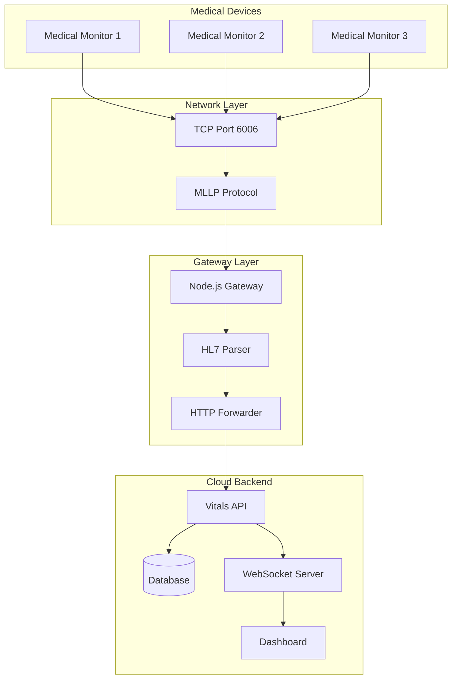
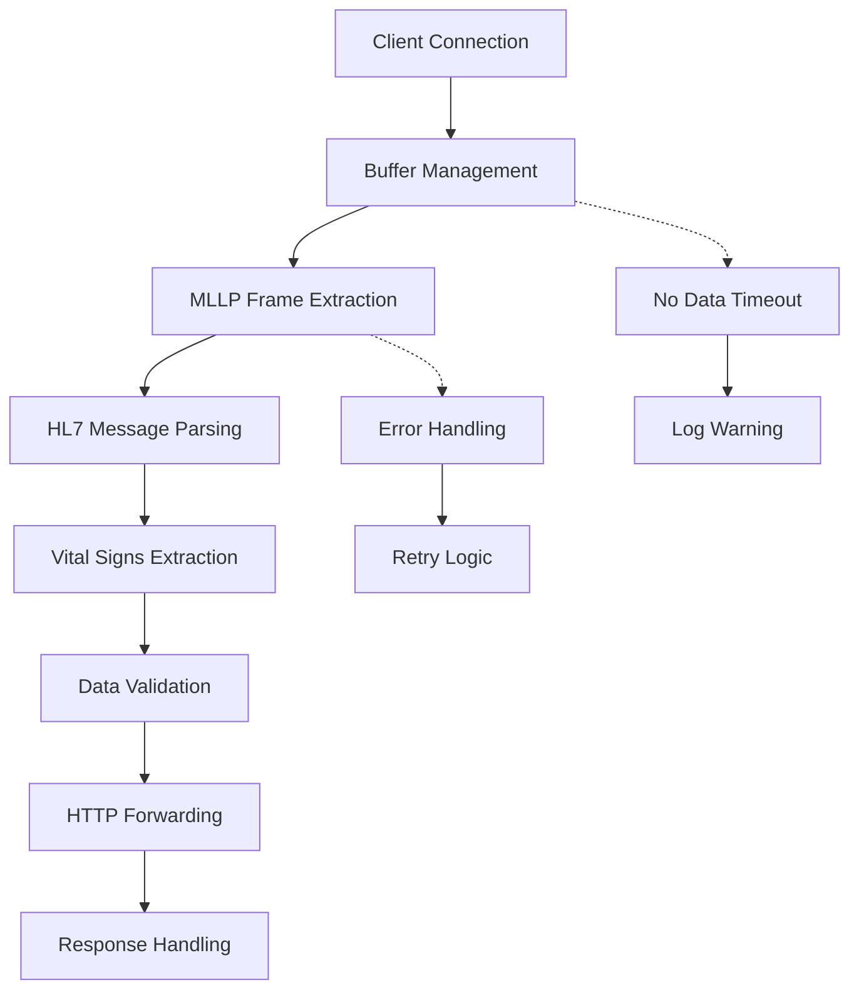
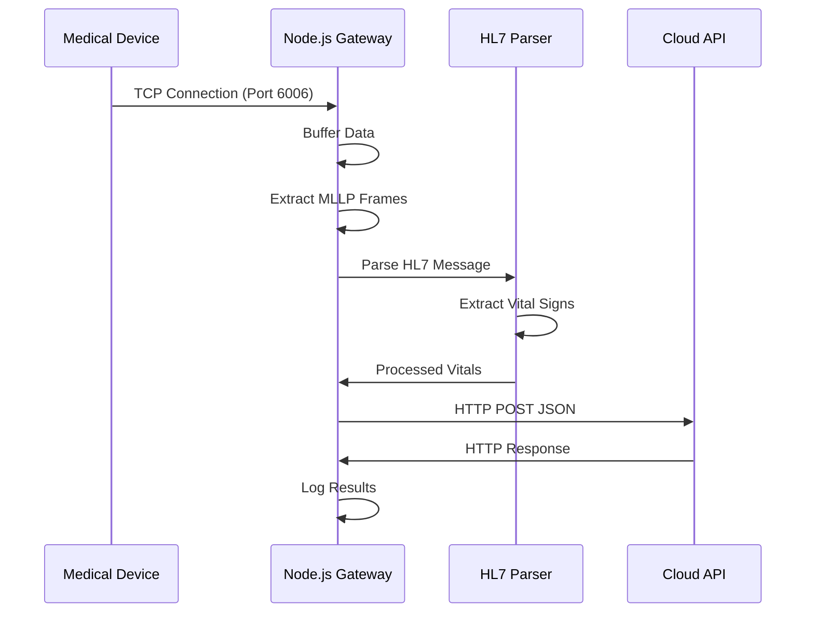
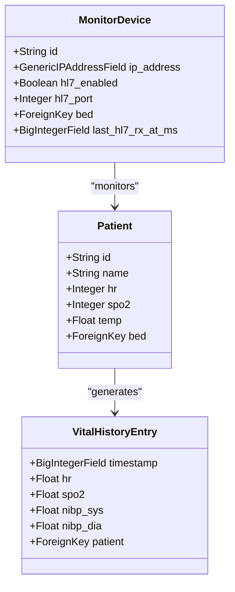
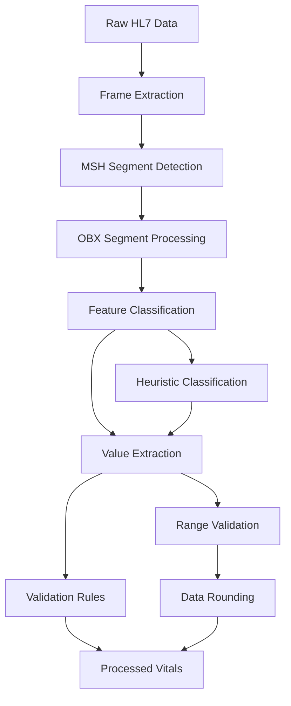
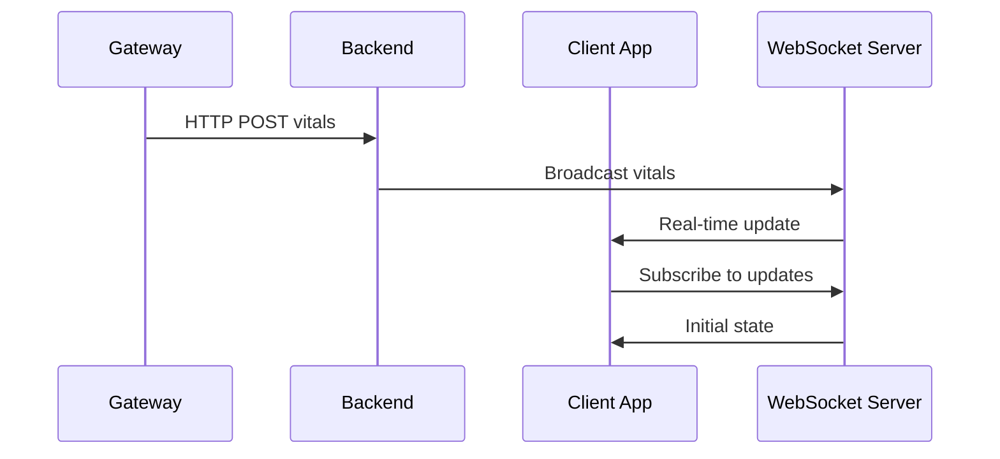
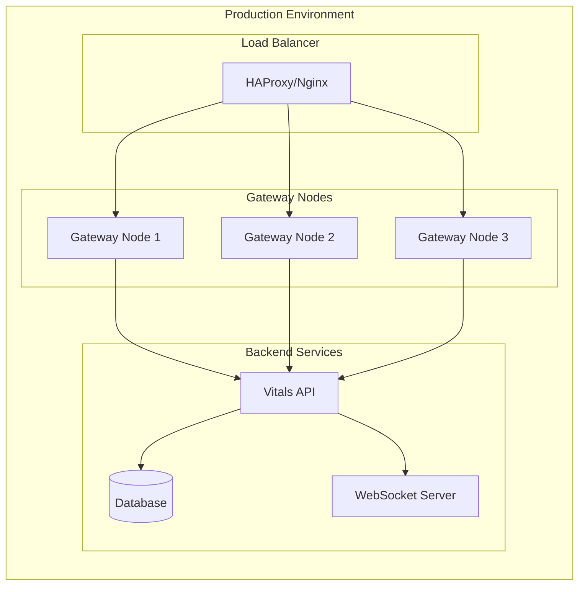

# Node.js HL7 Gateway

<cite>
**Referenced Files in This Document**
- [gateway/README.md](file://gateway/README.md)
- [gateway/package.json](file://gateway/package.json)
- [gateway/server.js](file://gateway/server.js)
- [portable-hl7-gateway/README.md](file://portable-hl7-gateway/README.md)
- [portable-hl7-gateway/package.json](file://portable-hl7-gateway/package.json)
- [portable-hl7-gateway/server.js](file://portable-hl7-gateway/server.js)
- [server/README.md](file://server/README.md)
- [server/app.js](file://server/app.js)
- [backend/monitoring/hl7_parser.py](file://backend/monitoring/hl7_parser.py)
- [backend/monitoring/hl7_listener.py](file://backend/monitoring/hl7_listener.py)
- [backend/monitoring/models.py](file://backend/monitoring/models.py)
- [backend/monitoring/views.py](file://backend/monitoring/views.py)
- [backend/monitoring/urls.py](file://backend/monitoring/urls.py)
- [backend/monitoring/consumers.py](file://backend/monitoring/consumers.py)
- [backend/monitoring/routing.py](file://backend/monitoring/routing.py)
- [backend/monitoring/serializers.py](file://backend/monitoring/serializers.py)
</cite>

## Table of Contents
1. [Introduction](#introduction)
2. [System Architecture](#system-architecture)
3. [Gateway Components](#gateway-components)
4. [Node.js Gateway Implementation](#nodejs-gateway-implementation)
5. [Portable Gateway Implementation](#portable-gateway-implementation)
6. [Backend Integration](#backend-integration)
7. [HL7 Processing Pipeline](#hl7-processing-pipeline)
8. [WebSocket Integration](#websocket-integration)
9. [Configuration Management](#configuration-management)
10. [Deployment Architecture](#deployment-architecture)
11. [Troubleshooting Guide](#troubleshooting-guide)
12. [Conclusion](#conclusion)

## Introduction

The Node.js HL7 Gateway is a specialized TCP server designed to receive HL7/MLLP formatted medical device data and forward it to cloud-based healthcare monitoring systems. This gateway serves as a bridge between legacy medical devices and modern cloud-based patient monitoring platforms, enabling real-time vital signs collection and analysis.

The system consists of two primary implementations: a lightweight Node.js gateway for local environments and a portable version designed for desktop deployments. Both implementations share the same core functionality of parsing HL7 messages, extracting vital signs data, and forwarding processed information to cloud APIs.

## System Architecture

The HL7 Gateway system follows a distributed architecture pattern with clear separation of concerns:

**Diagram sources**
- [gateway/server.js:1-326](file://gateway/server.js#L1-L326)
- [server/app.js:1-130](file://server/app.js#L1-L130)

The architecture supports multiple deployment scenarios:
- **Local Gateway**: Runs on-site near medical devices
- **Portable Gateway**: Desktop version for temporary or remote deployments
- **Cloud Backend**: Centralized API service for data processing and storage

## Gateway Components

### Core Gateway Functionality

Both gateway implementations share identical core functionality for processing HL7/MLLP data:

**Diagram sources**
- [gateway/server.js:246-325](file://gateway/server.js#L246-L325)
- [portable-hl7-gateway/server.js:265-344](file://portable-hl7-gateway/server.js#L265-L344)

### Data Processing Pipeline

The gateway implements a sophisticated data processing pipeline that handles various HL7 message formats and extraction strategies:

**Diagram sources**
- [gateway/server.js:175-244](file://gateway/server.js#L175-L244)
- [gateway/server.js:86-146](file://gateway/server.js#L86-L146)

## Node.js Gateway Implementation

### Server Configuration

The Node.js gateway provides a minimal but robust implementation for production environments:

**Section sources**
- [gateway/server.js:22-26](file://gateway/server.js#L22-L26)
- [gateway/server.js:314-325](file://gateway/server.js#L314-L325)

### Environment Variables

The gateway supports extensive configuration through environment variables:

| Variable | Default | Description |
|----------|---------|-------------|
| `GATEWAY_HOST` | `0.0.0.0` | Bind address for TCP server |
| `GATEWAY_PORT` | `6006` | TCP port for HL7/MLLP connections |
| `VITALS_URL` | `http://167.71.53.238/api/vitals` | Cloud API endpoint URL |
| `NO_DATA_MS` | `10000` | Timeout for no data warnings |
| `DEBUG` | `1` | Enable/disable verbose logging |

### Connection Handling

The gateway implements sophisticated connection management with automatic cleanup and error handling:

**Section sources**
- [gateway/server.js:246-312](file://gateway/server.js#L246-L312)

### MLLP Protocol Support

The gateway includes comprehensive MLLP (Minimum Lower Layer Protocol) support for proper HL7 framing:

**Section sources**
- [gateway/server.js:151-164](file://gateway/server.js#L151-L164)
- [gateway/server.js:186-209](file://gateway/server.js#L186-L209)

## Portable Gateway Implementation

### Desktop Deployment

The portable gateway is designed for desktop environments and includes configuration file support:

**Section sources**
- [portable-hl7-gateway/server.js:14-33](file://portable-hl7-gateway/server.js#L14-L33)
- [portable-hl7-gateway/package.json:1-9](file://portable-hl7-gateway/package.json#L1-L9)

### Configuration Management

Unlike the Node.js version, the portable gateway reads configuration from a local `.env` file:

**Section sources**
- [portable-hl7-gateway/server.js:42-45](file://portable-hl7-gateway/server.js#L42-L45)

## Backend Integration

### Cloud API Service

The backend provides a comprehensive REST API for vitals data management:

**Section sources**
- [server/README.md:1-26](file://server/README.md#L1-L26)
- [server/app.js:56-79](file://server/app.js#L56-L79)

### WebSocket Broadcasting

The backend implements real-time data streaming through WebSocket connections:

**Section sources**
- [server/app.js:109-122](file://server/app.js#L109-L122)
- [backend/monitoring/consumers.py:12-46](file://backend/monitoring/consumers.py#L12-L46)

### Data Model Architecture

The backend uses Django models to represent medical data structures:

**Diagram sources**
- [backend/monitoring/models.py:77-140](file://backend/monitoring/models.py#L77-L140)
- [backend/monitoring/models.py:141-180](file://backend/monitoring/models.py#L141-L180)
- [backend/monitoring/models.py:214-224](file://backend/monitoring/models.py#L214-L224)

**Section sources**
- [backend/monitoring/models.py:1-224](file://backend/monitoring/models.py#L1-L224)

## HL7 Processing Pipeline

### Message Parsing Strategy

The system implements a multi-layered approach to HL7 message parsing:

**Diagram sources**
- [gateway/server.js:48-146](file://gateway/server.js#L48-L146)
- [backend/monitoring/hl7_parser.py:423-452](file://backend/monitoring/hl7_parser.py#L423-L452)

### Feature Classification

The parser uses multiple classification strategies for accurate vital signs detection:

**Section sources**
- [gateway/server.js:48-81](file://gateway/server.js#L48-L81)
- [backend/monitoring/hl7_parser.py:29-66](file://backend/monitoring/hl7_parser.py#L29-L66)

### Value Extraction and Validation

The system implements sophisticated value extraction with built-in validation:

**Section sources**
- [gateway/server.js:64-81](file://gateway/server.js#L64-L81)
- [backend/monitoring/hl7_parser.py:69-93](file://backend/monitoring/hl7_parser.py#L69-L93)

## WebSocket Integration

### Real-time Data Streaming

The system provides real-time data updates through WebSocket connections:

**Diagram sources**
- [server/app.js:46-52](file://server/app.js#L46-L52)
- [backend/monitoring/consumers.py:13-29](file://backend/monitoring/consumers.py#L13-L29)

### Authentication and Authorization

WebSocket connections require authenticated sessions:

**Section sources**
- [backend/monitoring/consumers.py:14-22](file://backend/monitoring/consumers.py#L14-L22)
- [backend/monitoring/routing.py:5-7](file://backend/monitoring/routing.py#L5-L7)

## Configuration Management

### Environment-Based Configuration

Both gateway implementations support flexible configuration through environment variables:

**Section sources**
- [gateway/server.js:22-26](file://gateway/server.js#L22-L26)
- [portable-hl7-gateway/server.js:40-45](file://portable-hl7-gateway/server.js#L40-L45)

### Deployment Configuration

The system supports various deployment scenarios with appropriate configuration:

**Section sources**
- [gateway/README.md:20-36](file://gateway/README.md#L20-L36)
- [portable-hl7-gateway/README.md:1-36](file://portable-hl7-gateway/README.md#L1-L36)

## Deployment Architecture

### Production Deployment

The gateway can be deployed in multiple configurations:

### Monitoring and Health Checks

The system includes comprehensive monitoring capabilities:

**Section sources**
- [backend/monitoring/views.py:65-321](file://backend/monitoring/views.py#L65-L321)
- [backend/monitoring/hl7_listener.py:36-71](file://backend/monitoring/hl7_listener.py#L36-L71)

## Troubleshooting Guide

### Common Issues and Solutions

**Connection Problems:**
- Verify TCP port 6006 accessibility
- Check firewall configuration
- Confirm device HL7 settings match gateway configuration

**Data Processing Issues:**
- Validate HL7 message format compliance
- Check MLLP framing correctness
- Review vital signs extraction accuracy

**Network Connectivity:**
- Test network latency and bandwidth
- Verify DNS resolution for cloud endpoints
- Monitor TCP connection stability

### Diagnostic Commands

**Gateway-Specific Diagnostics:**
- Monitor connection logs and timeouts
- Check MLLP frame extraction success rates
- Validate HTTP forwarding responses

**Backend Integration:**
- Verify WebSocket connection establishment
- Check database connectivity and performance
- Monitor API response times and error rates

**Section sources**
- [gateway/server.js:252-255](file://gateway/server.js#L252-L255)
- [backend/monitoring/views.py:108-230](file://backend/monitoring/views.py#L108-L230)

## Conclusion

The Node.js HL7 Gateway provides a robust, scalable solution for connecting medical devices to cloud-based healthcare monitoring systems. Its dual-implementation approach accommodates both production and portable deployment scenarios while maintaining consistent functionality and reliability.

Key strengths of the system include:

- **Reliability**: Comprehensive error handling and retry mechanisms
- **Flexibility**: Support for multiple HL7 message formats and extraction strategies  
- **Scalability**: Stateless design enabling horizontal scaling
- **Real-time Capabilities**: WebSocket integration for live data streaming
- **Monitoring**: Built-in diagnostic capabilities and health checks

The system successfully bridges the gap between legacy medical equipment and modern cloud-based healthcare solutions, enabling real-time patient monitoring and analysis capabilities.