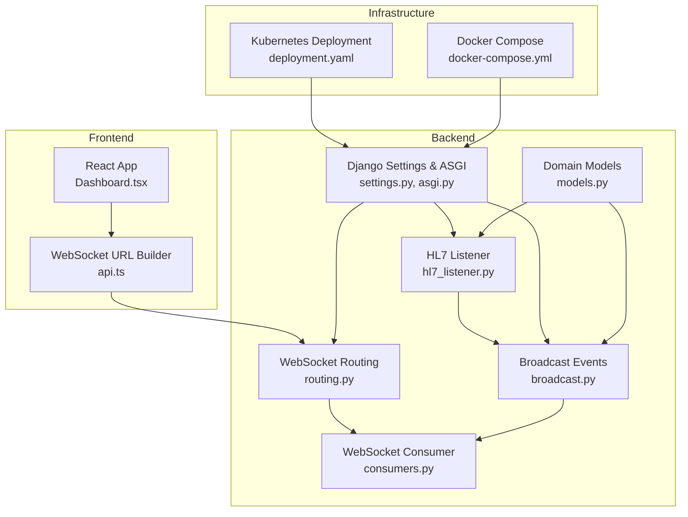
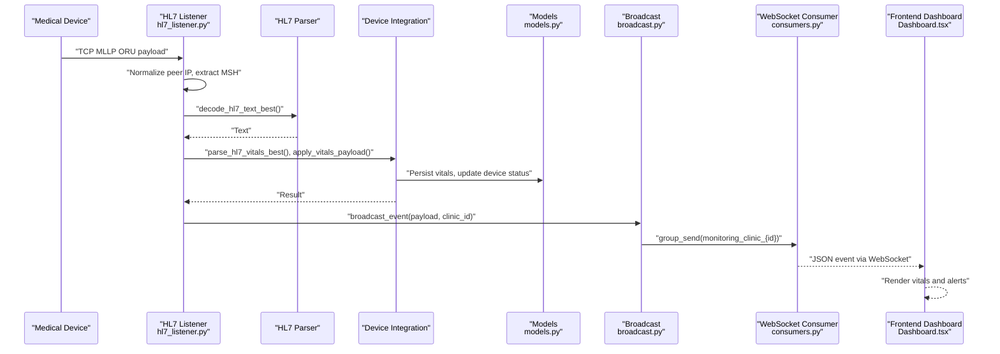
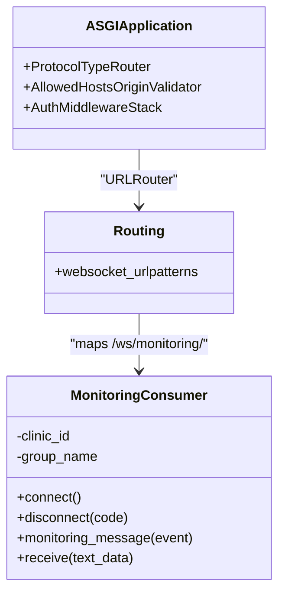
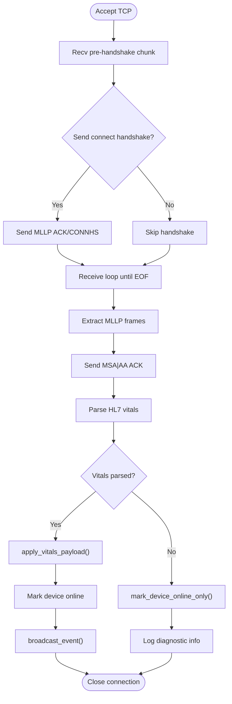
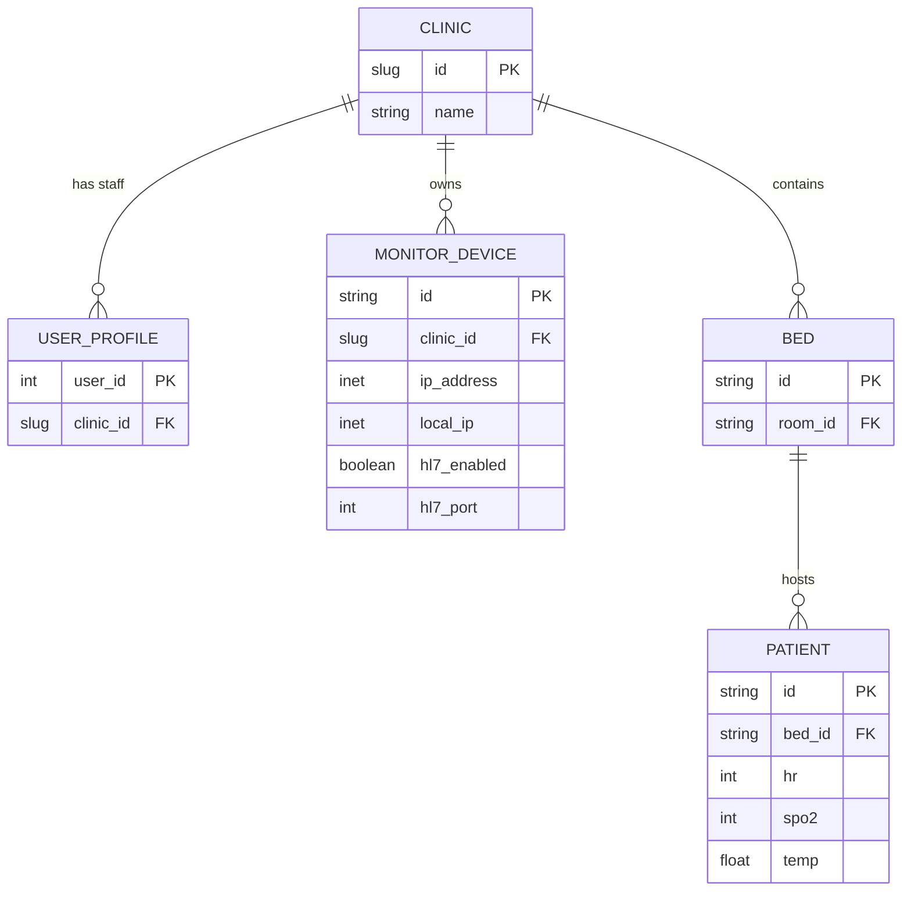
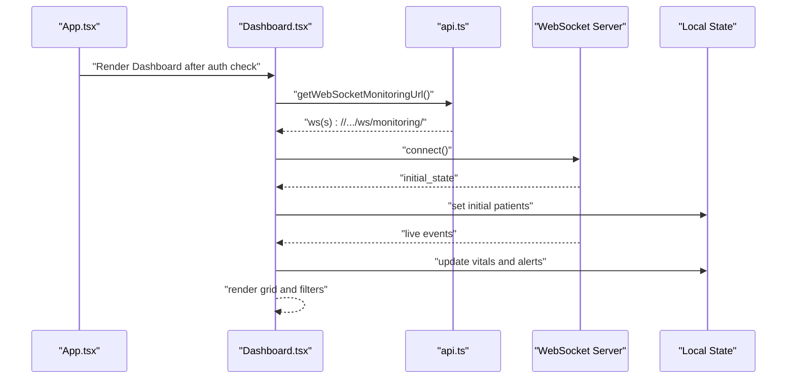
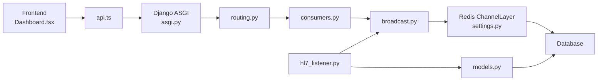
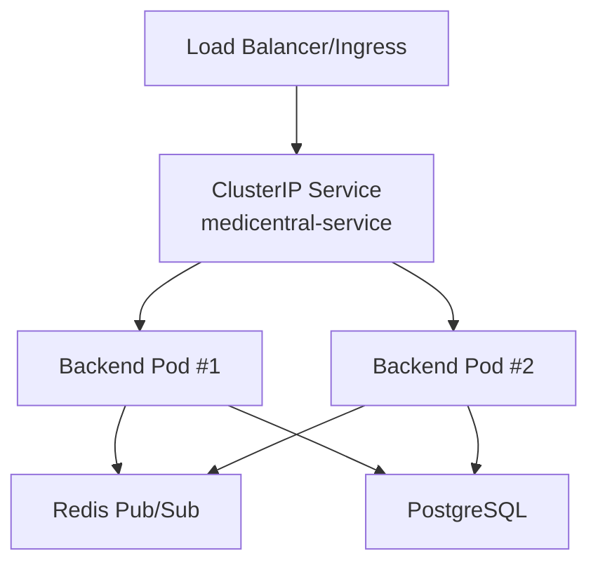

# System Architecture

<cite>
**Referenced Files in This Document**
- [settings.py](file://backend/medicentral/settings.py)
- [asgi.py](file://backend/medicentral/asgi.py)
- [routing.py](file://backend/monitoring/routing.py)
- [consumers.py](file://backend/monitoring/consumers.py)
- [broadcast.py](file://backend/monitoring/broadcast.py)
- [hl7_listener.py](file://backend/monitoring/hl7_listener.py)
- [models.py](file://backend/monitoring/models.py)
- [App.tsx](file://frontend/src/App.tsx)
- [Dashboard.tsx](file://frontend/src/components/Dashboard.tsx)
- [api.ts](file://frontend/src/lib/api.ts)
- [deployment.yaml](file://k8s/deployment.yaml)
- [docker-compose.yml](file://docker-compose.yml)
</cite>

## Table of Contents
1. [Introduction](#introduction)
2. [Project Structure](#project-structure)
3. [Core Components](#core-components)
4. [Architecture Overview](#architecture-overview)
5. [Detailed Component Analysis](#detailed-component-analysis)
6. [Dependency Analysis](#dependency-analysis)
7. [Performance Considerations](#performance-considerations)
8. [Troubleshooting Guide](#troubleshooting-guide)
9. [Conclusion](#conclusion)
10. [Appendices](#appendices)

## Introduction
This document describes the high-level architecture of the Medicentral system, an event-driven microservices platform integrating HL7 medical devices, a Django backend with Django Channels, and a React frontend. The system emphasizes real-time monitoring dashboards, multi-tenant clinic isolation, and scalable deployment using Kubernetes. It also outlines infrastructure requirements, security posture, monitoring, and disaster recovery considerations.

## Project Structure
The repository is organized into three primary layers:
- Backend: Django application with ASGI, Channels, and monitoring domain logic
- Frontend: React SPA with TypeScript and WebSocket client integration
- Infrastructure: Kubernetes manifests and Docker Compose for local/stage deployments

**Diagram sources**
- [settings.py:1-218](file://backend/medicentral/settings.py#L1-L218)
- [asgi.py:1-22](file://backend/medicentral/asgi.py#L1-L22)
- [routing.py:1-8](file://backend/monitoring/routing.py#L1-L8)
- [consumers.py:1-46](file://backend/monitoring/consumers.py#L1-L46)
- [broadcast.py:1-20](file://backend/monitoring/broadcast.py#L1-L20)
- [hl7_listener.py:1-677](file://backend/monitoring/hl7_listener.py#L1-L677)
- [models.py:1-224](file://backend/monitoring/models.py#L1-L224)
- [deployment.yaml:1-101](file://k8s/deployment.yaml#L1-L101)
- [docker-compose.yml:1-29](file://docker-compose.yml#L1-L29)

**Section sources**
- [settings.py:1-218](file://backend/medicentral/settings.py#L1-L218)
- [asgi.py:1-22](file://backend/medicentral/asgi.py#L1-L22)
- [routing.py:1-8](file://backend/monitoring/routing.py#L1-L8)
- [consumers.py:1-46](file://backend/monitoring/consumers.py#L1-L46)
- [broadcast.py:1-20](file://backend/monitoring/broadcast.py#L1-L20)
- [hl7_listener.py:1-677](file://backend/monitoring/hl7_listener.py#L1-L677)
- [models.py:1-224](file://backend/monitoring/models.py#L1-L224)
- [deployment.yaml:1-101](file://k8s/deployment.yaml#L1-L101)
- [docker-compose.yml:1-29](file://docker-compose.yml#L1-L29)

## Core Components
- Django backend with ASGI and Channels for WebSocket support
- HL7 MLLP listener for TCP-based medical device telemetry ingestion
- Multi-tenant clinic isolation via per-clinic groups and user profiles
- Real-time broadcasting to authenticated WebSocket clients
- React frontend dashboard with live vitals and alerts

Key implementation references:
- Django Channels configuration and runtime wiring
  - [settings.py:170-183](file://backend/medicentral/settings.py#L170-L183)
  - [asgi.py:14-21](file://backend/medicentral/asgi.py#L14-L21)
- WebSocket routing and consumer
  - [routing.py:5-7](file://backend/monitoring/routing.py#L5-L7)
  - [consumers.py:12-46](file://backend/monitoring/consumers.py#L12-L46)
- Broadcast and event delivery
  - [broadcast.py:10-19](file://backend/monitoring/broadcast.py#L10-L19)
- HL7 ingestion and parsing
  - [hl7_listener.py:502-555](file://backend/monitoring/hl7_listener.py#L502-L555)
- Multi-tenancy and models
  - [models.py:5-140](file://backend/monitoring/models.py#L5-L140)

**Section sources**
- [settings.py:170-183](file://backend/medicentral/settings.py#L170-L183)
- [asgi.py:14-21](file://backend/medicentral/asgi.py#L14-L21)
- [routing.py:5-7](file://backend/monitoring/routing.py#L5-L7)
- [consumers.py:12-46](file://backend/monitoring/consumers.py#L12-L46)
- [broadcast.py:10-19](file://backend/monitoring/broadcast.py#L10-L19)
- [hl7_listener.py:502-555](file://backend/monitoring/hl7_listener.py#L502-L555)
- [models.py:5-140](file://backend/monitoring/models.py#L5-L140)

## Architecture Overview
Medicentral follows an event-driven architecture:
- Medical devices stream HL7/ORU messages over TCP (MLLP) to the HL7 listener
- The listener parses and validates payloads, persists vitals, and triggers broadcasts
- Django Channels delivers events to authenticated users in the same clinic
- The React frontend connects via WebSocket to receive live updates and renders the dashboard

**Diagram sources**
- [hl7_listener.py:502-555](file://backend/monitoring/hl7_listener.py#L502-L555)
- [broadcast.py:10-19](file://backend/monitoring/broadcast.py#L10-L19)
- [consumers.py:35-36](file://backend/monitoring/consumers.py#L35-L36)
- [models.py:77-140](file://backend/monitoring/models.py#L77-L140)
- [Dashboard.tsx:49-54](file://frontend/src/components/Dashboard.tsx#L49-L54)

**Section sources**
- [hl7_listener.py:502-555](file://backend/monitoring/hl7_listener.py#L502-L555)
- [broadcast.py:10-19](file://backend/monitoring/broadcast.py#L10-L19)
- [consumers.py:35-36](file://backend/monitoring/consumers.py#L35-L36)
- [models.py:77-140](file://backend/monitoring/models.py#L77-L140)
- [Dashboard.tsx:49-54](file://frontend/src/components/Dashboard.tsx#L49-L54)

## Detailed Component Analysis

### Backend: Django Channels and WebSocket Consumers
- ASGI entrypoint configures HTTP and WebSocket protocols and applies authentication middleware
- WebSocket routing maps "/ws/monitoring/" to the MonitoringConsumer
- MonitoringConsumer authenticates users, resolves clinic, joins a per-clinic group, sends initial state, and handles inbound messages

**Diagram sources**
- [asgi.py:14-21](file://backend/medicentral/asgi.py#L14-L21)
- [routing.py:5-7](file://backend/monitoring/routing.py#L5-L7)
- [consumers.py:12-46](file://backend/monitoring/consumers.py#L12-L46)

**Section sources**
- [asgi.py:14-21](file://backend/medicentral/asgi.py#L14-L21)
- [routing.py:5-7](file://backend/monitoring/routing.py#L5-L7)
- [consumers.py:12-46](file://backend/monitoring/consumers.py#L12-L46)

### Backend: HL7 Listener and Event Broadcasting
- HL7 listener runs a dedicated thread, accepts TCP connections, normalizes MLLP frames, decodes HL7, and extracts vitals
- On successful parse, it persists vitals, marks device online, and broadcasts a clinic-scoped event
- Broadcast targets a per-clinic group derived from the authenticated user’s clinic

**Diagram sources**
- [hl7_listener.py:405-500](file://backend/monitoring/hl7_listener.py#L405-L500)
- [hl7_listener.py:502-555](file://backend/monitoring/hl7_listener.py#L502-L555)
- [broadcast.py:10-19](file://backend/monitoring/broadcast.py#L10-L19)

**Section sources**
- [hl7_listener.py:405-500](file://backend/monitoring/hl7_listener.py#L405-L500)
- [hl7_listener.py:502-555](file://backend/monitoring/hl7_listener.py#L502-L555)
- [broadcast.py:10-19](file://backend/monitoring/broadcast.py#L10-L19)

### Backend: Multi-Tenant Clinic Isolation
- Users belong to a Clinic via UserProfile
- Devices and Patients are scoped to a Clinic
- WebSocket groups are named by clinic ID to isolate tenants

**Diagram sources**
- [models.py:5-140](file://backend/monitoring/models.py#L5-L140)

**Section sources**
- [models.py:5-140](file://backend/monitoring/models.py#L5-L140)

### Frontend: React Dashboard and WebSocket Client
- App initializes session checks and routes to Dashboard upon authentication
- Dashboard establishes a WebSocket connection using normalized backend origin
- On connection, it receives initial_state and subscribes to live events
- Filters, sorting, and alerts are computed locally for responsive UX

**Diagram sources**
- [App.tsx:11-33](file://frontend/src/App.tsx#L11-L33)
- [Dashboard.tsx:49-54](file://frontend/src/components/Dashboard.tsx#L49-L54)
- [api.ts:21-34](file://frontend/src/lib/api.ts#L21-L34)

**Section sources**
- [App.tsx:11-33](file://frontend/src/App.tsx#L11-L33)
- [Dashboard.tsx:49-54](file://frontend/src/components/Dashboard.tsx#L49-L54)
- [api.ts:21-34](file://frontend/src/lib/api.ts#L21-L34)

## Dependency Analysis
- Django Channels relies on Redis for distributed group messaging in production
- The HL7 listener operates independently of Django ORM during ingestion and uses database transactions only when persisting
- Frontend depends on environment-provided backend origin for API and WebSocket URLs

**Diagram sources**
- [settings.py:170-183](file://backend/medicentral/settings.py#L170-L183)
- [asgi.py:14-21](file://backend/medicentral/asgi.py#L14-L21)
- [routing.py:5-7](file://backend/monitoring/routing.py#L5-L7)
- [consumers.py:12-46](file://backend/monitoring/consumers.py#L12-L46)
- [broadcast.py:10-19](file://backend/monitoring/broadcast.py#L10-L19)
- [hl7_listener.py:502-555](file://backend/monitoring/hl7_listener.py#L502-L555)
- [models.py:77-140](file://backend/monitoring/models.py#L77-L140)

**Section sources**
- [settings.py:170-183](file://backend/medicentral/settings.py#L170-L183)
- [asgi.py:14-21](file://backend/medicentral/asgi.py#L14-L21)
- [routing.py:5-7](file://backend/monitoring/routing.py#L5-L7)
- [consumers.py:12-46](file://backend/monitoring/consumers.py#L12-L46)
- [broadcast.py:10-19](file://backend/monitoring/broadcast.py#L10-L19)
- [hl7_listener.py:502-555](file://backend/monitoring/hl7_listener.py#L502-L555)
- [models.py:77-140](file://backend/monitoring/models.py#L77-L140)

## Performance Considerations
- Horizontal scaling: Kubernetes Deployment runs multiple backend pods behind a Service and Ingress; configure REDIS_URL for distributed Channels
- Health checks: Liveness and readiness probes on /api/health/ improve rollout reliability
- WebSocket timeouts: Configure proxy timeouts in Ingress annotations to keep long-lived connections alive
- Database tuning: Use PostgreSQL in production via DATABASE_URL; adjust connection pooling and SSL settings
- HL7 throughput: Tune HL7_RECV_TIMEOUT_SEC and HL7_POST_CONNECT_HANDSHAKE_DELAY_MS for device compatibility

[No sources needed since this section provides general guidance]

## Troubleshooting Guide
Common operational diagnostics:
- HL7 listener status and bind errors
  - Use the HL7 diagnostic summary and listener status APIs to inspect bind errors and acceptance behavior
  - Verify HL7_LISTEN_HOST, HL7_LISTEN_PORT, and HL7_LISTEN_ENABLED environment variables
- WebSocket connectivity
  - Confirm AllowedHostsOriginValidator and CSRF cookie settings for secure cookies in production
  - Ensure CORS_ALLOWED_ORIGINS matches the frontend origin
- Redis connectivity
  - Validate REDIS_URL and that Redis is reachable from backend pods
- Multi-tenancy isolation
  - Confirm user clinic association and that broadcast events target the correct clinic group

**Section sources**
- [hl7_listener.py:645-657](file://backend/monitoring/hl7_listener.py#L645-L657)
- [settings.py:40-51](file://backend/medicentral/settings.py#L40-L51)
- [settings.py:155-166](file://backend/medicentral/settings.py#L155-L166)
- [settings.py:170-183](file://backend/medicentral/settings.py#L170-L183)

## Conclusion
Medicentral employs a clean separation of concerns across the React frontend, Django backend with Channels, and HL7 device integration. Multi-tenant clinic isolation ensures secure, independent monitoring per facility. The architecture supports real-time dashboards, robust device ingestion, and scalable Kubernetes deployments with health checks and persistent storage options.

[No sources needed since this section summarizes without analyzing specific files]

## Appendices

### Production Deployment Topology
- Backend: Deployed as a Kubernetes Deployment with multiple replicas behind a Service and Ingress
- Redis: Required for Channels group messaging; provision a Redis instance and set REDIS_URL
- Database: SQLite for development; use PostgreSQL via DATABASE_URL in production
- Ingress: Enable WebSocket support and set extended proxy timeouts

**Diagram sources**
- [deployment.yaml:1-101](file://k8s/deployment.yaml#L1-L101)

**Section sources**
- [deployment.yaml:1-101](file://k8s/deployment.yaml#L1-L101)

### Local Development with Docker Compose
- Run Redis and backend locally with SQLite persistence
- Expose ports for interactive testing and debugging

**Section sources**
- [docker-compose.yml:1-29](file://docker-compose.yml#L1-L29)