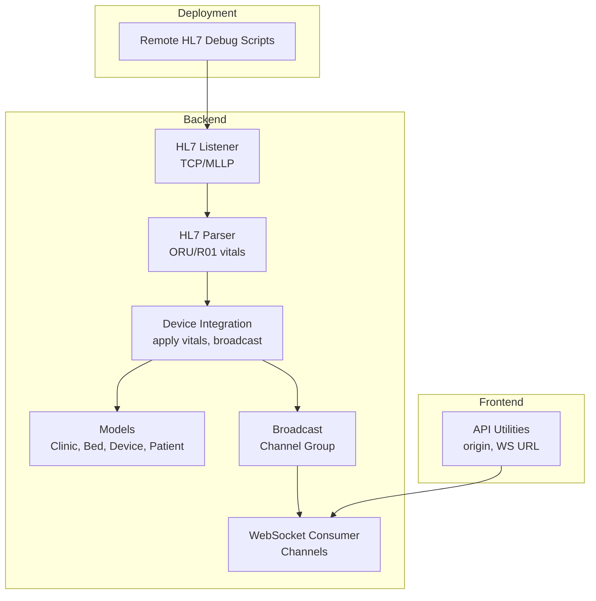
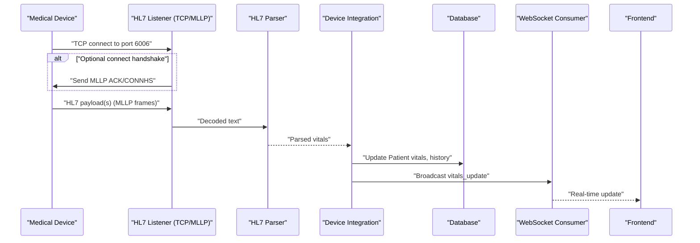
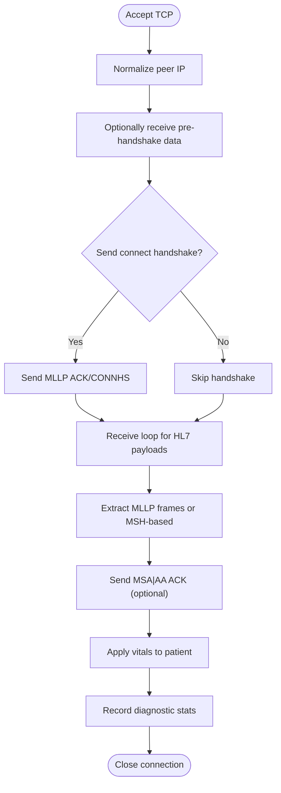
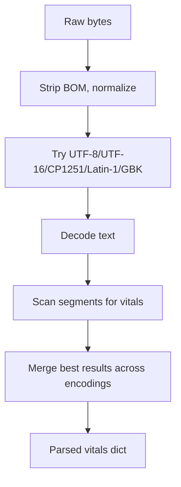
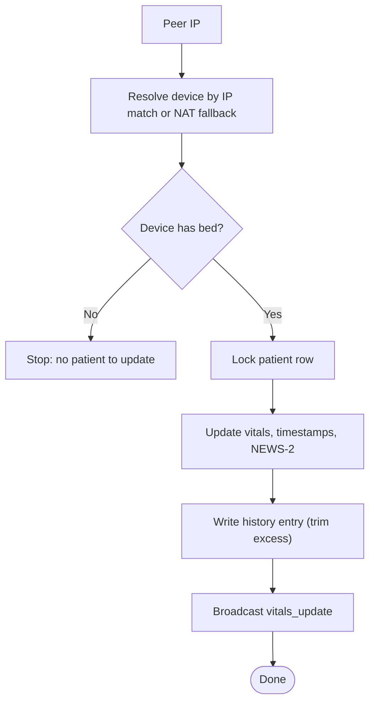
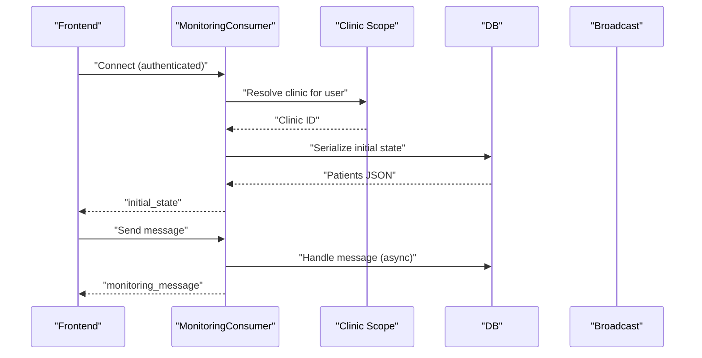
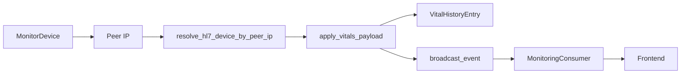

# Troubleshooting & FAQ

<cite>
**Referenced Files in This Document**
- [diagnose_hl7.py](file://backend/monitoring/management/commands/diagnose_hl7.py)
- [setup_real_hl7_monitor.py](file://backend/monitoring/management/commands/setup_real_hl7_monitor.py)
- [hl7_listener.py](file://backend/monitoring/hl7_listener.py)
- [hl7_parser.py](file://backend/monitoring/hl7_parser.py)
- [device_integration.py](file://backend/monitoring/device_integration.py)
- [models.py](file://backend/monitoring/models.py)
- [consumers.py](file://backend/monitoring/consumers.py)
- [broadcast.py](file://backend/monitoring/broadcast.py)
- [api.ts](file://frontend/src/lib/api.ts)
- [remote_hl7_debug.sh](file://deploy/remote_hl7_debug.sh)
- [remote_hl7_debug_off.sh](file://deploy/remote_hl7_debug_off.sh)
</cite>

## Table of Contents
1. [Introduction](#introduction)
2. [Project Structure](#project-structure)
3. [Core Components](#core-components)
4. [Architecture Overview](#architecture-overview)
5. [Detailed Component Analysis](#detailed-component-analysis)
6. [Dependency Analysis](#dependency-analysis)
7. [Performance Considerations](#performance-considerations)
8. [Troubleshooting Guide](#troubleshooting-guide)
9. [Conclusion](#conclusion)
10. [Appendices](#appendices)

## Introduction
This document provides comprehensive troubleshooting and FAQ guidance for the Medicentral system. It focuses on:
- HL7 device connection issues (TCP connectivity, MLLP protocol, authentication-like handshake)
- WebSocket connection and real-time synchronization
- Database-related problems (migrations, connection handling, performance)
- Frontend API and WebSocket issues
- Practical debugging techniques via Django management commands, remote scripts, and logs
- Step-by-step solutions for common deployment and configuration pitfalls
- Frequently asked questions about system requirements, supported devices, integrations, and customization

## Project Structure
The system comprises:
- Backend (Django + Django Channels) handling HL7 ingestion, WebSocket broadcasting, and data persistence
- Frontend (TypeScript/Vite) consuming REST and WebSocket APIs
- Deployment helpers for remote diagnostics and service restarts

**Diagram sources**
- [hl7_listener.py:588-708](file://backend/monitoring/hl7_listener.py#L588-L708)
- [hl7_parser.py:423-530](file://backend/monitoring/hl7_parser.py#L423-L530)
- [device_integration.py:129-232](file://backend/monitoring/device_integration.py#L129-L232)
- [broadcast.py:10-20](file://backend/monitoring/broadcast.py#L10-L20)
- [consumers.py:12-46](file://backend/monitoring/consumers.py#L12-L46)
- [models.py:77-140](file://backend/monitoring/models.py#L77-L140)
- [api.ts:10-35](file://frontend/src/lib/api.ts#L10-L35)
- [remote_hl7_debug.sh:1-40](file://deploy/remote_hl7_debug.sh#L1-L40)

**Section sources**
- [hl7_listener.py:1-708](file://backend/monitoring/hl7_listener.py#L1-L708)
- [hl7_parser.py:1-530](file://backend/monitoring/hl7_parser.py#L1-L530)
- [device_integration.py:1-232](file://backend/monitoring/device_integration.py#L1-L232)
- [models.py:1-224](file://backend/monitoring/models.py#L1-L224)
- [consumers.py:1-46](file://backend/monitoring/consumers.py#L1-L46)
- [broadcast.py:1-20](file://backend/monitoring/broadcast.py#L1-L20)
- [api.ts:1-35](file://frontend/src/lib/api.ts#L1-L35)
- [remote_hl7_debug.sh:1-40](file://deploy/remote_hl7_debug.sh#L1-L40)

## Core Components
- HL7 Listener: Accepts TCP connections, applies MLLP framing detection, optional connect handshake, and decodes HL7 messages
- HL7 Parser: Extracts vitals from ORU^R01 and similar segments across encodings and variants
- Device Integration: Resolves devices by peer IP, applies vitals to patients, updates status, and broadcasts updates
- WebSocket Consumer: Authenticates users, scopes to clinic groups, sends initial state, and handles inbound messages
- Broadcast: Sends events to the correct clinic group via Channels
- Frontend API Utilities: Builds REST and WebSocket URLs with environment-aware origins

**Section sources**
- [hl7_listener.py:588-708](file://backend/monitoring/hl7_listener.py#L588-L708)
- [hl7_parser.py:423-530](file://backend/monitoring/hl7_parser.py#L423-L530)
- [device_integration.py:129-232](file://backend/monitoring/device_integration.py#L129-L232)
- [consumers.py:12-46](file://backend/monitoring/consumers.py#L12-L46)
- [broadcast.py:10-20](file://backend/monitoring/broadcast.py#L10-L20)
- [api.ts:10-35](file://frontend/src/lib/api.ts#L10-L35)

## Architecture Overview
End-to-end flow from device to frontend:

**Diagram sources**
- [hl7_listener.py:405-531](file://backend/monitoring/hl7_listener.py#L405-L531)
- [hl7_parser.py:487-530](file://backend/monitoring/hl7_parser.py#L487-L530)
- [device_integration.py:129-232](file://backend/monitoring/device_integration.py#L129-L232)
- [broadcast.py:10-20](file://backend/monitoring/broadcast.py#L10-L20)
- [consumers.py:12-46](file://backend/monitoring/consumers.py#L12-L46)

## Detailed Component Analysis

### HL7 Listener and MLLP Handling
Key behaviors:
- Binds to configurable host/port, restarts on bind errors
- Accepts connections, normalizes peer IPs, optionally sends connect handshake
- Receives chunks, detects MLLP frames, or falls back to MSH-based detection
- Records diagnostic counters and last session details
- Updates device last HL7 RX timestamps

**Diagram sources**
- [hl7_listener.py:405-531](file://backend/monitoring/hl7_listener.py#L405-L531)

**Section sources**
- [hl7_listener.py:588-708](file://backend/monitoring/hl7_listener.py#L588-L708)
- [hl7_listener.py:405-531](file://backend/monitoring/hl7_listener.py#L405-L531)

### HL7 Parser and Vitals Extraction
Capabilities:
- Multi-encoding decoding (UTF-8, UTF-16 LE/BE, CP1251, Latin-1, GBK)
- Segment scanning across OBX/OBR/NTE/ST/Z* variants
- Numeric heuristics and regex-based extraction
- Aggregates best-effort vitals (HR, SpO2, Temp, RR, NIBP)

**Diagram sources**
- [hl7_parser.py:487-530](file://backend/monitoring/hl7_parser.py#L487-L530)

**Section sources**
- [hl7_parser.py:423-530](file://backend/monitoring/hl7_parser.py#L423-L530)

### Device Resolution and Vitals Application
- Resolves device by ip_address/local_ip/hl7_peer_ip with NAT fallback
- Applies vitals atomically, updates NEWS-2 score, writes history, and broadcasts

**Diagram sources**
- [device_integration.py:129-232](file://backend/monitoring/device_integration.py#L129-L232)

**Section sources**
- [device_integration.py:31-78](file://backend/monitoring/device_integration.py#L31-L78)
- [device_integration.py:129-232](file://backend/monitoring/device_integration.py#L129-L232)
- [models.py:77-140](file://backend/monitoring/models.py#L77-L140)

### WebSocket Consumer and Real-Time Updates
- Authenticates users and scopes to clinic
- Joins monitoring group and sends initial state
- Forwards inbound messages to backend handlers

**Diagram sources**
- [consumers.py:12-46](file://backend/monitoring/consumers.py#L12-L46)
- [broadcast.py:10-20](file://backend/monitoring/broadcast.py#L10-L20)

**Section sources**
- [consumers.py:12-46](file://backend/monitoring/consumers.py#L12-L46)
- [broadcast.py:10-20](file://backend/monitoring/broadcast.py#L10-L20)

## Dependency Analysis
- HL7 ingestion depends on device registration and bed/patient linkage
- WebSocket updates depend on successful vitals application and group membership
- Environment variables control MLLP behavior, timeouts, and logging

**Diagram sources**
- [device_integration.py:31-78](file://backend/monitoring/device_integration.py#L31-L78)
- [device_integration.py:129-232](file://backend/monitoring/device_integration.py#L129-L232)
- [broadcast.py:10-20](file://backend/monitoring/broadcast.py#L10-L20)
- [consumers.py:12-46](file://backend/monitoring/consumers.py#L12-L46)

**Section sources**
- [models.py:77-140](file://backend/monitoring/models.py#L77-L140)
- [device_integration.py:31-78](file://backend/monitoring/device_integration.py#L31-L78)
- [broadcast.py:10-20](file://backend/monitoring/broadcast.py#L10-L20)
- [consumers.py:12-46](file://backend/monitoring/consumers.py#L12-L46)

## Performance Considerations
- Keep TCP_NODELAY and SO_KEEPALIVE configured for responsive connections
- Limit history entries per patient to reduce storage overhead
- Use environment controls for timeouts and handshake delays to balance compatibility and latency
- Ensure database connections are healthy and migrations are current

[No sources needed since this section provides general guidance]

## Troubleshooting Guide

### HL7 Device Connection Problems

Common symptoms and checks:
- No data received despite device showing connected
- Port 6006 not accepting connections
- Frequent empty sessions or zero-byte handshakes
- MLLP framing mismatches or missing ACKs

Practical steps:
- Verify database connectivity and that a clinic and device exist with proper associations
- Confirm device registration includes IP fields and bed linkage
- Run the HL7 diagnostic command to check listener status, port acceptance, and recent payloads
- Inspect environment flags controlling MLLP behavior and timeouts
- Use the setup command to provision a real device and review recommended device settings

Operational commands and scripts:
- Run the HL7 diagnostic command to enumerate database state, listener status, and recent activity
- Re-run the setup command to register a real device with correct server IP and optional peer IP for NAT scenarios
- Toggle HL7 debug mode remotely and restart the Daphne service to increase verbosity

**Section sources**
- [diagnose_hl7.py:25-182](file://backend/monitoring/management/commands/diagnose_hl7.py#L25-L182)
- [setup_real_hl7_monitor.py:77-224](file://backend/monitoring/management/commands/setup_real_hl7_monitor.py#L77-L224)
- [hl7_listener.py:658-708](file://backend/monitoring/hl7_listener.py#L658-L708)
- [remote_hl7_debug.sh:1-40](file://deploy/remote_hl7_debug.sh#L1-L40)
- [remote_hl7_debug_off.sh:1-16](file://deploy/remote_hl7_debug_off.sh#L1-L16)

### TCP Connectivity and Port Issues
Symptoms:
- Local probe indicates port closed
- Bind errors reported by listener
- Firewall blocking incoming connections

Resolution:
- Confirm listener is enabled and bound to the correct host/port
- Allow TCP 6006 ingress on the host firewall and cloud security groups
- Validate NAT peer IP configuration if device connects via public IP

**Section sources**
- [hl7_listener.py:658-708](file://backend/monitoring/hl7_listener.py#L658-L708)
- [diagnose_hl7.py:118-132](file://backend/monitoring/management/commands/diagnose_hl7.py#L118-L132)

### MLLP Protocol and Handshake Errors
Symptoms:
- Zero-byte sessions after connection
- Device waits for handshake before sending data
- Parser reports no MSH frames

Resolution:
- Enable or disable connect handshake depending on device firmware
- Adjust pre-handshake receive delay and post-handshake delay
- Ensure ACK sending is enabled when required by device behavior

**Section sources**
- [hl7_listener.py:357-451](file://backend/monitoring/hl7_listener.py#L357-L451)
- [hl7_listener.py:473-494](file://backend/monitoring/hl7_listener.py#L473-L494)
- [hl7_parser.py:455-464](file://backend/monitoring/hl7_parser.py#L455-L464)

### Device Authentication Failures (Conceptual)
Note: The system authenticates users for web access, not devices for HL7. If a device appears “authenticated” but no data arrives:
- Confirm device network settings (server IP, port, protocol)
- Validate that the device’s HL7 output is enabled and sending ORU^R01
- Ensure the device’s IP matches the registered device record or peer IP fallback is configured

[No sources needed since this section doesn't analyze specific files]

### WebSocket Connection Troubleshooting
Symptoms:
- Connection closes immediately after opening
- No initial state received
- Messages not delivered to clients

Resolution:
- Ensure user is authenticated and associated with a clinic
- Verify WebSocket URL construction and origin handling
- Check that the consumer joins the correct clinic group and sends initial state

**Section sources**
- [consumers.py:12-46](file://backend/monitoring/consumers.py#L12-L46)
- [api.ts:22-35](file://frontend/src/lib/api.ts#L22-L35)

### Message Delivery Failures and Real-Time Sync
Symptoms:
- Vitals appear stale or not updating
- Broadcast not reaching clients

Resolution:
- Confirm device has an associated bed and patient
- Verify broadcast is invoked after vitals application
- Ensure Channels group name resolution and channel layer availability

**Section sources**
- [device_integration.py:129-232](file://backend/monitoring/device_integration.py#L129-L232)
- [broadcast.py:10-20](file://backend/monitoring/broadcast.py#L10-L20)

### Database-Related Problems
Symptoms:
- Migration errors during startup
- Connection pool exhaustion under load
- Slow queries or timeouts

Resolution:
- Run migrations to completion and verify schema alignment
- Review connection settings and pool limits
- Monitor slow queries and add indexes where appropriate

[No sources needed since this section provides general guidance]

### Frontend API Communication and Browser Compatibility
Symptoms:
- CORS or mixed-content errors
- WebSocket URL mismatch
- Inconsistent behavior across browsers

Resolution:
- Set VITE_BACKEND_ORIGIN for production deployments
- Ensure protocol and host are derived correctly for WebSocket URLs
- Test across supported browsers and address polyfills if needed

**Section sources**
- [api.ts:10-35](file://frontend/src/lib/api.ts#L10-L35)

### Practical Debugging Techniques

Django management commands:
- Use the HL7 diagnostic command to print listener status, port acceptance, and recent activity
- Use the setup command to provision a real device and review recommended device settings

Remote debugging and logging:
- Toggle HL7 debug mode remotely and restart the Daphne service
- Tail the Daphne systemd logs for live diagnostics

**Section sources**
- [diagnose_hl7.py:25-182](file://backend/monitoring/management/commands/diagnose_hl7.py#L25-L182)
- [setup_real_hl7_monitor.py:77-224](file://backend/monitoring/management/commands/setup_real_hl7_monitor.py#L77-L224)
- [remote_hl7_debug.sh:1-40](file://deploy/remote_hl7_debug.sh#L1-L40)
- [remote_hl7_debug_off.sh:1-16](file://deploy/remote_hl7_debug_off.sh#L1-L16)

### Step-by-Step Solutions

Common deployment issues:
- Device shows disconnected
  - Verify device server IP and port 6006
  - Confirm firewall allows inbound TCP 6006
  - Run the HL7 diagnostic command and follow suggested actions
- No real-time updates in the dashboard
  - Ensure the device is linked to a bed and patient
  - Confirm the consumer accepts and sends initial state
  - Check that broadcast reaches the correct clinic group

Configuration problems:
- NAT scenario with mismatched device and server IPs
  - Configure device.hl7_peer_ip or enable single-device NAT fallback
- MLLP handshake mismatch
  - Toggle connect handshake and adjust pre/post delays
- Parser not extracting vitals
  - Increase verbosity and confirm MSH presence and encoding

Performance bottlenecks:
- Reduce history retention and optimize queries
- Tune TCP and socket options for responsiveness
- Scale Redis-backed Channels if throughput increases

**Section sources**
- [diagnose_hl7.py:152-181](file://backend/monitoring/management/commands/diagnose_hl7.py#L152-L181)
- [setup_real_hl7_monitor.py:157-186](file://backend/monitoring/management/commands/setup_real_hl7_monitor.py#L157-L186)
- [hl7_listener.py:357-451](file://backend/monitoring/hl7_listener.py#L357-L451)
- [device_integration.py:129-232](file://backend/monitoring/device_integration.py#L129-L232)

### Frequently Asked Questions

System requirements:
- Backend runs on Django with Channels and requires a working database and Redis-backed channel layer
- Devices must be able to reach the server on TCP 6006

Supported medical devices:
- The setup command targets Creative Medical K12; other devices may require adjusting handshake and timeouts

Integration possibilities:
- HL7 MLLP ingestion is supported; ensure device output is enabled and formatted as ORU^R01
- Real-time updates are published via WebSocket groups scoped by clinic

Customization options:
- Environment flags control MLLP behavior, timeouts, and logging
- Device records can be adjusted for NAT and peer IP scenarios

Escalation procedures:
- Collect HL7 diagnostic summary and listener status
- Enable HL7 debug mode and restart Daphne
- Tail systemd logs for the monitoring service
- Engage healthcare IT professionals for device-side verification

**Section sources**
- [setup_real_hl7_monitor.py:29-36](file://backend/monitoring/management/commands/setup_real_hl7_monitor.py#L29-L36)
- [diagnose_hl7.py:152-181](file://backend/monitoring/management/commands/diagnose_hl7.py#L152-L181)
- [remote_hl7_debug.sh:1-40](file://deploy/remote_hl7_debug.sh#L1-L40)

## Conclusion
This guide consolidates actionable steps to diagnose and resolve HL7, WebSocket, database, and frontend issues in Medicentral. Use the provided commands, scripts, and environment controls to isolate problems quickly and restore reliable real-time monitoring.

[No sources needed since this section summarizes without analyzing specific files]

## Appendices

### Quick Reference: Environment Controls
- HL7_LISTEN_ENABLED, HL7_LISTEN_HOST, HL7_LISTEN_PORT
- HL7_SEND_ACK, HL7_SEND_CONNECT_HANDSHAKE, HL7_POST_CONNECT_HANDSHAKE_DELAY_MS
- HL7_RECV_TIMEOUT_SEC, HL7_RECV_BEFORE_HANDSHAKE_MS
- HL7_NAT_SINGLE_DEVICE_FALLBACK
- HL7_DEBUG

**Section sources**
- [hl7_listener.py:645-688](file://backend/monitoring/hl7_listener.py#L645-L688)
- [hl7_listener.py:164-185](file://backend/monitoring/hl7_listener.py#L164-L185)
- [hl7_listener.py:357-393](file://backend/monitoring/hl7_listener.py#L357-L393)
- [remote_hl7_debug.sh:6-23](file://deploy/remote_hl7_debug.sh#L6-L23)